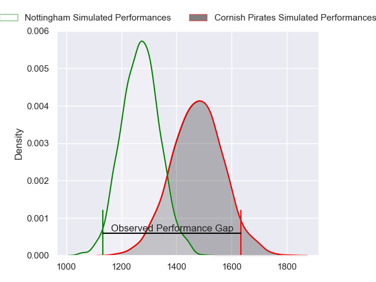
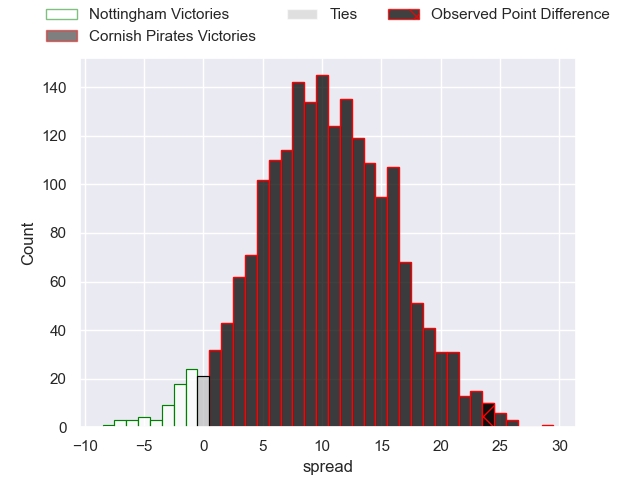
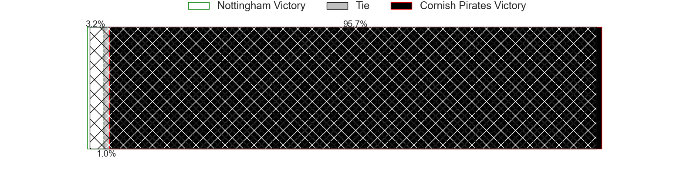
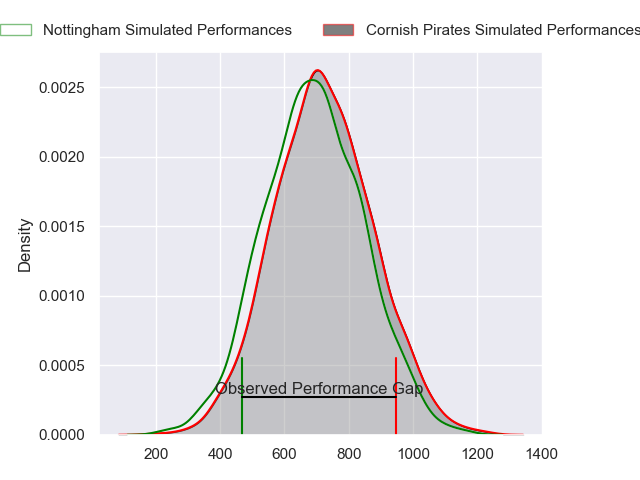
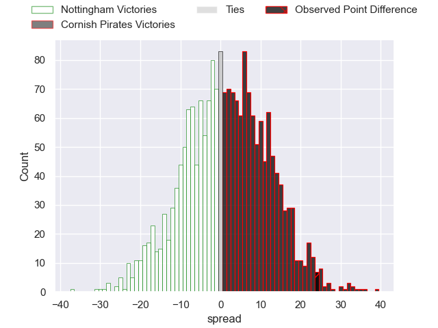
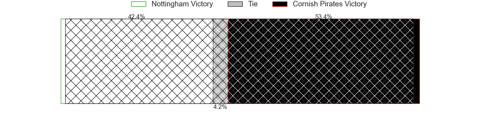
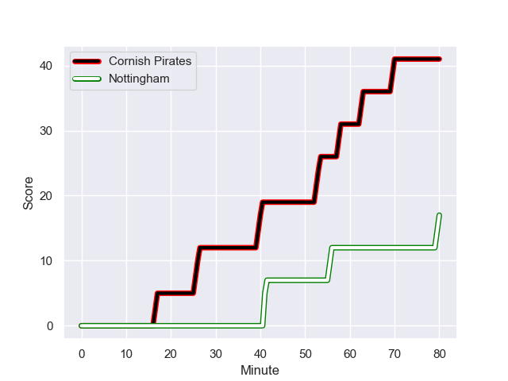
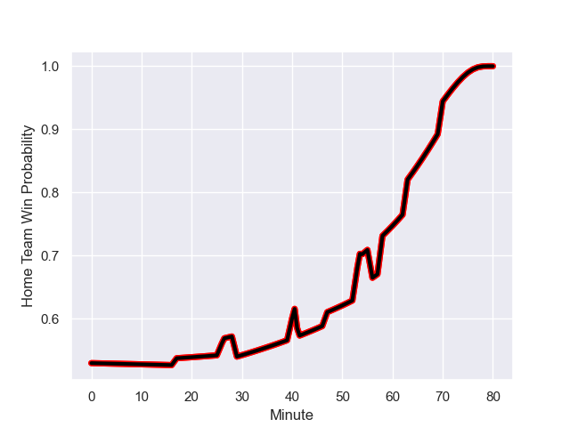

---  
layout: page  
title: Nottingham at Cornish Pirates; 17-41  
date: 2024-01-20 18:00:00 -0500  
categories: "RFU Championship 2023" match review  
---
# Nottingham at Cornish Pirates; 17-41

# Club Level Predictions

The first set of predictions treats a club as the smallest object, as the club develops its members, organizes a gameplan, and deploys its players as needed for each match. This club model has a prediction of 0.762, which translates to predicting Cornish Pirates to win by 10.3.

Our Over/Under is 47.5 - and combined with the spread above, we have a predicted scoreline of 18 to 29

Each club has a rating and a rating deviation (similar to a Glicko rating), and expected performances can be generated. This allows for simulated matches and spreads like the ones below.
## Projected Performances - Club Model

## Projected Spreads - Club Model

## Projected Results - Club Model

# Player Level Predictions - Version 2

Treating teams instead as an entity made up of the currently active players, I have ratings for each player in an altogether different system. These can be combined to form team ratings once teamsheets are announced, weighting starters a bit higher than the reserves. After the match is played, players can be weighted by their minutes on the field, allowing for an accurate measure of the team's composition. With these compiled team ratings, we can make predictions, measure inaccuracy, and update the individual player ratings.
## Prediction with Player Minutes: Cornish Pirates by 1.3

Cornish Pirates by 2.5 on a neutral field
## Prediction without Player Minutes: Cornish Pirates by 3.9

Cornish Pirates by 0.1 on a neutral pitch

## Projected Performances - Player Model

## Projected Spreads - Player Model

## Projected Results - Player Model

## Scores over Time

## Win Probability over Time

There were 8 large changes in win probability in this match

|   Away Minutes | Away Player               |   Away elo |   Number |   Home elo | Home Player          |   Home Minutes |
|---------------:|:--------------------------|-----------:|---------:|-----------:|:---------------------|---------------:|
|             47 | Kai Owen                  |      50.05 |        1 |      47.86 | Lefty Zigiriadis     |             54 |
|             47 | Jack Dickinson            |      42.43 |        2 |      43.45 | Morgan Nelson        |             63 |
|             54 | Xavier Valentine          |      51.55 |        3 |      49.42 | Finlay Richardson    |             54 |
|              5 | Sebastien Ferreira        |     -33.57 |        4 |      12.99 | Will Britton         |             54 |
|             80 | Come Clayver Joussain     |      38.86 |        5 |      49.39 | Steele Robert Barker |             80 |
|             47 | Iosefa Danny Wayne Fiaola |      52.86 |        6 |      34.37 | Alex Everett         |             80 |
|             80 | Emeka Ilione              |      44.99 |        7 |      48.59 | John Stevens         |             80 |
|             56 | Richard Clift             |      51.17 |        8 |      47.25 | Hugh Bokenham        |             58 |
|             54 | Micheal Stronge           |      23.34 |        9 |      36.87 | Alex Schwarz         |             54 |
|             80 | Josh Goodwin              |      46.63 |       10 |      49.56 | Bruce Houston        |             80 |
|             60 | Jordan Olowofela          |      67.47 |       11 |       5.94 | Matthew McNab        |             63 |
|             80 | Joe Woodward              |      56.31 |       12 |      34    | Joe Elderkin         |             80 |
|             80 | Marcus Alexander Ramage   |      30.04 |       13 |      55.4  | Ioan Evans           |             29 |
|             80 | David Williams            |      33.03 |       14 |      29.97 | Robin Wedlake        |             80 |
|             80 | Ellis Mee                 |      56.64 |       15 |      51.48 | Will Trewin          |             80 |
|             33 | Archie Van der Flier      |      52.91 |       16 |      48.3  | Jake Morris          |             26 |
|             33 | Harry Clayton             |      67.52 |       17 |      33.59 | Marlen Walker        |             17 |
|             26 | Jake Bridges              |      22    |       18 |      53.01 | Matt Johnson         |             26 |
|             75 | Jack Shine                |      54.22 |       19 |      52.38 | Josh Williams        |             26 |
|             33 | Sam Green                 |      45.21 |       20 |      47.82 | Harry Dugmore        |             22 |
|             24 | Jay Ecclesfield           |      47.84 |       21 |      46.48 | Ruaridh Dawson       |             26 |
|             26 | Will Yarnell              |      31.47 |       22 |     103.18 | Jack Nowell          |             17 |
|             20 | Dafydd-Rhys Tiueti        |      50.44 |       23 |      51.2  | Tom Pittman          |             51 |

