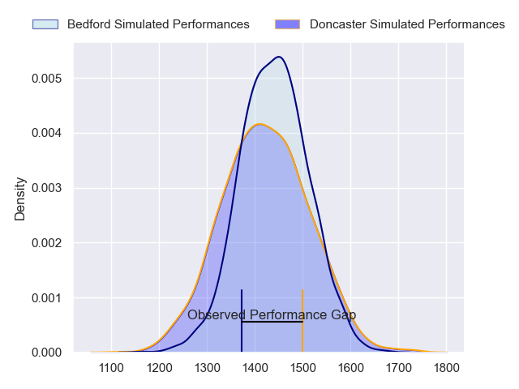
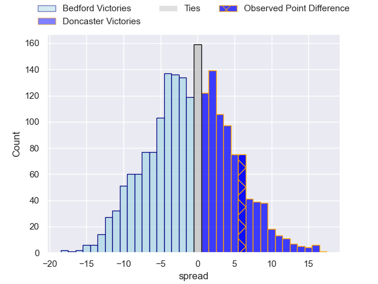
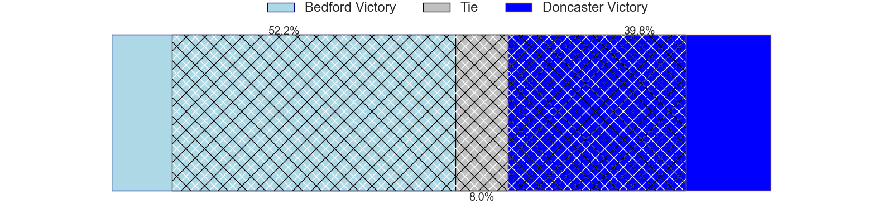
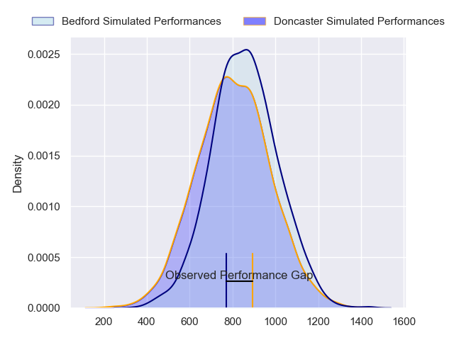
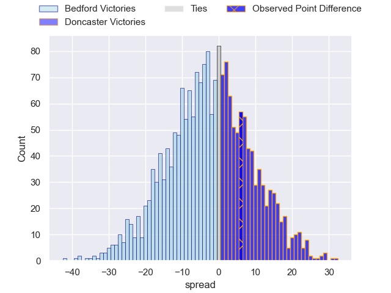
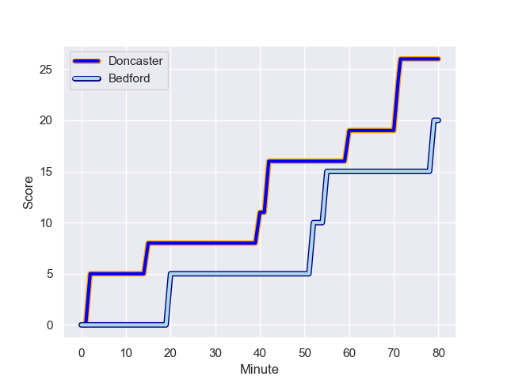
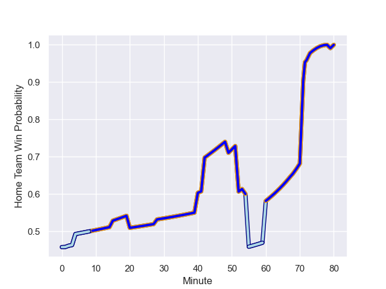

---  
layout: page  
title: Bedford at Doncaster; 20-26  
date: 2024-01-20 18:00:00 -0500  
categories: "RFU Championship 2023" match review  
---
# Bedford at Doncaster; 20-26

# Club Level Predictions

The first set of predictions treats a club as the smallest object, as the club develops its members, organizes a gameplan, and deploys its players as needed for each match. This club model has a prediction of 0.476, which translates to predicting Bedford to win by 0.9.

Our Over/Under is 60.5 - and combined with the spread above, we have a predicted scoreline of 31 to 30

Each club has a rating and a rating deviation (similar to a Glicko rating), and expected performances can be generated. This allows for simulated matches and spreads like the ones below.
## Projected Performances - Club Model

## Projected Spreads - Club Model

## Projected Results - Club Model

# Player Level Predictions - Version 2

Treating teams instead as an entity made up of the currently active players, I have ratings for each player in an altogether different system. These can be combined to form team ratings once teamsheets are announced, weighting starters a bit higher than the reserves. After the match is played, players can be weighted by their minutes on the field, allowing for an accurate measure of the team's composition. With these compiled team ratings, we can make predictions, measure inaccuracy, and update the individual player ratings.
## Prediction with Player Minutes: Bedford by 1.9

Bedford by 5.6 on a neutral field
## Prediction without Player Minutes: Bedford by 1.1

Bedford by 4.9 on a neutral pitch

## Projected Performances - Player Model

## Projected Spreads - Player Model

## Projected Results - Player Model

## Scores over Time

## Win Probability over Time

There were 10 large changes in win probability in this match

|   Away Minutes | Away Player          |   Away elo |   Number |   Home elo | Home Player              |   Home Minutes |
|---------------:|:---------------------|-----------:|---------:|-----------:|:-------------------------|---------------:|
|             49 | Jamie Jack           |      36.09 |        1 |      59.26 | Harrison Courtney        |             52 |
|             54 | James Fish           |      53.63 |        2 |      33.42 | Tom Doughty              |              4 |
|             28 | Bryan O'Connor       |      63.65 |        3 |      38.23 | Corrie Barrett           |             62 |
|             80 | Tom Lockett          |      56.65 |        4 |      32.46 | Harry Wilson             |             80 |
|             54 | Alex Woolford        |      64.4  |        5 |      91.7  | Evan Mintern             |             62 |
|             80 | Luke Frost           |      16.12 |        6 |      50.05 | Archie Smeaton           |             71 |
|             80 | Joe Howard           |      37.64 |        7 |      42.42 | Rhys Tait                |             80 |
|             49 | Cameron King         |      17.83 |        8 |      68.85 | Jack Digby               |             80 |
|             73 | Alex Day             |      76.3  |        9 |     -15.93 | Ollie Fox                |             72 |
|             80 | William Maisey       |      83.5  |       10 |      65.41 | Billy McBryde            |             80 |
|             80 | Dean Adamson         |      77.18 |       11 |      57.99 | Westleigh Alleyne Holden |             80 |
|             68 | Josh Matavesi        |      51.91 |       12 |      69.17 | Russell Bennett          |             80 |
|             52 | Jamie Elliott        |      53.24 |       13 |      61.22 | Joe Margetts             |             80 |
|             80 | Sean French          |      56.52 |       14 |      49.48 | George Simpson           |             80 |
|             80 | Michael Le Bourgeois |      84.27 |       15 |      -7.18 | Jack Metcalf             |             80 |
|             31 | Joey Conway          |      61.54 |       16 |      60.72 | Cameron Terry            |             76 |
|             31 | Kieran Curran        |      60.66 |       17 |      40.99 | Conor Davidson           |             28 |
|             28 | Matthew Worley       |      67.29 |       18 |      11.88 | Ehize Ehizode            |             18 |
|             26 | Oisin Heffernan      |      81.87 |       19 |      88.55 | Lewis Thiede             |             18 |
|             26 | Robin Williams       |      70.24 |       20 |      46.85 | Adam Hopkinson           |              9 |
|             12 | Louis Grimoldby      |      27.13 |       21 |      73.59 | Alex Dolly               |              8 |
|              7 | James Lennon         |      25.25 |       22 |     nan    | nan                      |            nan |
|             52 | Craig Wright         |      50.61 |       23 |     nan    | nan                      |            nan |

