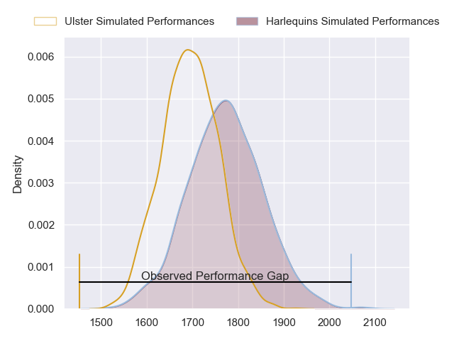
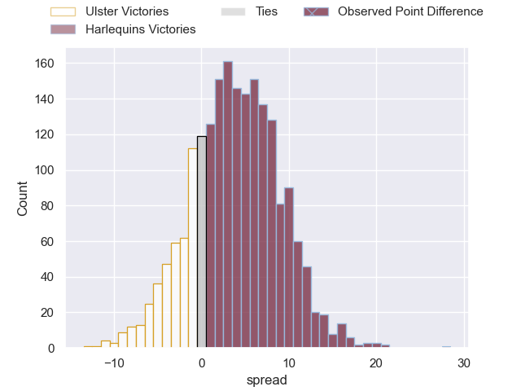
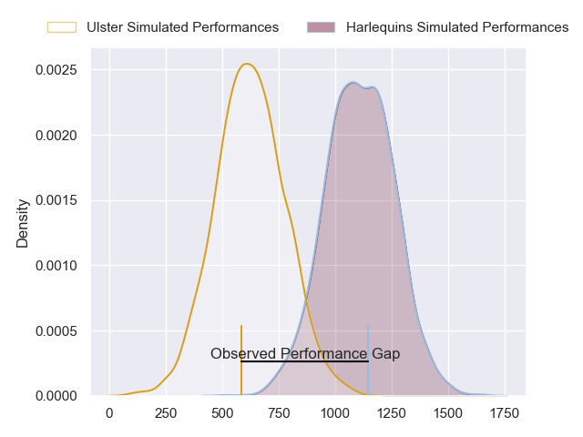
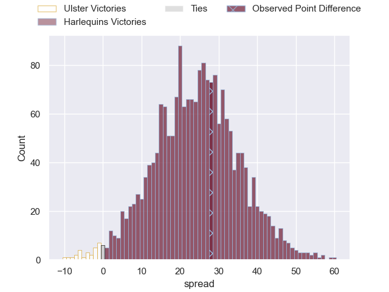
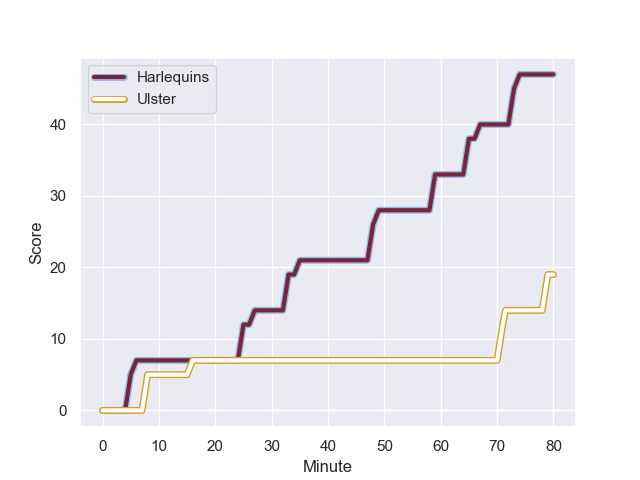
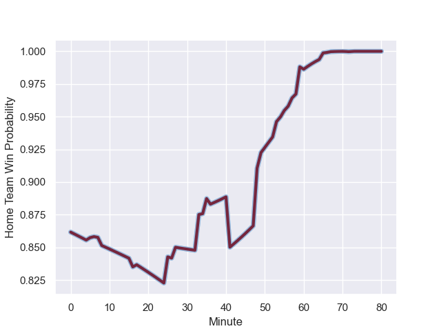

---  
layout: page  
title: Ulster at Harlequins; 19-47  
date: 2024-01-20 18:00:00 -0500  
categories: "European Rugby Champions Cup 2023" match review  
---
# Ulster at Harlequins; 19-47

# Club Level Predictions

The first set of predictions treats a club as the smallest object, as the club develops its members, organizes a gameplan, and deploys its players as needed for each match. This club model has a prediction of 0.612, which translates to predicting Harlequins to win by 4.0.

Our Over/Under is 51.5 - and combined with the spread above, we have a predicted scoreline of 24 to 28

Each club has a rating and a rating deviation (similar to a Glicko rating), and expected performances can be generated. This allows for simulated matches and spreads like the ones below.
## Projected Performances - Club Model

## Projected Spreads - Club Model

## Projected Results - Club Model

# Player Level Predictions - Version 2

Treating teams instead as an entity made up of the currently active players, I have ratings for each player in an altogether different system. These can be combined to form team ratings once teamsheets are announced, weighting starters a bit higher than the reserves. After the match is played, players can be weighted by their minutes on the field, allowing for an accurate measure of the team's composition. With these compiled team ratings, we can make predictions, measure inaccuracy, and update the individual player ratings.
## Prediction with Player Minutes: Harlequins by 20.1

Harlequins by 12.8 on a neutral field
## Prediction without Player Minutes: Harlequins by 21.8

Harlequins by 14.5 on a neutral pitch

## Projected Performances - Player Model

## Projected Spreads - Player Model

## Projected Results - Player Model

## Scores over Time

## Win Probability over Time

There were 3 large changes in win probability in this match

|   Away Minutes | Away Player       |   Away elo |   Number |   Home elo | Home Player               |   Home Minutes |
|---------------:|:------------------|-----------:|---------:|-----------:|:--------------------------|---------------:|
|             55 | Steven Kitshoff   |      64.99 |        1 |     101.42 | Joe Marler                |             41 |
|             49 | Tom Stewart       |       0.67 |        2 |      24.18 | Jack Walker               |             60 |
|             68 | Tom O'Toole       |      27.98 |        3 |      67.87 | Will Collier              |             57 |
|             36 | Kieran Treadwell  |      27.44 |        4 |      52.8  | Irne Herbst               |             53 |
|             80 | Iain Henderson    |      78.83 |        5 |      -6.76 | George Hammond            |             80 |
|             72 | Matty Rea         |      46.65 |        6 |      56.67 | Chandler Cunningham-South |             72 |
|             80 | David McCann      |      46.65 |        7 |      46.79 | Will Evans                |             80 |
|             80 | Nick Timoney      |      41.25 |        8 |      76.82 | Alex Dombrandt            |             80 |
|             55 | John Cooney       |      60.62 |        9 |     147.31 | Danny Care                |             60 |
|             80 | Billy Burns       |      40.58 |       10 |      72.83 | Marcus Smith              |             80 |
|             80 | Jacob Stockdale   |      36.11 |       11 |      63.93 | Will Joseph               |             80 |
|             80 | Stuart McCloskey  |      38.5  |       12 |     108.35 | Andre Esterhuizen         |             80 |
|             41 | James Hume        |      28.58 |       13 |      54.8  | Oscar Beard               |             17 |
|             80 | Robert Baloucoune |       5.39 |       14 |      29.47 | Nick David                |             75 |
|             72 | Mike Lowry        |      46.65 |       15 |      71.42 | Tyrone Green              |             80 |
|             31 | John Andrew       |      30.18 |       16 |      42.4  | Sam Riley                 |             20 |
|             25 | Andrew Warwick    |      36.37 |       17 |      17.71 | Fin Baxter                |             39 |
|             12 | Marty Moore       |      70.87 |       18 |     102.36 | Dillon Lewis              |             23 |
|             44 | Harry Sheridan    |      46.65 |       19 |     111.2  | Joe Launchbury            |             27 |
|              8 | Marcus Rea        |      46.65 |       20 |      46.65 | Archie White              |              8 |
|             25 | Nathan Doak       |      32.32 |       21 |      15.49 | Will Porter               |             20 |
|             39 | Luke Marshall     |      83.01 |       22 |      78.52 | Lennox Anyanwu            |              5 |
|              8 | Will Addison      |      46.11 |       23 |      62.89 | Louis Lynagh              |             63 |

