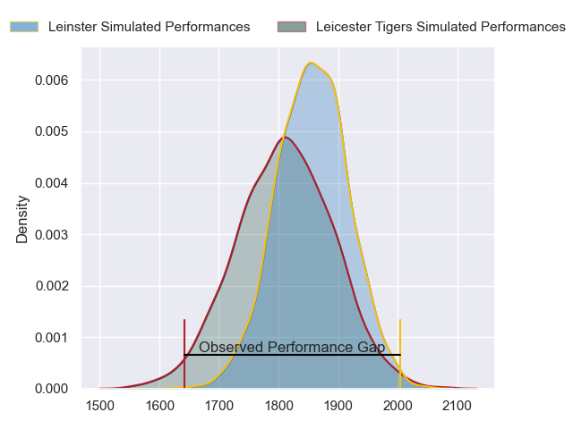
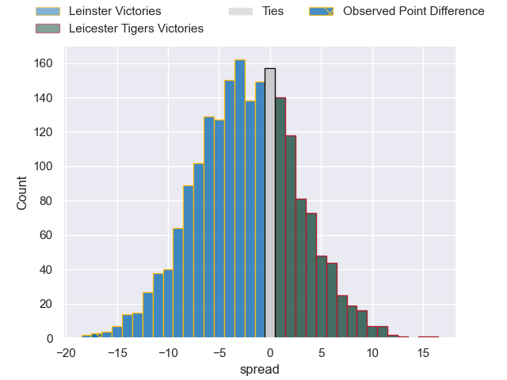
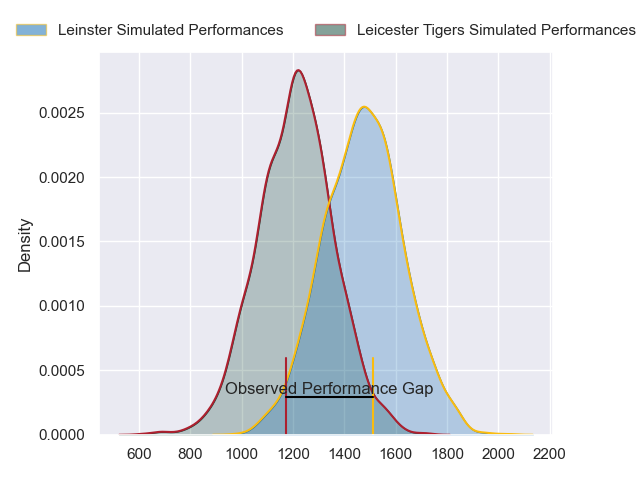
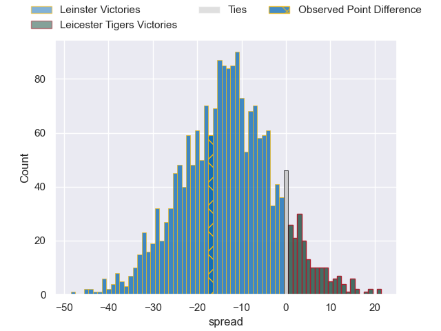
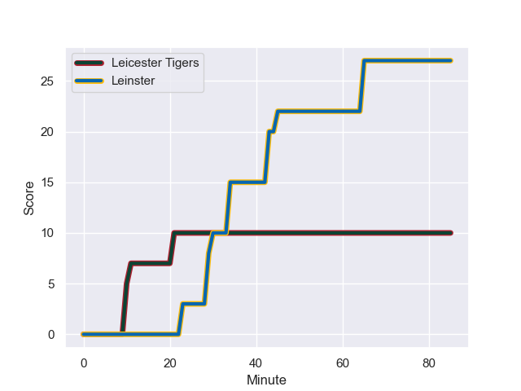
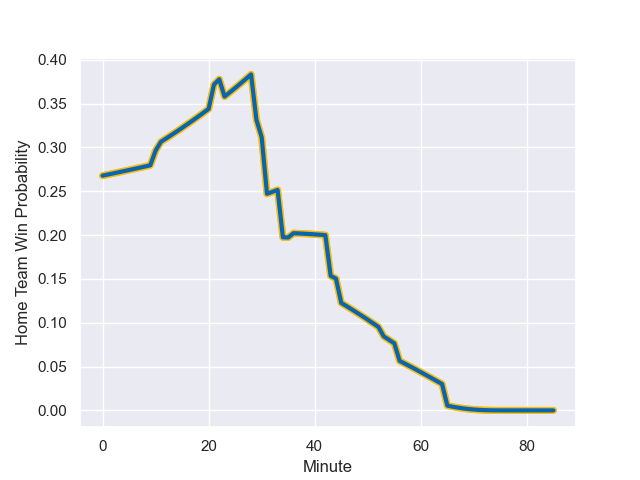

---  
layout: page  
title: Leinster at Leicester Tigers; 27-10  
date: 2024-01-20 18:00:00 -0500  
categories: "European Rugby Champions Cup 2023" match review  
---
# Leinster at Leicester Tigers; 27-10

# Club Level Predictions

The first set of predictions treats a club as the smallest object, as the club develops its members, organizes a gameplan, and deploys its players as needed for each match. This club model has a prediction of 0.435, which translates to predicting Leinster to win by 2.3.

Our Over/Under is 36.5 - and combined with the spread above, we have a predicted scoreline of 19 to 17

Each club has a rating and a rating deviation (similar to a Glicko rating), and expected performances can be generated. This allows for simulated matches and spreads like the ones below.
## Projected Performances - Club Model

## Projected Spreads - Club Model

## Projected Results - Club Model

# Player Level Predictions - Version 2

Treating teams instead as an entity made up of the currently active players, I have ratings for each player in an altogether different system. These can be combined to form team ratings once teamsheets are announced, weighting starters a bit higher than the reserves. After the match is played, players can be weighted by their minutes on the field, allowing for an accurate measure of the team's composition. With these compiled team ratings, we can make predictions, measure inaccuracy, and update the individual player ratings.
## Prediction with Player Minutes: Leinster by 11.1

Leinster by 19.4 on a neutral field
## Prediction without Player Minutes: Leinster by 9.0

Leinster by 17.4 on a neutral pitch

## Projected Performances - Player Model

## Projected Spreads - Player Model

## Projected Results - Player Model

## Scores over Time

## Win Probability over Time

There were 6 large changes in win probability in this match

|   Away Minutes | Away Player         |   Away elo |   Number |   Home elo | Home Player           |   Home Minutes |
|---------------:|:--------------------|-----------:|---------:|-----------:|:----------------------|---------------:|
|             71 | Andrew Porter       |      79.67 |        1 |      87.09 | James Cronin          |             53 |
|             58 | Dan Sheehan         |      68.16 |        2 |     108.61 | Julian Montoya        |             79 |
|             58 | Tadhg Furlong       |     100.67 |        3 |      82.91 | Joe Heyes             |             56 |
|             70 | Joe McCarthy        |      66.62 |        4 |      64.84 | Harry Wells           |             85 |
|             85 | James Ryan          |     103.73 |        5 |      62.82 | Ollie Chessum         |             43 |
|             85 | Ryan Baird          |      87.2  |        6 |      83.51 | Hanro Liebenberg      |             85 |
|             58 | Josh van der Flier  |     117.13 |        7 |      69.62 | Tommy Reffell         |             31 |
|             85 | Caelan Doris        |     125.53 |        8 |      78.37 | Jasper Wiese          |             85 |
|             70 | Jamison Gibson-Park |     106.3  |        9 |      19.46 | Tom Whiteley          |             58 |
|             64 | Harry Byrne         |      46.65 |       10 |     102.76 | Handre Pollard        |             85 |
|             85 | James Lowe          |     161.81 |       11 |      62.69 | Ollie Hassell-Collins |             85 |
|             85 | Robbie Henshaw      |      82.9  |       12 |      88.96 | Dan Kelly             |             56 |
|             85 | Garry Ringrose      |     114.97 |       13 |      59.24 | Matt Scott            |             85 |
|             76 | Jordan Larmour      |      65.89 |       14 |      37.75 | Harry Simmons         |             36 |
|             85 | Hugo Keenan         |     149.44 |       15 |      46.81 | Freddie Steward       |             85 |
|             27 | Ronan Kelleher      |      90.76 |       16 |      46.65 | Archie Vanes          |              6 |
|             14 | Cian Healy          |      71.87 |       17 |      62.21 | Francois van Wyk      |             32 |
|             27 | Michael Ala'alatoa  |      89.84 |       18 |      44.01 | Will Hurd             |             29 |
|             15 | Ross Molony         |      46.65 |       19 |     107.68 | Sam Carter            |             42 |
|             27 | Jack Conan          |     100.9  |       20 |     -19.24 | Kyle Hatherell        |             54 |
|             15 | Luke McGrath        |     123.48 |       21 |      77.6  | Ben Youngs            |             27 |
|             21 | Sam Prendergast     |      46.65 |       22 |      46.36 | Jamie Shillcock       |             49 |
|              9 | Tommy O'Brien       |      61.68 |       23 |      46.66 | Solomone Kata         |             29 |

