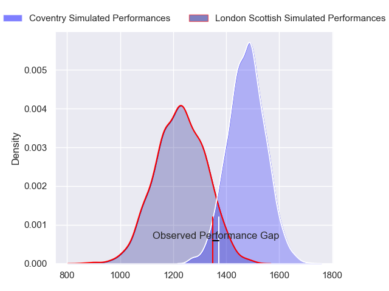
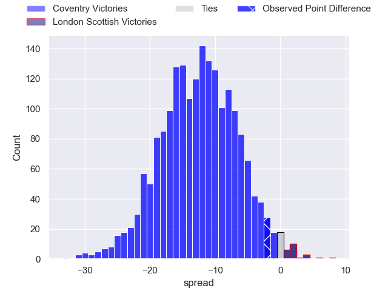
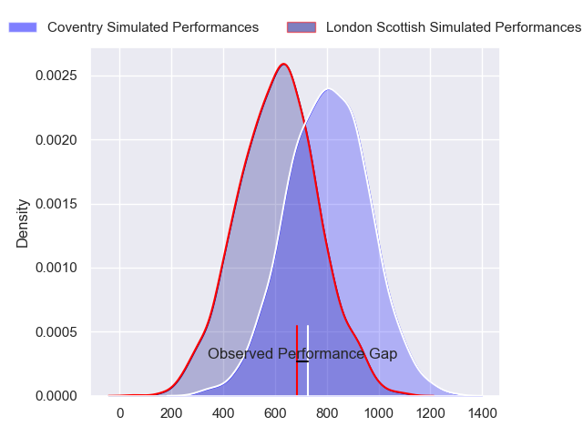
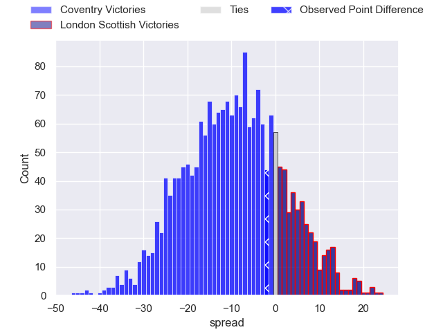
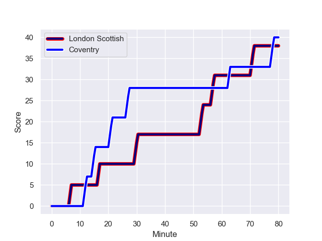
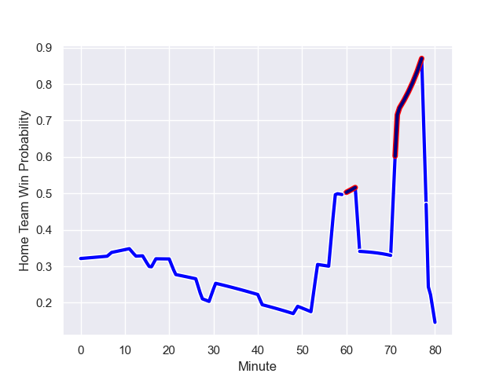

---  
layout: page  
title: Coventry at London Scottish; 40-38  
date: 2024-01-20 18:00:00 -0500  
categories: "RFU Championship 2023" match review  
---
# Coventry at London Scottish; 40-38

# Club Level Predictions

The first set of predictions treats a club as the smallest object, as the club develops its members, organizes a gameplan, and deploys its players as needed for each match. This club model has a prediction of 0.203, which translates to predicting Coventry to win by 12.2.

Our Over/Under is 51.5 - and combined with the spread above, we have a predicted scoreline of 32 to 19

Each club has a rating and a rating deviation (similar to a Glicko rating), and expected performances can be generated. This allows for simulated matches and spreads like the ones below.
## Projected Performances - Club Model

## Projected Spreads - Club Model

## Projected Results - Club Model

# Player Level Predictions - Version 2

Treating teams instead as an entity made up of the currently active players, I have ratings for each player in an altogether different system. These can be combined to form team ratings once teamsheets are announced, weighting starters a bit higher than the reserves. After the match is played, players can be weighted by their minutes on the field, allowing for an accurate measure of the team's composition. With these compiled team ratings, we can make predictions, measure inaccuracy, and update the individual player ratings.
## Prediction with Player Minutes: Coventry by 8.2

Coventry by 11.9 on a neutral field
## Prediction without Player Minutes: Coventry by 7.1

Coventry by 10.8 on a neutral pitch

## Projected Performances - Player Model

## Projected Spreads - Player Model

## Projected Results - Player Model

## Scores over Time

## Win Probability over Time

There were 17 large changes in win probability in this match

|   Away Minutes | Away Player          |   Away elo |   Number |   Home elo | Home Player          |   Home Minutes |
|---------------:|:---------------------|-----------:|---------:|-----------:|:---------------------|---------------:|
|             49 | Vilikesa Nairau      |      41.58 |        1 |      43.69 | Tom Osborne          |             49 |
|             80 | Jordon Poole         |      43.22 |        2 |      17.43 | Austin Wallis        |             41 |
|             49 | Adam Nicol           |      43.7  |        3 |      48.66 | Rhys Charalambous    |             41 |
|             80 | James Tyas           |      16.21 |        4 |      19.64 | Matas Jurevicius     |             72 |
|             59 | Obinna Nkwocha       |      32.97 |        5 |      50.98 | Bailey Ransom        |             80 |
|             80 | Tom Ball             |      77.75 |        6 |      25.42 | Will Trenholm        |             80 |
|             80 | Matt Kvesic          |      30.84 |        7 |      31.82 | Lewis Barrett        |             49 |
|             49 | Jack Bartlett        |      42.43 |        8 |      28.04 | Tom Marshall         |             80 |
|             41 | Will Lane            |      57.25 |        9 |      32.75 | Jonny Law            |             49 |
|             80 | Patrick Pellegrini   |      75.37 |       10 |      42.35 | Connor Slevin        |             80 |
|             80 | James Martin         |      79.1  |       11 |     -39.42 | Noah Ferdinand       |             80 |
|             80 | Will Rigg            |      93.42 |       12 |      46.53 | Will Simonds         |             80 |
|             59 | Will Wand            |      54.75 |       13 |      26.52 | Hayden Hyde          |             80 |
|             53 | Ryan Hutler          |      21.58 |       14 |      66.69 | Will Brown           |             80 |
|             80 | Tobi Wilson          |      53.1  |       15 |      34.86 | Luke Mehson          |             53 |
|             39 | Will Chudley         |     148.23 |       16 |      54.03 | William Hobson       |             39 |
|             31 | Eliot Salt           |      36.92 |       17 |      51.36 | George Head          |             39 |
|             31 | Paddy Ryan           |      34.98 |       18 |       9.11 | Daniel Nutton        |             31 |
|             31 | Elliott Chilvers     |      34.46 |       19 |      82.17 | Charlie Ingall       |             31 |
|             27 | David Opoku-Fordjour |      35.85 |       20 |      57.82 | Will Prior           |             31 |
|             21 | Lucas Titherington   |      63.78 |       21 |      51.57 | Alexander Lloyd-Seed |             27 |
|             21 | Rhys Anstey          |      40.37 |       22 |      54.47 | Harry Browne         |              8 |

