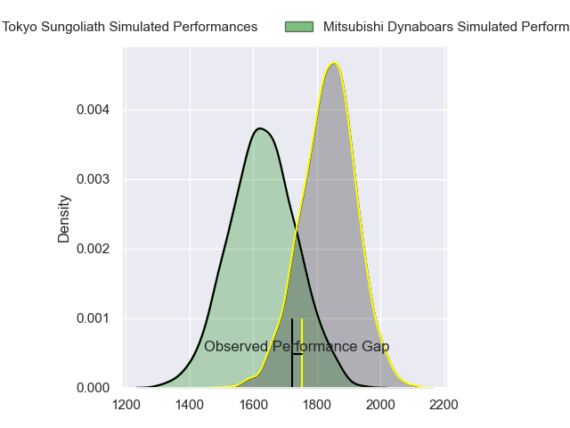
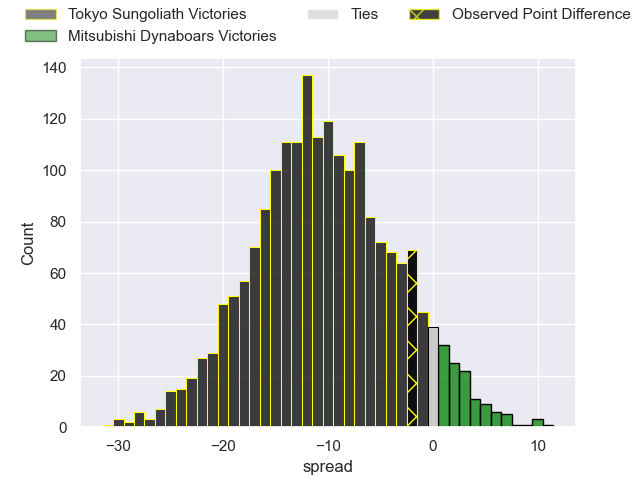
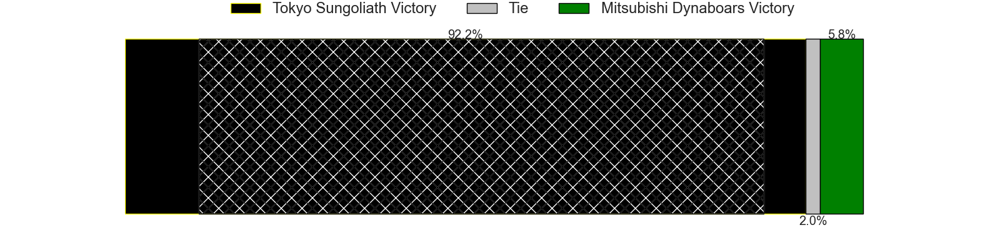
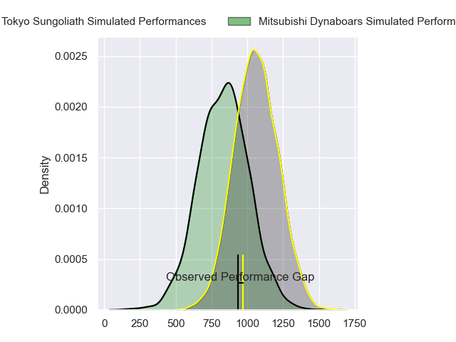
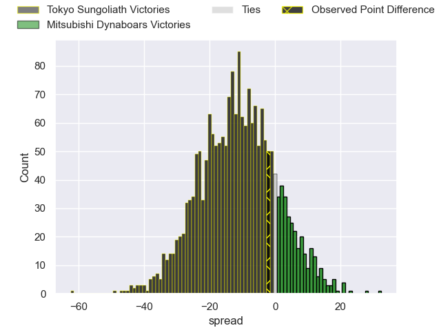
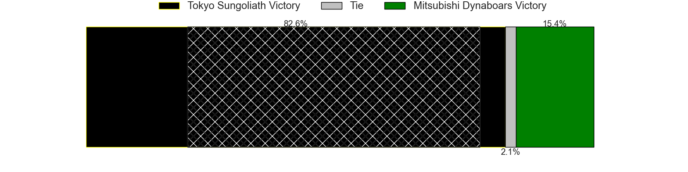
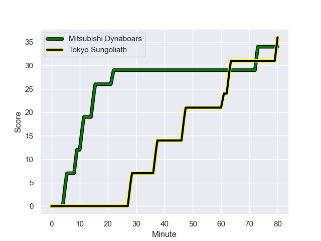
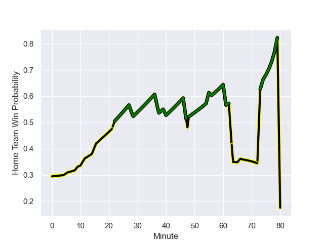

---  
layout: page  
title: Tokyo Sungoliath at Mitsubishi Dynaboars; 36-34  
date: 2024-01-20 18:00:00 -0500  
categories: "Japan Rugby League One 2023" match review  
---
# Tokyo Sungoliath at Mitsubishi Dynaboars; 36-34

# Club Level Predictions

The first set of predictions treats a club as the smallest object, as the club develops its members, organizes a gameplan, and deploys its players as needed for each match. This club model has a prediction of 0.242, which translates to predicting Tokyo Sungoliath to win by 10.3.

Our Over/Under is 58.5 - and combined with the spread above, we have a predicted scoreline of 35 to 24

Each club has a rating and a rating deviation (similar to a Glicko rating), and expected performances can be generated. This allows for simulated matches and spreads like the ones below.
## Projected Performances - Club Model

## Projected Spreads - Club Model

## Projected Results - Club Model

# Player Level Predictions - Version 2

Treating teams instead as an entity made up of the currently active players, I have ratings for each player in an altogether different system. These can be combined to form team ratings once teamsheets are announced, weighting starters a bit higher than the reserves. After the match is played, players can be weighted by their minutes on the field, allowing for an accurate measure of the team's composition. With these compiled team ratings, we can make predictions, measure inaccuracy, and update the individual player ratings.
## Prediction with Player Minutes: Tokyo Sungoliath by 9.6

Tokyo Sungoliath by 13.0 on a neutral field
## Prediction without Player Minutes: Tokyo Sungoliath by 8.2

Tokyo Sungoliath by 11.6 on a neutral pitch

## Projected Performances - Player Model

## Projected Spreads - Player Model

## Projected Results - Player Model

## Scores over Time

## Win Probability over Time

There were 17 large changes in win probability in this match

|   Away Minutes | Away Player      |   Away elo |   Number |   Home elo | Home Player       |   Home Minutes |
|---------------:|:-----------------|-----------:|---------:|-----------:|:------------------|---------------:|
|             56 | Kenta Kobayashi  |      49.56 |        1 |      30.65 | Mototsugu Hachiya |             40 |
|             62 | Kosuke Horikoshi |      43.28 |        2 |      39.74 | Yuki Miyazato     |             80 |
|             62 | Kotaro Hosoki    |      51.03 |        3 |      45.31 | Chinen Yu         |             55 |
|             48 | Trevor Hosea     |      30.83 |        4 |      42.7  | Daniel Linde      |             80 |
|             80 | Harry Hockings   |     137.5  |        5 |      -4.66 | Epineri Uluiviti  |             80 |
|             80 | Kanji Shimokawa  |      45.85 |        6 |      76.57 | Kyo Yoshida       |             80 |
|             74 | Sam Cane         |     121.39 |        7 |      -8.86 | Koki Sato         |             66 |
|             80 | Ryuga Hashimoto  |      42.03 |        8 |      60.69 | Jackson Hemopo    |             80 |
|             40 | Naoto Saito      |      24.68 |        9 |      77.89 | Kota Iwamura      |             66 |
|             80 | Mikiya Takamoto  |      56.43 |       10 |      61.56 | James Grayson     |             80 |
|             67 | Ryosuke Kawase   |      56.52 |       11 |      61.73 | Kento Nakai       |             80 |
|             48 | Ryoto Nakamura   |     135.46 |       12 |      66.8  | Curtis Rona       |             66 |
|             80 | Shogo Nakano     |      24.96 |       13 |      50.28 | Joichiro Iwashita |             80 |
|             80 | Seiya Ozaki      |      94.19 |       14 |      62.63 | Roland Alaiasa    |             80 |
|             80 | Cheslin Kolbe    |     143.81 |       15 |      58.35 | Matt Vaega        |             80 |
|             40 | Yutaka Nagare    |      89.09 |       16 |      40.84 | Jun Morimoto      |             40 |
|             32 | Isaiah Punivai   |      35.18 |       17 |     115.76 | Tomoaki Ishii     |             25 |
|             32 | Koji Iino        |      62.68 |       18 |      35.13 | Timote Tavalea    |             14 |
|             24 | Yukio Morikawa   |      91.43 |       19 |      96.55 | Jack Stratton     |             14 |
|             18 | Kienori Go       |      51.93 |       20 |      45.84 | Ryoto Fukuyama    |             14 |
|             18 | Soshi Oga        |      47.06 |       21 |     nan    | nan               |            nan |
|             13 | Shota Emi        |      60.64 |       22 |     nan    | nan               |            nan |
|              6 | Tamati Ioane     |      34.62 |       23 |     nan    | nan               |            nan |

