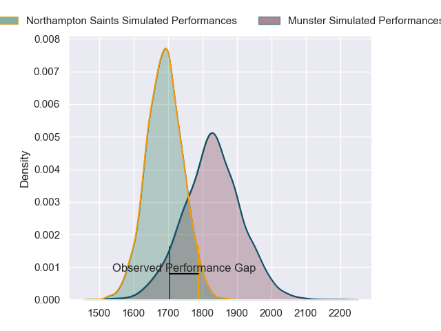
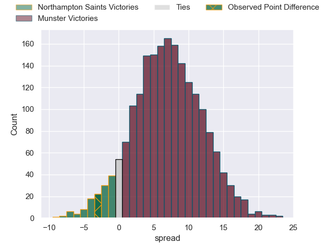
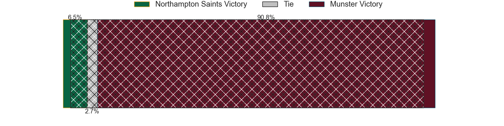
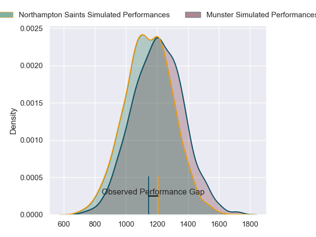
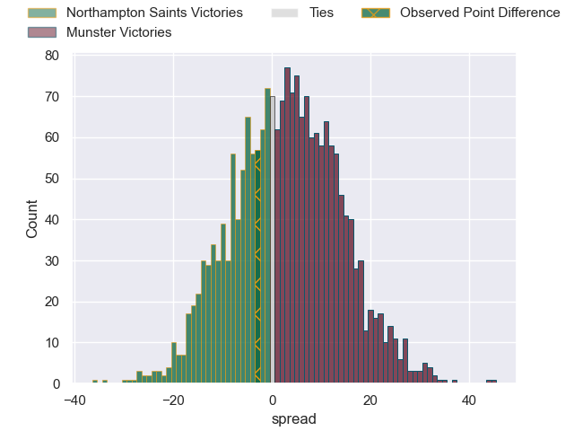
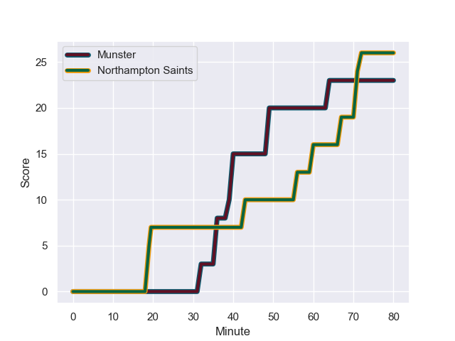
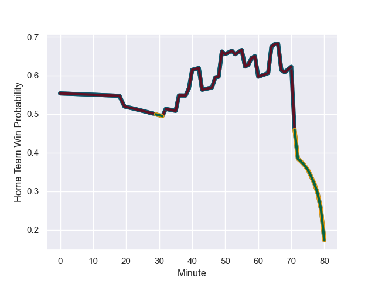

---  
layout: page  
title: Northampton Saints at Munster; 26-23  
date: 2024-01-20 18:00:00 -0500  
categories: "European Rugby Champions Cup 2023" match review  
---
# Northampton Saints at Munster; 26-23

# Club Level Predictions

The first set of predictions treats a club as the smallest object, as the club develops its members, organizes a gameplan, and deploys its players as needed for each match. This club model has a prediction of 0.689, which translates to predicting Munster to win by 7.0.

Our Over/Under is 42.5 - and combined with the spread above, we have a predicted scoreline of 18 to 25

Each club has a rating and a rating deviation (similar to a Glicko rating), and expected performances can be generated. This allows for simulated matches and spreads like the ones below.
## Projected Performances - Club Model

## Projected Spreads - Club Model

## Projected Results - Club Model

# Player Level Predictions - Version 2

Treating teams instead as an entity made up of the currently active players, I have ratings for each player in an altogether different system. These can be combined to form team ratings once teamsheets are announced, weighting starters a bit higher than the reserves. After the match is played, players can be weighted by their minutes on the field, allowing for an accurate measure of the team's composition. With these compiled team ratings, we can make predictions, measure inaccuracy, and update the individual player ratings.
## Prediction with Player Minutes: Munster by 2.4

Northampton Saints by 3.6 on a neutral field
## Prediction without Player Minutes: Munster by 2.8

Northampton Saints by 3.1 on a neutral pitch

## Projected Performances - Player Model

## Projected Spreads - Player Model

## Projected Results - Player Model

## Scores over Time

## Win Probability over Time

There were 14 large changes in win probability in this match

|   Away Minutes | Away Player         |   Away elo |   Number |   Home elo | Home Player     |   Home Minutes |
|---------------:|:--------------------|-----------:|---------:|-----------:|:----------------|---------------:|
|             58 | Alex Waller         |     101.93 |        1 |      82.23 | Jeremy Loughman |             68 |
|             80 | Curtis Langdon      |      78.04 |        2 |      50.18 | Niall Scannell  |             68 |
|             53 | Trevor Davison      |       8.81 |        3 |      46.65 | Oli Jager       |             50 |
|             58 | Temo Mayanavanua    |      93.71 |        4 |      45.5  | Thomas Ahern    |             40 |
|             80 | Alex Coles          |       8.47 |        5 |     158.81 | Tadhg Beirne    |             80 |
|             80 | Courtney Lawes      |     112.17 |        6 |      88.02 | Peter O'Mahony  |             66 |
|             80 | Tom Pearson         |     127.84 |        7 |      65.75 | John Hodnett    |             80 |
|             50 | Juarno Augustus     |      56.57 |        8 |      66.34 | Gavin Coombes   |             80 |
|             80 | Alex Mitchell       |      85.91 |        9 |      58.07 | Craig Casey     |             80 |
|             80 | Fin Smith           |      55.99 |       10 |      36.48 | Jack Crowley    |             80 |
|             47 | Ollie Sleightholme  |     112.78 |       11 |     106.27 | Shane Daly      |             80 |
|             64 | Rory Hutchinson     |      64.13 |       12 |      53.71 | Alex Nankivell  |             76 |
|             80 | Fraser Dingwall     |      60.26 |       13 |      70.25 | Antoine Frisch  |             80 |
|             80 | Tommy Freeman       |      95.77 |       14 |      86.05 | Calvin Nash     |             80 |
|             80 | George Furbank      |      83.46 |       15 |      81.07 | Simon Zebo      |             43 |
|             33 | Robbie Smith        |      46.65 |       16 |      46.65 | Eoghan Clarke   |             12 |
|             22 | Emmanuel Iyogun     |      56.41 |       17 |      37.06 | Josh Wycherley  |             12 |
|             27 | Elliot Millar-Mills |      53.86 |       18 |      74.51 | John Ryan       |             30 |
|             22 | Alex Moon           |      93.69 |       19 |      46.65 | Brian Gleeson   |             40 |
|             30 | Sam Graham          |     117.57 |       20 |      61.44 | Alex Kendellen  |             14 |
|              0 | Tom James           |       4.66 |       21 |      46.65 | Paddy Patterson |              0 |
|             16 | Burger Odendaal     |      75.63 |       22 |      26.06 | Joey Carbery    |              4 |
|              0 | Charlie Savala      |      30    |       23 |      10.3  | Sean O'Brien    |             37 |

