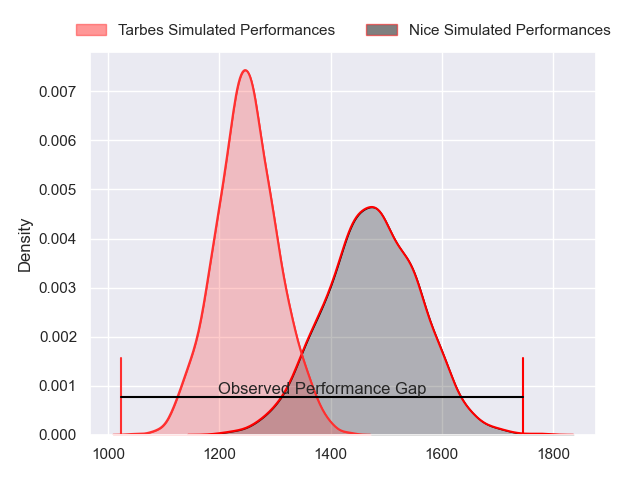
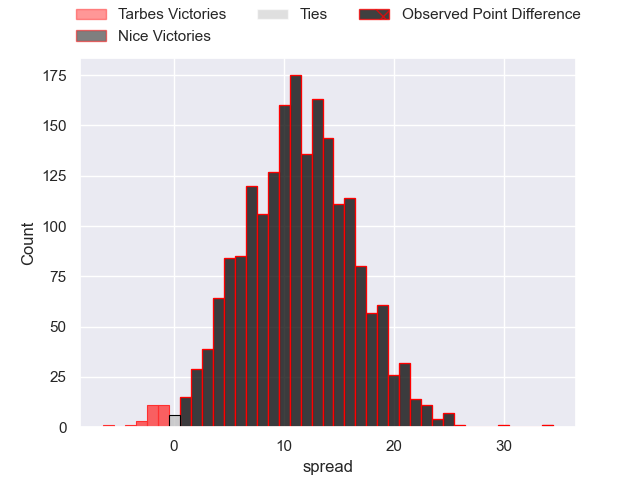
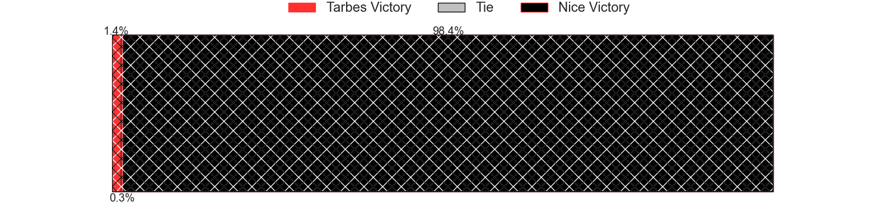
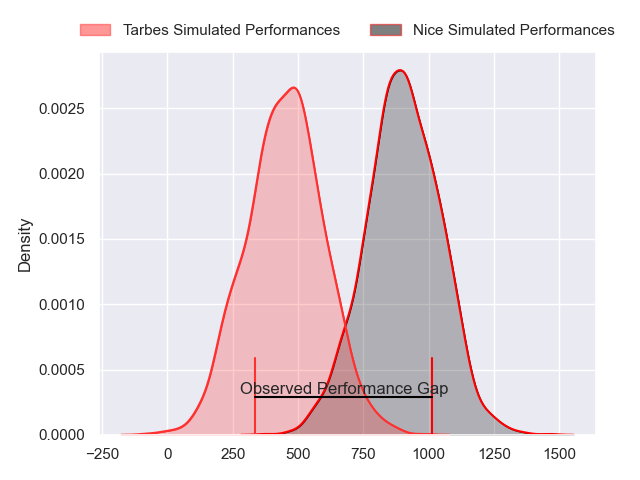
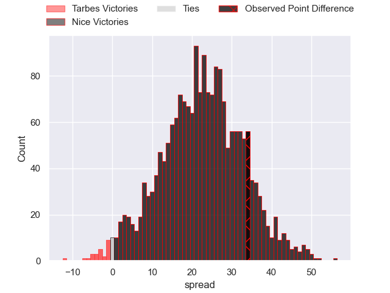
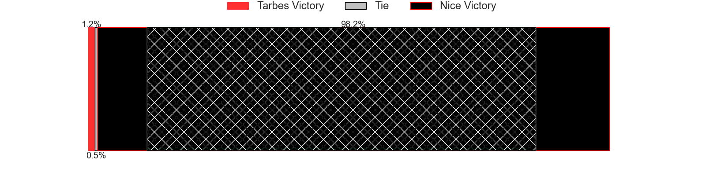
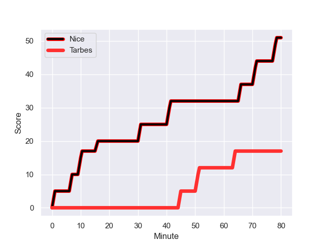
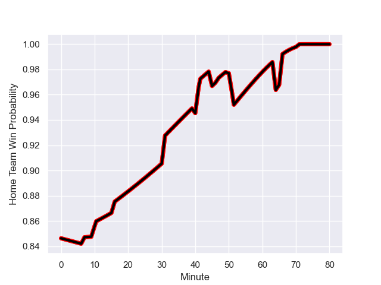

---  
layout: page  
title: Tarbes at Nice; 17-51  
date: 2024-01-20 18:00:00 -0500  
categories: "Nationale 2023" match review  
---
# Tarbes at Nice; 17-51

# Club Level Predictions

The first set of predictions treats a club as the smallest object, as the club develops its members, organizes a gameplan, and deploys its players as needed for each match. This club model has a prediction of 0.779, which translates to predicting Nice to win by 11.1.

Our Over/Under is 44.5 - and combined with the spread above, we have a predicted scoreline of 16 to 28

Each club has a rating and a rating deviation (similar to a Glicko rating), and expected performances can be generated. This allows for simulated matches and spreads like the ones below.
## Projected Performances - Club Model

## Projected Spreads - Club Model

## Projected Results - Club Model

# Player Level Predictions - Version 2

Treating teams instead as an entity made up of the currently active players, I have ratings for each player in an altogether different system. These can be combined to form team ratings once teamsheets are announced, weighting starters a bit higher than the reserves. After the match is played, players can be weighted by their minutes on the field, allowing for an accurate measure of the team's composition. With these compiled team ratings, we can make predictions, measure inaccuracy, and update the individual player ratings.
## Prediction with Player Minutes: Nice by 18.7

Nice by 15.2 on a neutral field
## Prediction without Player Minutes: Nice by 18.8

Nice by 15.4 on a neutral pitch

## Projected Performances - Player Model

## Projected Spreads - Player Model

## Projected Results - Player Model

## Scores over Time

## Win Probability over Time

|   Away Minutes | Away Player            |   Away elo |   Number |   Home elo | Home Player          |   Home Minutes |
|---------------:|:-----------------------|-----------:|---------:|-----------:|:---------------------|---------------:|
|             51 | Alexandre Combier      |      28.13 |        1 |      57.09 | Sunia Vola           |             40 |
|             53 | Florian Lamothe        |      48.22 |        2 |      70.17 | Sione Anga'aelangi   |             50 |
|             53 | Toma Taufa             |      38.74 |        3 |      28.81 | Luvuyo Pupuma        |             47 |
|             80 | Baptiste Peytavi       |      41.88 |        4 |      71.33 | Yann Tivoli          |             58 |
|             80 | Jone Trevor Seuvou     |      24.28 |        5 |      56.5  | Martin Freytes       |             53 |
|             80 | Jean Guicherd          |      46.99 |        6 |      87.03 | Louis Suaud          |             80 |
|             60 | Aurelien Ricart        |      49.25 |        7 |       4.35 | Bastien Berenguel    |             53 |
|             53 | Filipe Manu            |      -4.47 |        8 |      49.47 | Arthur Vignolles     |             80 |
|             57 | Thibaut Dulucq         |      31.67 |        9 |      51.81 | Jules Solinas        |             51 |
|             51 | Anthony Fuertes        |      16.43 |       10 |      59.16 | Mathis Viard         |             80 |
|             80 | Jone Tuva              |      -7.25 |       11 |      47.82 | Simon Delas          |             80 |
|             80 | Pierre Descoubet       |      51.19 |       12 |      52.9  | Romain Riguet        |             80 |
|             80 | Savenaca Rawaca        |      23.36 |       13 |      59    | Nathan Courtade      |             53 |
|             50 | Clement Latorre        |      31.73 |       14 |      80.8  | Andrzej Charlat      |             80 |
|             80 | Thibaut Trotta         |      30.62 |       15 |      49.33 | David Odiete         |             80 |
|             29 | Alexandre Duny         |      27.49 |       16 |      19.2  | Jules Martinez       |             40 |
|             27 | Vincent Dolier         |      47.81 |       17 |      37.55 | Pierre Strippoli     |             30 |
|             27 | Aleksi Tchitchiashvili |      38.03 |       18 |      44.88 | Nicolas Ciancio      |             33 |
|             27 | Julien Cantan          |      18.36 |       19 |      78.61 | Adrien Vigne         |             27 |
|             20 | Léo Estaque            |      33.02 |       20 |      72.45 | Laijiasa Bolenaivalu |             27 |
|             30 | Kalione Nasoko         |      41.96 |       21 |      21.94 | Matéo Jeune-Joly     |             29 |
|             29 | Mathieu Berbizier      |      20.57 |       22 |     -24.11 | Alban Conduche       |             27 |
|             23 | Anthony Meric          |      -3.16 |       23 |     161.79 | Tom Murday           |             22 |

