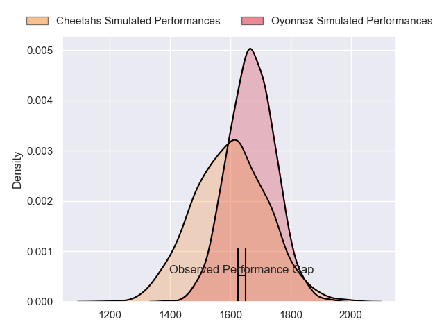
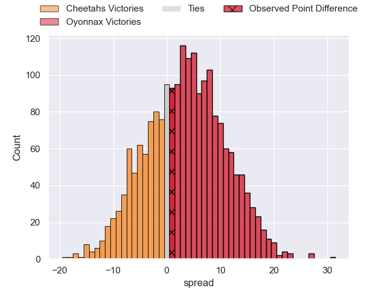
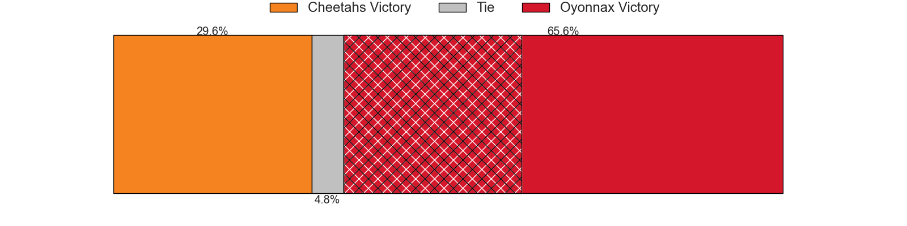
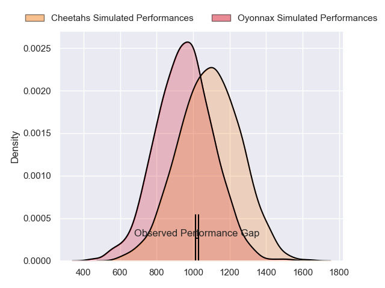
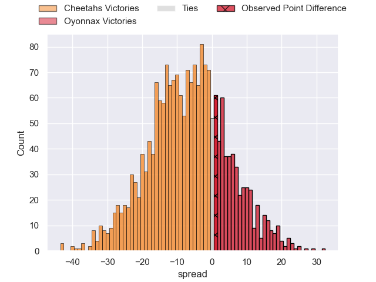
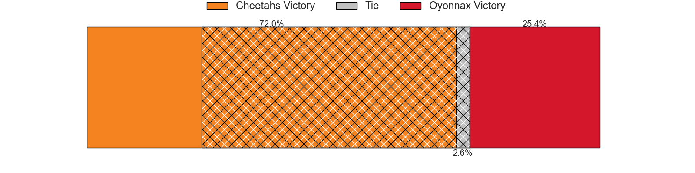
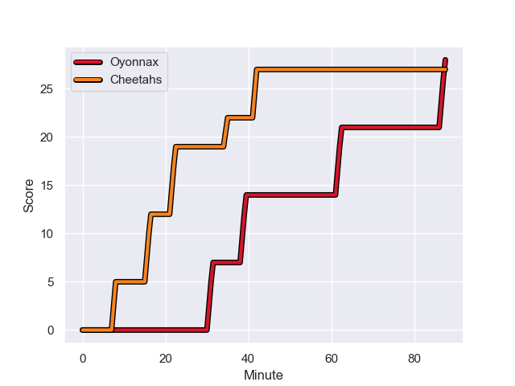
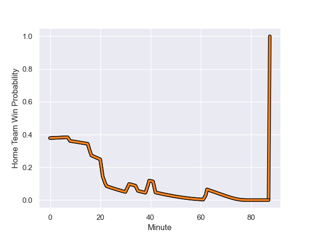

---  
layout: page  
title: Cheetahs at Oyonnax; 27-28  
date: 2024-01-20 18:00:00 -0500  
categories: "European Rugby Challenge Cup 2023" match review  
---
# Cheetahs at Oyonnax; 27-28

# Club Level Predictions

The first set of predictions treats a club as the smallest object, as the club develops its members, organizes a gameplan, and deploys its players as needed for each match. This club model has a prediction of 0.598, which translates to predicting Oyonnax to win by 3.7.

Our Over/Under is 43.5 - and combined with the spread above, we have a predicted scoreline of 20 to 24

Each club has a rating and a rating deviation (similar to a Glicko rating), and expected performances can be generated. This allows for simulated matches and spreads like the ones below.
## Projected Performances - Club Model

## Projected Spreads - Club Model

## Projected Results - Club Model

# Player Level Predictions - Version 2

Treating teams instead as an entity made up of the currently active players, I have ratings for each player in an altogether different system. These can be combined to form team ratings once teamsheets are announced, weighting starters a bit higher than the reserves. After the match is played, players can be weighted by their minutes on the field, allowing for an accurate measure of the team's composition. With these compiled team ratings, we can make predictions, measure inaccuracy, and update the individual player ratings.
## Prediction with Player Minutes: Cheetahs by 5.5

Cheetahs by 12.8 on a neutral field
## Prediction without Player Minutes: Cheetahs by 3.5

Cheetahs by 10.8 on a neutral pitch

## Projected Performances - Player Model

## Projected Spreads - Player Model

## Projected Results - Player Model

## Scores over Time

## Win Probability over Time

There were 11 large changes in win probability in this match

|   Away Minutes | Away Player              |   Away elo |   Number |   Home elo | Home Player          |   Home Minutes |
|---------------:|:-------------------------|-----------:|---------:|-----------:|:---------------------|---------------:|
|             47 | Schalk Ferreira          |      32.46 |        1 |      29.88 | Rory Sutherland      |             50 |
|             53 | Marnus van der Merwe     |      84.61 |        2 |      -7.72 | Manu Leiataua        |             58 |
|             36 | Aranos Coetzee           |      30.34 |        3 |      47.49 | Irakli Mirtskhulava  |             47 |
|              9 | Rynier Bernardo          |      70.73 |        4 |      49.77 | Ewan Thomas Johnson  |             80 |
|             80 | Victor Kutlwano Sekekete |      74.3  |        5 |      39.9  | Hugo Fabregue        |             51 |
|             73 | Gideon van der Merwe     |      86.23 |        6 |      67.23 | Filimo Taofifenua    |             58 |
|             80 | Friedle Olivier          |     106.72 |        7 |      21.09 | Hugo Hermet          |             80 |
|             64 | Jeandre Rudolph          |      47.46 |        8 |      27.99 | Loic Godener         |             80 |
|             80 | Ruan Pienaar             |     117.93 |        9 |      88.4  | Charlie Cassang      |             58 |
|             73 | George Lourens           |      51.04 |       10 |     110.7  | Domingo Miotti       |             47 |
|             80 | Munier Hartzenberg       |      92.47 |       11 |      70.73 | Joe Ravouvou         |             80 |
|             80 | Reinhardt Fortuin        |      95.85 |       12 |      89.51 | Lucas Mensa          |             80 |
|             80 | Evardi Boshoff           |       1.36 |       13 |      40.01 | Leo Treilles         |             80 |
|             80 | Daniel Kasende           |      94.45 |       14 |      62.39 | Daniel Ikpefan       |             80 |
|             69 | Tapiwa Lloyd Mafura      |      46.48 |       15 |      55.04 | Maxime Salles        |             21 |
|             40 | Alulutho Tshakweni       |      82.2  |       16 |      21.48 | Adrien Bordenave     |             37 |
|             34 | Louis van der Westhuizen |      73.91 |       17 |      45.69 | Julien Ratajczak     |             29 |
|             51 | Hencus van Wyk           |      55.37 |       18 |      40.67 | Thibault Berthaud    |             40 |
|             78 | Carl Wegner              |      30.15 |       19 |      34    | Steve Mafi           |             36 |
|             14 | Oupa Mohoje              |      66.32 |       20 |      45.45 | David Odiase         |             29 |
|             23 | Daniel Johannes Maartens |      75.35 |       21 |      18.47 | Ilan El Khattabi     |             29 |
|             18 | Rewan Kruger             |     102.28 |       22 |      72.26 | Jules Soulan         |             40 |
|             14 | Abner van Reenen         |      57.65 |       23 |      41.5  | Souleymane Coulibaly |             66 |

