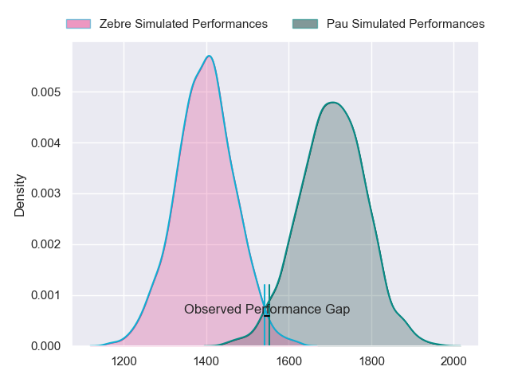
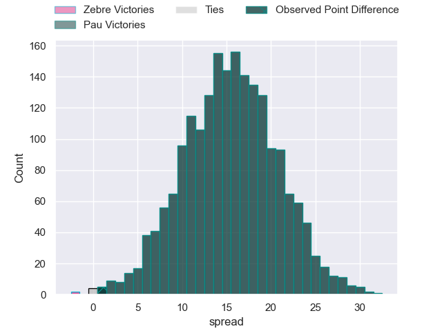
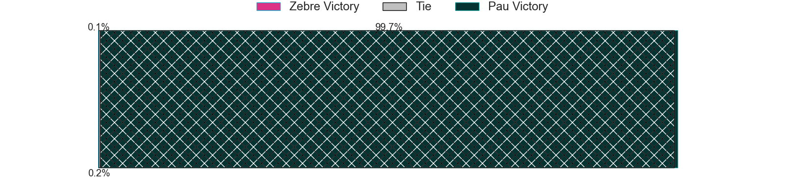
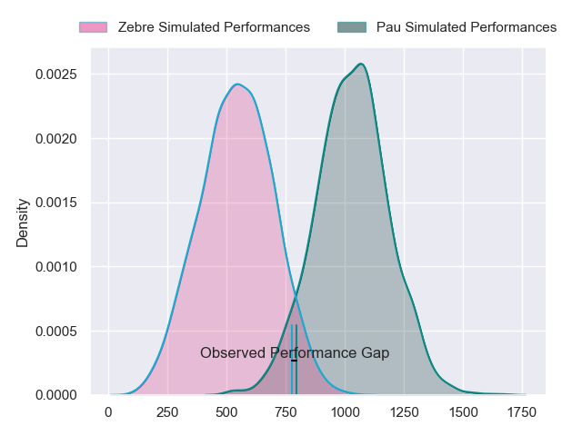
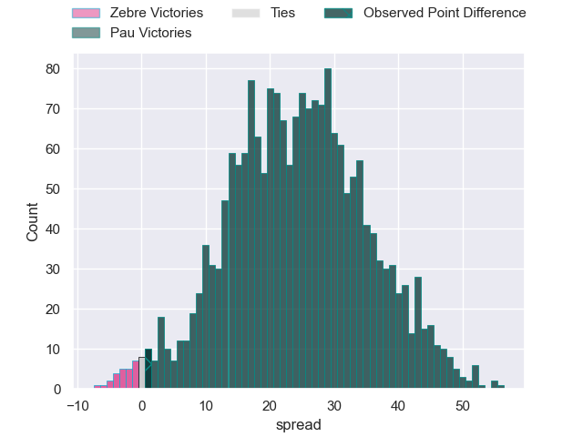
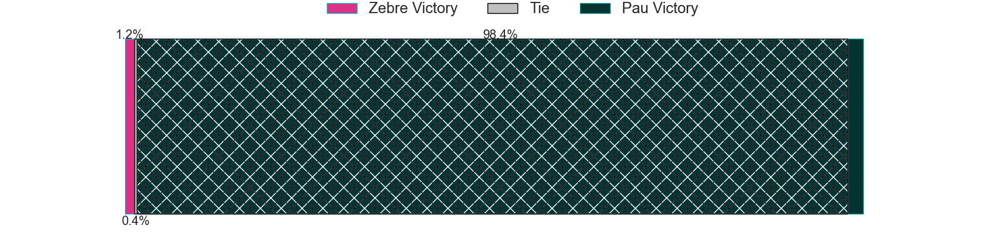
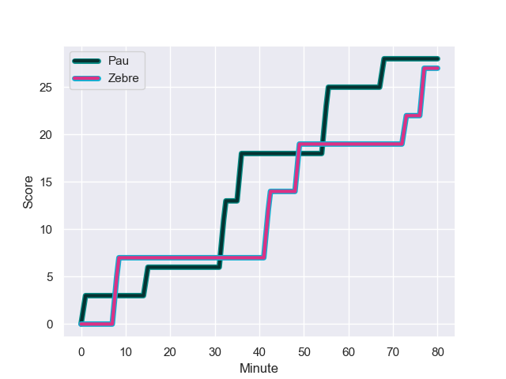
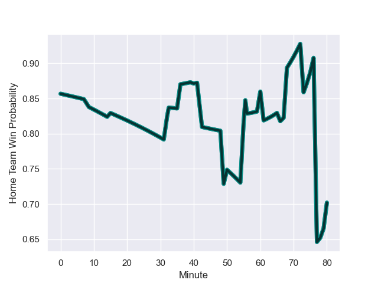

---  
layout: page  
title: Zebre at Pau; 27-28  
date: 2024-01-20 18:00:00 -0500  
categories: "European Rugby Challenge Cup 2023" match review  
---
# Zebre at Pau; 27-28

# Club Level Predictions

The first set of predictions treats a club as the smallest object, as the club develops its members, organizes a gameplan, and deploys its players as needed for each match. This club model has a prediction of 0.849, which translates to predicting Pau to win by 15.3.

Our Over/Under is 52.5 - and combined with the spread above, we have a predicted scoreline of 18 to 34

Each club has a rating and a rating deviation (similar to a Glicko rating), and expected performances can be generated. This allows for simulated matches and spreads like the ones below.
## Projected Performances - Club Model

## Projected Spreads - Club Model

## Projected Results - Club Model

# Player Level Predictions - Version 2

Treating teams instead as an entity made up of the currently active players, I have ratings for each player in an altogether different system. These can be combined to form team ratings once teamsheets are announced, weighting starters a bit higher than the reserves. After the match is played, players can be weighted by their minutes on the field, allowing for an accurate measure of the team's composition. With these compiled team ratings, we can make predictions, measure inaccuracy, and update the individual player ratings.
## Prediction with Player Minutes: Pau by 19.7

Pau by 11.8 on a neutral field
## Prediction without Player Minutes: Pau by 19.2

Pau by 11.4 on a neutral pitch

## Projected Performances - Player Model

## Projected Spreads - Player Model

## Projected Results - Player Model

## Scores over Time

## Win Probability over Time

There were 12 large changes in win probability in this match

|   Away Minutes | Away Player             |   Away elo |   Number |   Home elo | Home Player              |   Home Minutes |
|---------------:|:------------------------|-----------:|---------:|-----------:|:-------------------------|---------------:|
|             56 | Luca Rizzoli            |      30.64 |        1 |      30.43 | Facundo Gigena           |             40 |
|             61 | Marco Manfredi          |       8.92 |        2 |      31.16 | Romain Ruffenach         |             50 |
|             56 | Matteo Nocera           |      -3.52 |        3 |      14.5  | Nicolas Corato           |             50 |
|             61 | Leonard Krumov          |       3.82 |        4 |      14.59 | Guillaume Ducat          |             60 |
|             80 | Andrea Zambonin         |      34.67 |        5 |      79.37 | Fabrice Metz             |             80 |
|             80 | Guido Volpi             |      60.79 |        6 |      80.05 | Lekima Tagitagivalu      |             80 |
|             80 | Iacopo Bianchi          |      12.49 |        7 |      52.42 | Martin Puech             |             73 |
|             56 | Davide Ruggeri          |      37.27 |        8 |      46.65 | Paulo Tauiliili-Palesasa |             50 |
|             68 | Gonzalo Jesus Garcia    |      24.94 |        9 |     111.74 | Thibault Daubagna        |             66 |
|             61 | Giovanni Montemauri     |      -0.8  |       10 |     106.73 | Joe Simmonds             |             80 |
|             80 | Simone Gesi             |      11.35 |       11 |      78.78 | Aminiasi Tuimaba         |             80 |
|             80 | Enrico Lucchin          |      83.36 |       12 |      66.74 | Nathan Decron            |             80 |
|             80 | Luca Morisi             |     109.11 |       13 |       3.84 | Samuel Ezeala            |             76 |
|             60 | Pierre Bruno            |      44.51 |       14 |      51.87 | Thomas Carol             |             80 |
|             80 | Lorenzo Pani            |      23.67 |       15 |      30.69 | Théo Attissogbe          |             80 |
|             24 | Danilo Fischetti        |      53.3  |       16 |      21.26 | Guram Papidze            |             40 |
|             19 | Giampietro Ribaldi      |      32.54 |       17 |      29.6  | Lucas Rey                |             30 |
|             24 | Juan Manuel Pitinari    |      40.44 |       18 |      74.74 | Siate Tokolahi           |             30 |
|             19 | Matteo Canali           |      55.47 |       19 |     146.13 | Samuel Whitelock         |             20 |
|             24 | Bautista Stavile Bravin |      37.69 |       20 |      14.53 | Thibault Hamonou         |              7 |
|             12 | Thomas Dominguez        |      47.26 |       21 |      44.68 | Reece Hewat              |             30 |
|             19 | Geronimo Prisciantelli  |      88.49 |       22 |      46.06 | Thomas Souverbie         |             14 |
|             20 | Scott Gregory           |      68.8  |       23 |      36.69 | Axel Desperes            |              4 |

