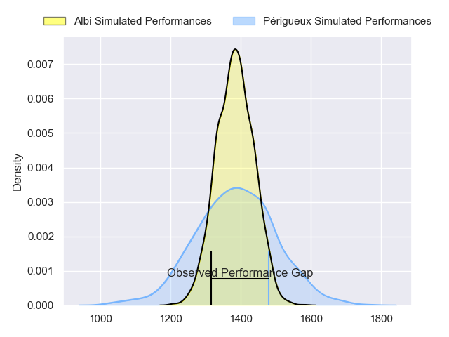
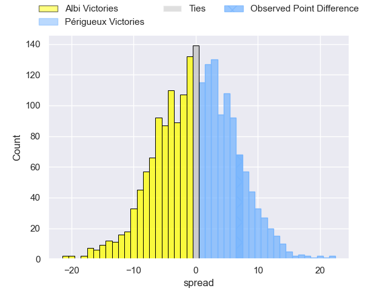
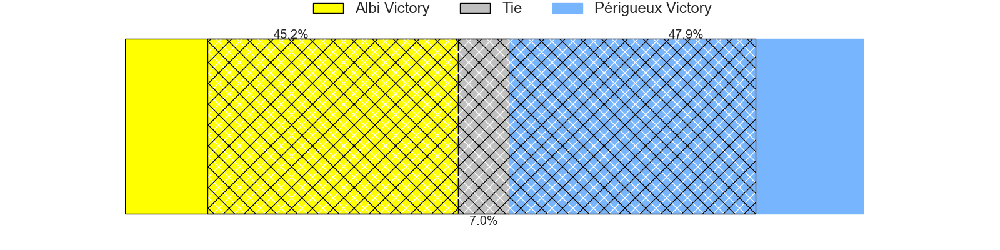
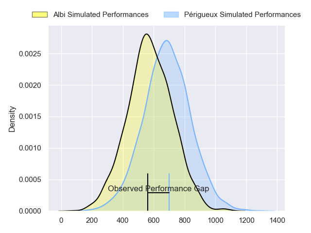
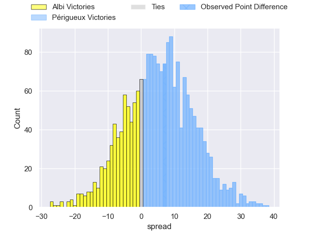
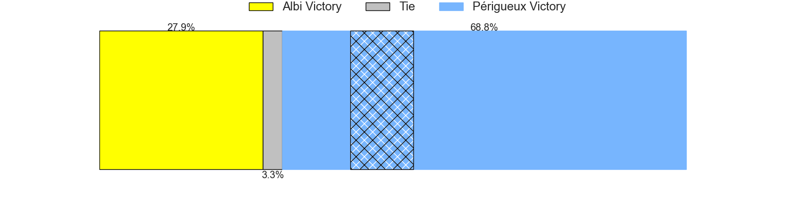
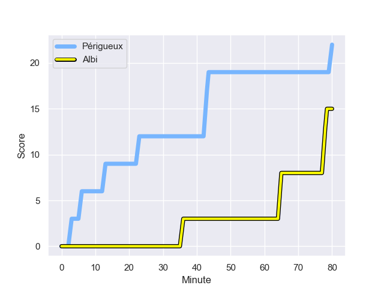
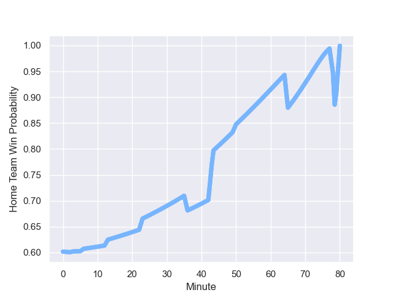

---  
layout: page  
title: Albi at Perigueux; 15-22  
date: 2024-01-20 18:00:00 -0500  
categories: "Nationale 2023" match review  
---
# Albi at Perigueux; 15-22

# Club Level Predictions

The first set of predictions treats a club as the smallest object, as the club develops its members, organizes a gameplan, and deploys its players as needed for each match. This club model has a prediction of 0.496, which translates to predicting Albi to win by 0.2.

Our Over/Under is 33.5 - and combined with the spread above, we have a predicted scoreline of 17 to 17

Each club has a rating and a rating deviation (similar to a Glicko rating), and expected performances can be generated. This allows for simulated matches and spreads like the ones below.
## Projected Performances - Club Model

## Projected Spreads - Club Model

## Projected Results - Club Model

# Player Level Predictions - Version 2

Treating teams instead as an entity made up of the currently active players, I have ratings for each player in an altogether different system. These can be combined to form team ratings once teamsheets are announced, weighting starters a bit higher than the reserves. After the match is played, players can be weighted by their minutes on the field, allowing for an accurate measure of the team's composition. With these compiled team ratings, we can make predictions, measure inaccuracy, and update the individual player ratings.
## Prediction with Player Minutes: Périgueux by 4.5

Périgueux by 1.3 on a neutral field
## Prediction without Player Minutes: Périgueux by 4.0

Périgueux by 0.7 on a neutral pitch

## Projected Performances - Player Model

## Projected Spreads - Player Model

## Projected Results - Player Model

## Scores over Time

## Win Probability over Time

There were 7 large changes in win probability in this match

|   Away Minutes | Away Player             |   Away elo |   Number |   Home elo | Home Player        |   Home Minutes |
|---------------:|:------------------------|-----------:|---------:|-----------:|:-------------------|---------------:|
|             50 | Thibaud Sebire          |      54.49 |        1 |      49.59 | Thomas Vidal       |             50 |
|             50 | Reinach Venter          |      23.67 |        2 |      47.95 | Lucas Marijon      |             50 |
|             50 | Dimitri Tchapnga        |      58.98 |        3 |      39.86 | Anthony Pelmard    |             50 |
|             50 | Mohsen Essid            |      59.15 |        4 |      22.57 | Madioke Konate     |             65 |
|             80 | Dion Evrard Oulai       |      14.14 |        5 |      18.72 | Jaco Willemse      |             50 |
|             80 | Vincent Calas           |      31.45 |        6 |      24.13 | Clement Lanen      |             80 |
|             80 | Pierre Roussel          |     -19.32 |        7 |      59.46 | Afaesetiti Amosa   |             80 |
|             50 | Sandrick Maciotta       |      79.87 |        8 |      38.97 | Karl Lambert       |             65 |
|             50 | Titouan Pouzoullic      |      48.76 |        9 |      42.27 | Matteo Bordenave   |             70 |
|             53 | James Haydn Tedder      |      17.62 |       10 |      31.13 | Yann Caillat       |             73 |
|             80 | Simon Hartmann          |      66.93 |       11 |      49.84 | Rory Scholes       |             80 |
|             80 | Jarrod Poi              |       8.95 |       12 |      60.48 | Fred Hickes        |             80 |
|             80 | Baptiste Couchinave     |      75.06 |       13 |      53.58 | Vincent Fouillade  |             80 |
|             65 | Charly Trussardi        |      41    |       14 |      32.98 | Paul Piveteau      |             80 |
|             80 | Téo Dospital            |       1.65 |       15 |      32.54 | Thibault Rabourdin |             80 |
|             30 | Antoine Soave           |      58.67 |       16 |      37.82 | Jason Tindiliere   |             30 |
|             30 | Romain Maurice          |      60.26 |       17 |      39.66 | Baptiste Arvouet   |             30 |
|             30 | Jean Baptiste De Clercq |      51.97 |       18 |      25.99 | Kalaveti Tawake    |             30 |
|             30 | Simon Meka              |      67.54 |       19 |      24.95 | Richard Fourcade   |             15 |
|             30 | Mattéo Coustalat        |      36.88 |       20 |      34.13 | Damien Lavergne    |             30 |
|             30 | Gilen Queheille         |      61.84 |       21 |      59.17 | Hendri Storm       |             15 |
|             27 | Benjamin Pehau          |      53.7  |       22 |      44.66 | Gaëtan Chapon      |             10 |
|             15 | Sean Robinson           |       3.7  |       23 |      47.59 | Greg Hutley        |              7 |

