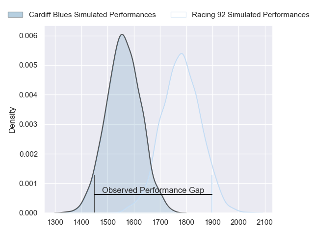
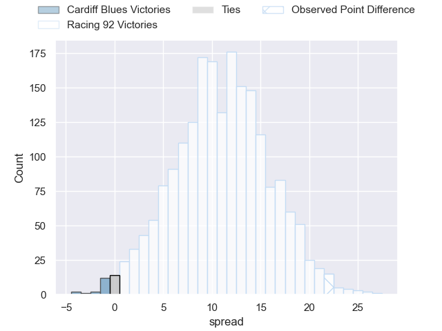
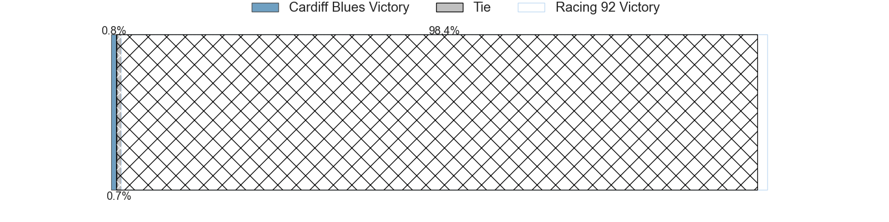
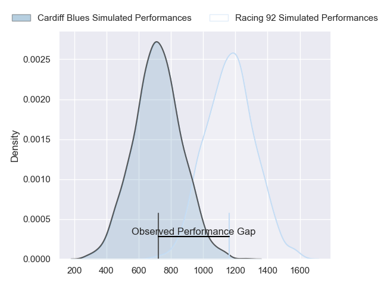
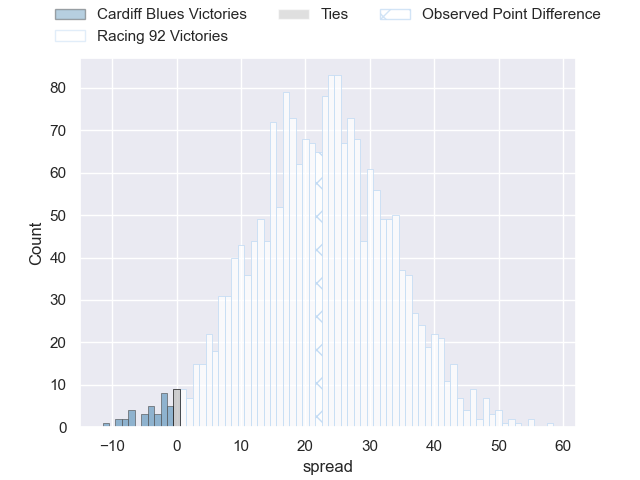
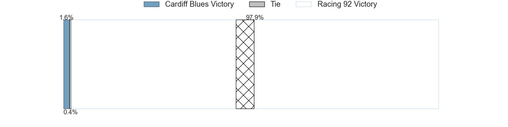
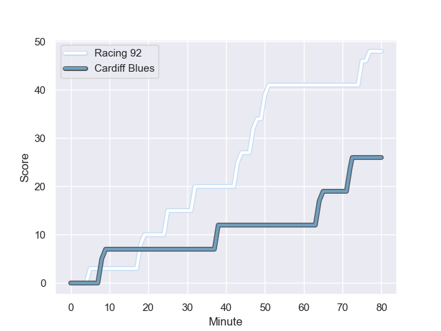
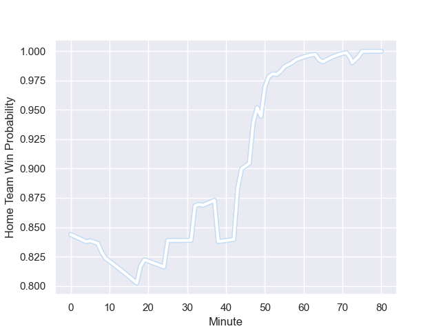

---  
layout: page  
title: Cardiff Blues at Racing 92; 26-48  
date: 2024-01-20 18:00:00 -0500  
categories: "European Rugby Champions Cup 2023" match review  
---
# Cardiff Blues at Racing 92; 26-48

# Club Level Predictions

The first set of predictions treats a club as the smallest object, as the club develops its members, organizes a gameplan, and deploys its players as needed for each match. This club model has a prediction of 0.778, which translates to predicting Racing 92 to win by 11.1.

Our Over/Under is 59.5 - and combined with the spread above, we have a predicted scoreline of 24 to 36

Each club has a rating and a rating deviation (similar to a Glicko rating), and expected performances can be generated. This allows for simulated matches and spreads like the ones below.
## Projected Performances - Club Model

## Projected Spreads - Club Model

## Projected Results - Club Model

# Player Level Predictions - Version 2

Treating teams instead as an entity made up of the currently active players, I have ratings for each player in an altogether different system. These can be combined to form team ratings once teamsheets are announced, weighting starters a bit higher than the reserves. After the match is played, players can be weighted by their minutes on the field, allowing for an accurate measure of the team's composition. With these compiled team ratings, we can make predictions, measure inaccuracy, and update the individual player ratings.
## Prediction with Player Minutes: Racing 92 by 18.5

Racing 92 by 11.2 on a neutral field
## Prediction without Player Minutes: Racing 92 by 19.5

Racing 92 by 12.1 on a neutral pitch

## Projected Performances - Player Model

## Projected Spreads - Player Model

## Projected Results - Player Model

## Scores over Time

## Win Probability over Time

There were 5 large changes in win probability in this match

|   Away Minutes | Away Player      |   Away elo |   Number |   Home elo | Home Player        |   Home Minutes |
|---------------:|:-----------------|-----------:|---------:|-----------:|:-------------------|---------------:|
|             71 | Rhys Carré       |      17.9  |        1 |      42.29 | Hassane Kolingar   |             55 |
|             63 | Efan Daniel      |      45.18 |        2 |     108.85 | Camille Chat       |             63 |
|             55 | Keiron Assiratti |      40.55 |        3 |      51.57 | Trevor Nyakane     |             61 |
|             55 | Teddy Williams   |      27.61 |        4 |      68.02 | Cameron Woki       |             55 |
|             80 | Rory Thornton    |      14.27 |        5 |      39.73 | Will Rowlands      |             80 |
|             53 | Alex Mann        |      40.02 |        6 |      31.27 | Ibrahim Diallo     |             80 |
|             80 | Ellis Jenkins    |      46.65 |        7 |     108.39 | Siya Kolisi        |             80 |
|             34 | Mackenzie Martin |      40.38 |        8 |      92.67 | Kitione Kamikamica |             49 |
|             65 | Tomos Williams   |      69.82 |        9 |      71.37 | Nolann Le Garrec   |             49 |
|             80 | Tinus de Beer    |      39.29 |       10 |      94.05 | Antoine Gibert     |             80 |
|             58 | Mason Grady      |      79.43 |       11 |      46.65 | Juan Imhoff        |             80 |
|             80 | Ben Thomas       |      61.82 |       12 |      46.15 | Inia Tabuavou      |             71 |
|             80 | Rey Lee-Lo       |     109.98 |       13 |      97.53 | Gael Fickou        |             58 |
|             80 | Aled Summerhill  |      46.65 |       14 |      46.65 | Christian Wade     |             80 |
|             80 | Jacob Beetham    |      44.33 |       15 |      87.38 | Tristan Tedder     |             80 |
|             17 | Dafydd Hughes    |      46.65 |       16 |      46.65 | Janick Tarrit      |             17 |
|              9 | Rhys Barratt     |      46.65 |       17 |     103.3  | Eddy Ben Arous     |             25 |
|             25 | Rhys Litterick   |      46.65 |       18 |      46.65 | Gia Kharaishvili   |             19 |
|             25 | Seb Davies       |      15.15 |       19 |      46.65 | Fabien Sanconnie   |             25 |
|             46 | Lopeti Timani    |      46.65 |       20 |      42.03 | Maxime Baudonne    |             31 |
|             27 | Thomas Young     |      88.03 |       21 |      46.65 | Clovis Le Bail     |             31 |
|             15 | Ellis Bevan      |      45.98 |       22 |      46.65 | Olivier Klemenczak |             22 |
|             22 | Owen Lane        |     -12.33 |       23 |      46.65 | Donovan Taofifenua |              9 |

