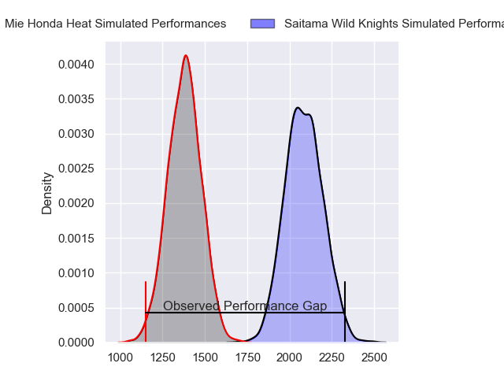
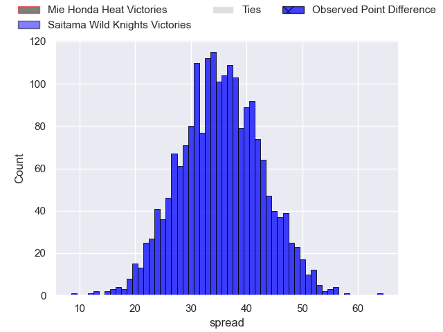
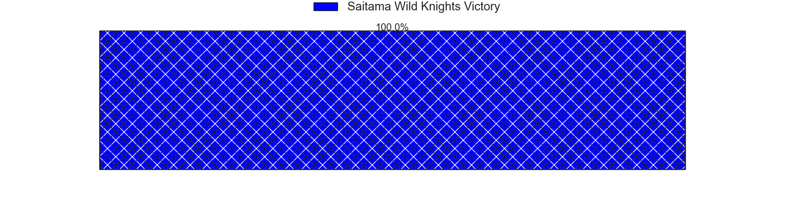
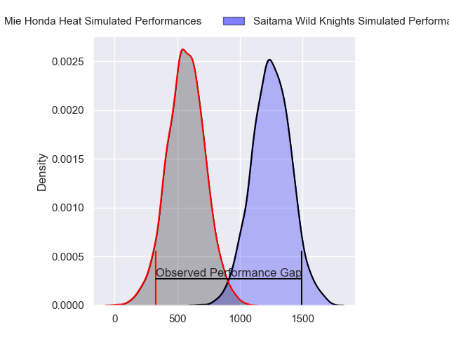
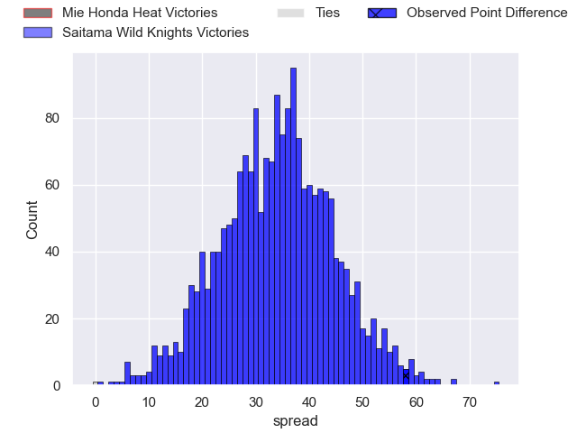
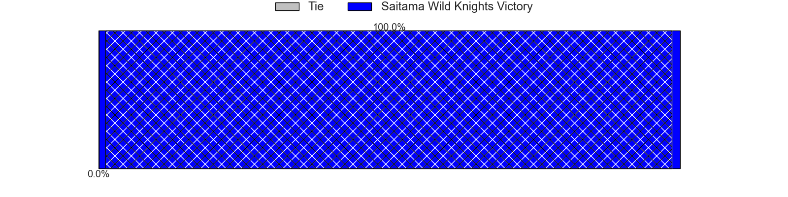
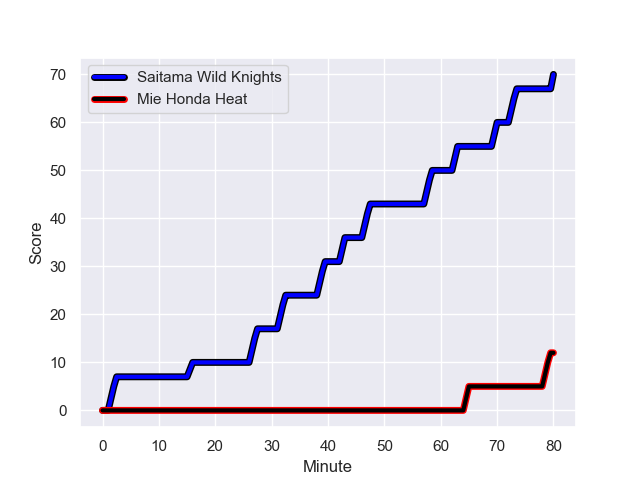
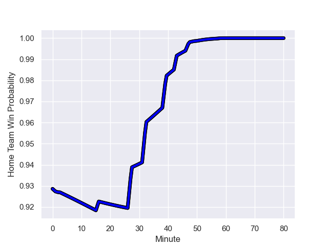

---  
layout: page  
title: Mie Honda Heat at Saitama Wild Knights; 12-70  
date: 2024-01-20 18:00:00 -0500  
categories: "Japan Rugby League One 2023" match review  
---
# Mie Honda Heat at Saitama Wild Knights; 12-70

# Club Level Predictions

The first set of predictions treats a club as the smallest object, as the club develops its members, organizes a gameplan, and deploys its players as needed for each match. This club model has a prediction of 0.98, which translates to predicting Saitama Wild Knights to win by 35.4.

Our Over/Under is 57.5 - and combined with the spread above, we have a predicted scoreline of 11 to 46

Each club has a rating and a rating deviation (similar to a Glicko rating), and expected performances can be generated. This allows for simulated matches and spreads like the ones below.
## Projected Performances - Club Model

## Projected Spreads - Club Model

## Projected Results - Club Model

# Player Level Predictions - Version 2

Treating teams instead as an entity made up of the currently active players, I have ratings for each player in an altogether different system. These can be combined to form team ratings once teamsheets are announced, weighting starters a bit higher than the reserves. After the match is played, players can be weighted by their minutes on the field, allowing for an accurate measure of the team's composition. With these compiled team ratings, we can make predictions, measure inaccuracy, and update the individual player ratings.
## Prediction with Player Minutes: Saitama Wild Knights by 28.2

Saitama Wild Knights by 24.4 on a neutral field
## Prediction without Player Minutes: Saitama Wild Knights by 28.4

Saitama Wild Knights by 24.6 on a neutral pitch

## Projected Performances - Player Model

## Projected Spreads - Player Model

## Projected Results - Player Model

## Scores over Time

## Win Probability over Time

|   Away Minutes | Away Player          |   Away elo |   Number |   Home elo | Home Player       |   Home Minutes |
|---------------:|:---------------------|-----------:|---------:|-----------:|:------------------|---------------:|
|             50 | Tatsuhiko Tsurukawa  |      15.51 |        1 |      41.37 | Daniel Perez      |             60 |
|             50 | Lee Seung Hyok       |      17.84 |        2 |      70.92 | Kazuma Shimane    |             60 |
|             50 | Taiki Yoshioka       |      35.21 |        3 |      57.3  | Taiki Fujii       |             50 |
|             72 | Ryota Kobayashi      |      13.84 |        4 |      67.3  | Esei Ha'angana    |             60 |
|             80 | Franco Mostert       |     108.13 |        5 |      65.88 | Lood de Jager     |             60 |
|             62 | Waimana Kapa         |      50.34 |        6 |      55    | Shota Fukui       |             80 |
|             80 | Ryo Furuta           |      -1.31 |        7 |      89.05 | Lachlan Boshier   |             80 |
|             80 | Viliami Afu Kaipouli |      16.43 |        8 |      93.63 | Jack Cornelsen    |             80 |
|             50 | Shogo Nezuka         |      38.48 |        9 |     159.41 | Keisuke Uchida    |             80 |
|             62 | Gwangtee Oh          |      42.26 |       10 |     121.99 | Rikiya Matsuda    |             60 |
|             50 | Dawid Kellerman      |      29.74 |       11 |     118.19 | Ryuji Noguchi     |             60 |
|             80 | Fraser Quirk         |      19.74 |       12 |      26.06 | Vince Aso         |             67 |
|             80 | Clinton Knox         |      30.48 |       13 |     125.31 | Dylan Riley       |             80 |
|             80 | Haruhiko Uemura      |      45.36 |       14 |      19.77 | Tomoki Osada      |             80 |
|             80 | Tom Banks            |      77.22 |       15 |      47.95 | Kyohei Yamasawa   |             80 |
|             30 | Kanato Hirano        |      42.91 |       16 |      93.71 | Shohei Hirano     |             30 |
|             30 | Koki Hida            |      44.77 |       17 |      51.55 | Craig Millar      |             20 |
|             30 | Matthys Basson       |      31.69 |       18 |      77.73 | Shota Horie       |             20 |
|             30 | Taichi Takenaka      |      34.05 |       19 |      88.36 | Itsuki Onishi     |             20 |
|             30 | Kanta Watanabe       |      45    |       20 |      93.11 | Marika Koroibete  |             20 |
|             18 | Kosuke Hattori       |      51.35 |       21 |      72.53 | Damian de Allende |             20 |
|             18 | Mitch Hunt           |      70.77 |       22 |      17.34 | Mark Abbott       |             20 |
|              8 | Yoji Akiyama         |      32.59 |       23 |      85.89 | Taiki Koyama      |             13 |

