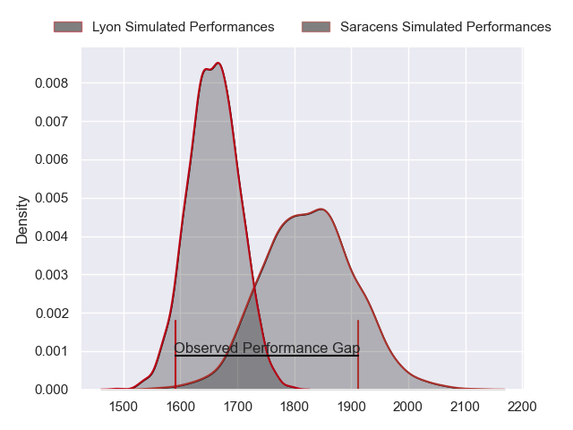
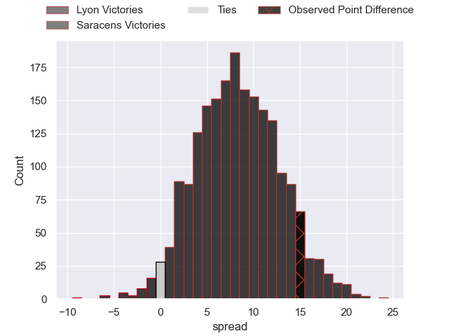
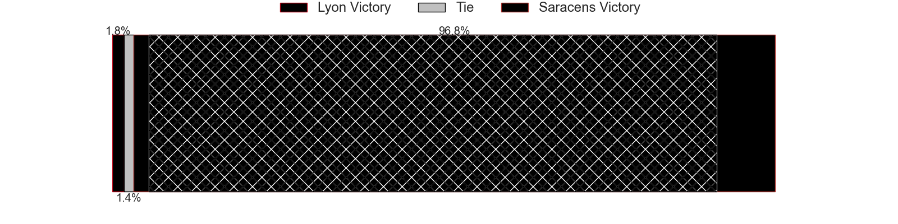
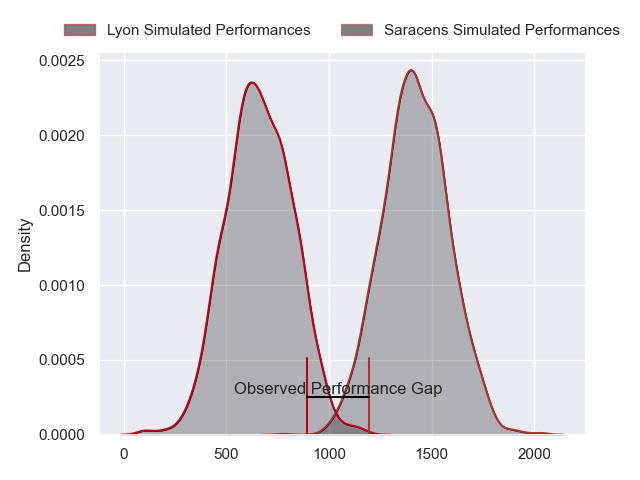
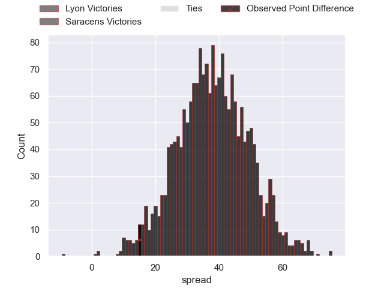
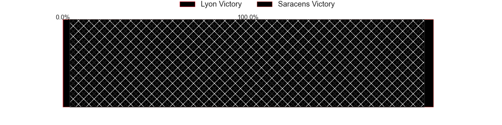
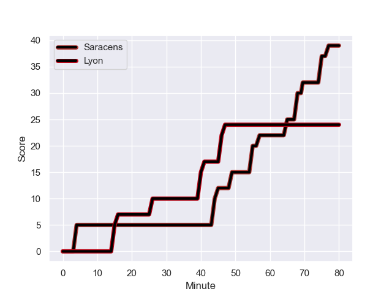
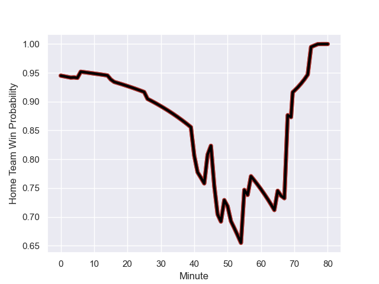

---  
layout: page  
title: Lyon at Saracens; 24-39  
date: 2024-01-20 18:00:00 -0500  
categories: "European Rugby Champions Cup 2023" match review  
---
# Lyon at Saracens; 24-39

# Club Level Predictions

The first set of predictions treats a club as the smallest object, as the club develops its members, organizes a gameplan, and deploys its players as needed for each match. This club model has a prediction of 0.724, which translates to predicting Saracens to win by 8.5.

Our Over/Under is 54.5 - and combined with the spread above, we have a predicted scoreline of 23 to 31

Each club has a rating and a rating deviation (similar to a Glicko rating), and expected performances can be generated. This allows for simulated matches and spreads like the ones below.
## Projected Performances - Club Model

## Projected Spreads - Club Model

## Projected Results - Club Model

# Player Level Predictions - Version 2

Treating teams instead as an entity made up of the currently active players, I have ratings for each player in an altogether different system. These can be combined to form team ratings once teamsheets are announced, weighting starters a bit higher than the reserves. After the match is played, players can be weighted by their minutes on the field, allowing for an accurate measure of the team's composition. With these compiled team ratings, we can make predictions, measure inaccuracy, and update the individual player ratings.
## Prediction with Player Minutes: Saracens by 31.4

Saracens by 24.3 on a neutral field
## Prediction without Player Minutes: Saracens by 29.0

Saracens by 21.9 on a neutral pitch

## Projected Performances - Player Model

## Projected Spreads - Player Model

## Projected Results - Player Model

## Scores over Time

## Win Probability over Time

There were 13 large changes in win probability in this match

|   Away Minutes | Away Player          |   Away elo |   Number |   Home elo | Home Player          |   Home Minutes |
|---------------:|:---------------------|-----------:|---------:|-----------:|:---------------------|---------------:|
|             51 | Jerome Rey           |      14.3  |        1 |     104.71 | Logovi'i Mulipola    |             47 |
|             47 | Yanis Charcosset     |      47.25 |        2 |      54.99 | Theo Dan             |             77 |
|             66 | Paulo Tafili         |      32.23 |        3 |      57.74 | Christian Judge      |             47 |
|             80 | Joel Kpoku           |      44.53 |        4 |     126.88 | Maro Itoje           |             80 |
|             54 | Ugo Vignolles        |      46.91 |        5 |      80.67 | Nick Isiekwe         |             69 |
|             80 | Marvin Okuya         |      43.93 |        6 |      93.92 | Juan Martin Gonzalez |             80 |
|             60 | Theo William         |      46.65 |        7 |     105.1  | Ben Earl             |             80 |
|             80 | Maxime Gouzou        |      41.19 |        8 |     140.94 | Billy Vunipola       |             65 |
|             70 | Liam Rimet           |      46.65 |        9 |      71.62 | Ivan van Zyl         |             65 |
|             68 | Leo Berdeu           |      72.7  |       10 |     130.54 | Owen Farrell         |             80 |
|             80 | Davit Niniashvili    |      46.65 |       11 |      43.65 | Lucio Cinti          |             80 |
|             80 | Josiah Maraku        |      27.38 |       12 |     100.97 | Nick Tompkins        |             77 |
|             80 | Alfred Parisien      |      46.82 |       13 |      80.85 | Elliot Daly          |             80 |
|              6 | Monty Ioane          |      98.98 |       14 |      42.01 | Rotimi Segun         |             80 |
|             80 | Alexandre Tchaptchet |      47.43 |       15 |      63.22 | Alex Goode           |             77 |
|             33 | Liam Coltman         |      46.65 |       16 |      46.65 | James Hadfield       |              3 |
|             29 | Sebastien Taofifenua |      46.65 |       17 |      47.76 | Sam Crean            |             33 |
|             14 | Vivien Devisme       |      46.65 |       18 |      94.5  | Oli Hoskins          |             33 |
|             20 | Loann Goujon         |      46.65 |       19 |      41.21 | Hugh Tizard          |             11 |
|             26 | Felix Lambey         |      46.65 |       20 |      27.77 | Toby Knight          |             15 |
|             10 | Paul Dumas           |      46.65 |       21 |      31.03 | Gareth Simpson       |             15 |
|             74 | Kyle Godwin          |      46.65 |       22 |      20.19 | Olly Hartley         |              3 |
|             12 | Fletcher Smith       |      46.65 |       23 |     105.41 | Tom Parton           |              3 |

