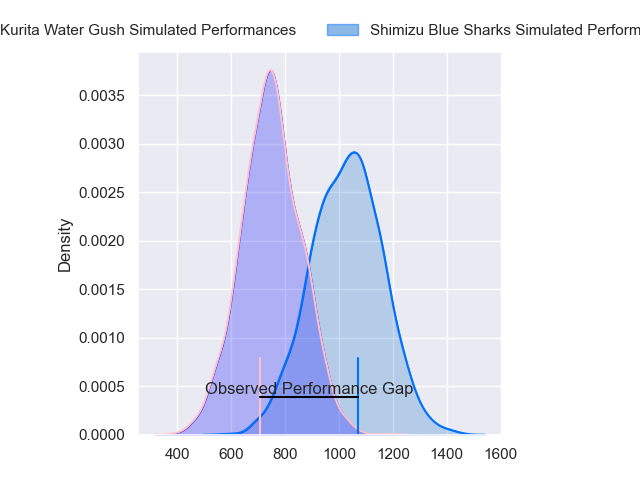
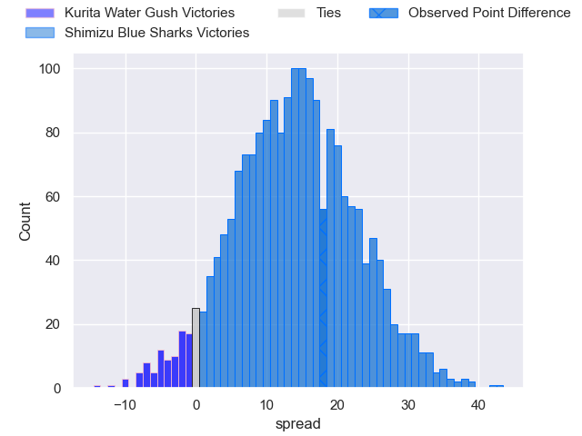
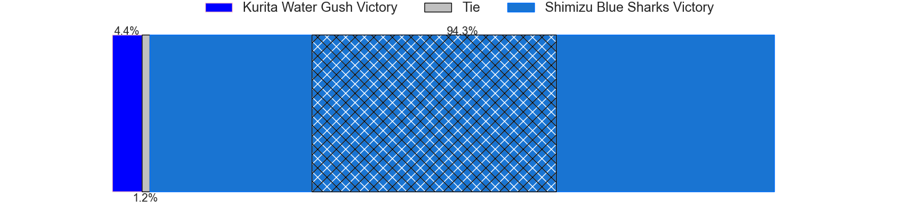
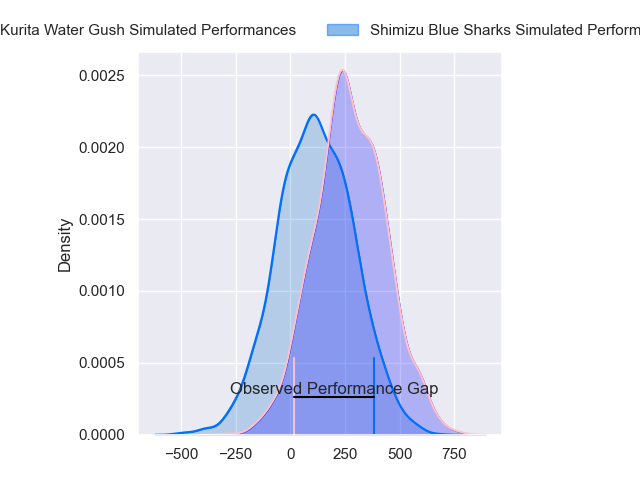
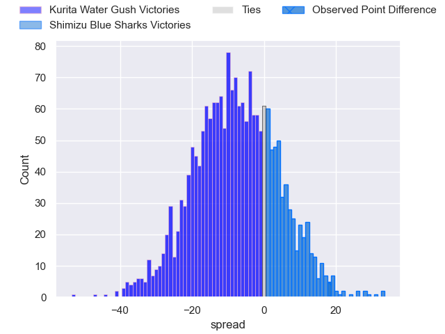
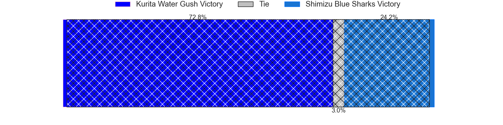
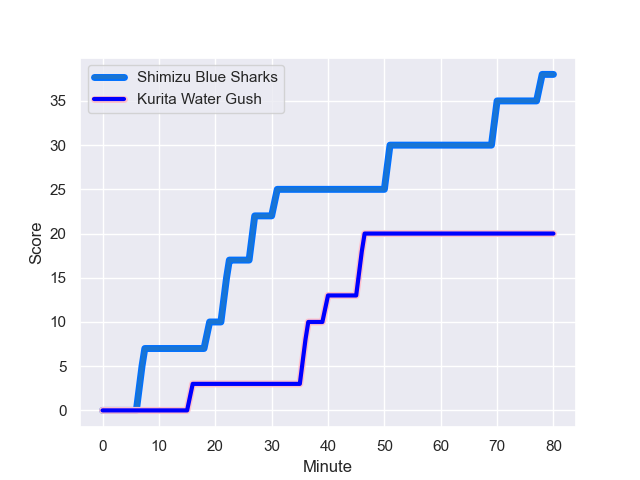
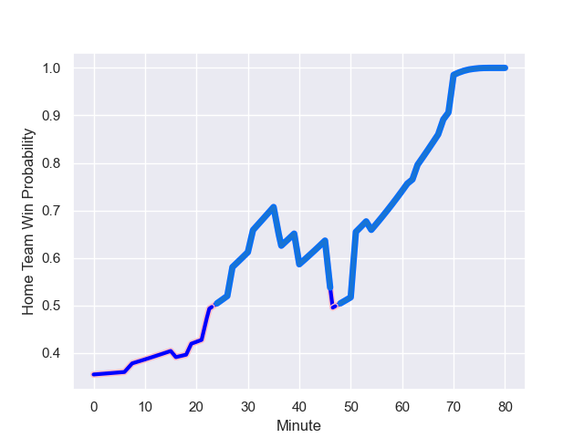

---  
layout: page  
title: Kurita Water Gush at Shimizu Blue Sharks; 20-38  
date: 2024-01-20 18:00:00 -0500  
categories: "Japan Rugby League One D3 2023" match review  
---
# Kurita Water Gush at Shimizu Blue Sharks; 20-38

# Club Level Predictions

The first set of predictions treats a club as the smallest object, as the club develops its members, organizes a gameplan, and deploys its players as needed for each match. This club model has a prediction of 0.822, which translates to predicting Shimizu Blue Sharks to win by 14.1.

Our Over/Under is 56.5 - and combined with the spread above, we have a predicted scoreline of 21 to 35

Each club has a rating and a rating deviation (similar to a Glicko rating), and expected performances can be generated. This allows for simulated matches and spreads like the ones below.
## Projected Performances - Club Model

## Projected Spreads - Club Model

## Projected Results - Club Model

# Player Level Predictions - Version 2

Treating teams instead as an entity made up of the currently active players, I have ratings for each player in an altogether different system. These can be combined to form team ratings once teamsheets are announced, weighting starters a bit higher than the reserves. After the match is played, players can be weighted by their minutes on the field, allowing for an accurate measure of the team's composition. With these compiled team ratings, we can make predictions, measure inaccuracy, and update the individual player ratings.
## Prediction with Player Minutes: Kurita Water Gush by 6.6

Kurita Water Gush by 9.8 on a neutral field
## Prediction without Player Minutes: Kurita Water Gush by 4.5

Kurita Water Gush by 7.7 on a neutral pitch

## Projected Performances - Player Model

## Projected Spreads - Player Model

## Projected Results - Player Model

## Scores over Time

## Win Probability over Time

There were 11 large changes in win probability in this match

|   Away Minutes | Away Player          |   Away elo |   Number |   Home elo | Home Player        |   Home Minutes |
|---------------:|:---------------------|-----------:|---------:|-----------:|:-------------------|---------------:|
|             68 | Kei Shibuya          |      39.87 |        1 |       6.85 | Takatoshi Sugawara |             75 |
|             74 | Ryota Kuribara       |      -1.97 |        2 |      15.61 | Naomichi Tatekawa  |             62 |
|             70 | Kuriyama Rui         |      18.33 |        3 |      10.34 | Ryota Saitou       |             68 |
|             80 | Kota Nakamura        |     -13.96 |        4 |      35.52 | Koudai Takahashi   |             80 |
|             68 | Daymon Leasuasu      |     -41.99 |        5 |      26.46 | Tom Rowe           |             76 |
|             54 | Kengo Nakamura       |      15.24 |        6 |     -38.4  | Yutaro Shirako     |             80 |
|             80 | Yosuke Ishii         |     -11.83 |        7 |      14.05 | Haruki Matsudo     |             79 |
|             63 | Tebita Oto           |      57.32 |        8 |     -43.07 | Murphy Taramai     |             80 |
|             62 | Sho Nakamura         |      26.93 |        9 |      38.24 | Kayne Hammington   |             79 |
|             40 | Takuro Hayashida     |      14.48 |       10 |      -1.7  | Coenie van Wyk     |             80 |
|             80 | Hosea Saumaki        |      27.48 |       11 |      42.01 | Toru Kanazawa      |             80 |
|             80 | Jamie Vakalahi       |      44.34 |       12 |     -17.54 | Orbyn Leger        |             80 |
|             80 | Ayato Sakamoto       |     -28.19 |       13 |     -48.65 | Naoki Moriya       |             80 |
|             80 | Tumanawa Tawhai      |      43.87 |       14 |       7.33 | Ryota Noda         |             72 |
|             80 | Koshi Emoto          |      51.66 |       15 |     -20.62 | Tatsuhiro Ozaki    |             80 |
|             40 | Piers Francis        |      46.21 |       16 |      20.84 | Kaito Tamori       |             18 |
|             26 | Teariki Ben-Nicholas |      67.15 |       17 |      46.48 | Uha Lee            |             12 |
|             18 | Kakeru Sugihara      |      48.46 |       18 |      46.66 | Masaya Yamada      |              8 |
|             17 | Mitsuo Nakao         |      17.57 |       19 |      41.9  | Fumiyake Mato      |              5 |
|             12 | Shoya Koyama         |       4.87 |       20 |       4.26 | Suguru Hidaka      |              4 |
|             12 | Mike Williams        |       6.73 |       21 |      23.64 | Ryo Sato           |              1 |
|             10 | Masachi Debuchi      |      12.42 |       22 |      40.25 | Reijiro Usui       |              1 |
|              6 | Jun Kaneko           |      48.51 |       23 |     nan    | nan                |            nan |

