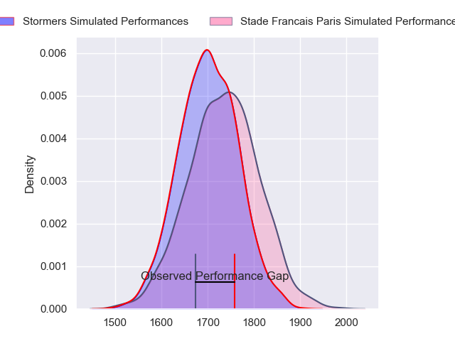
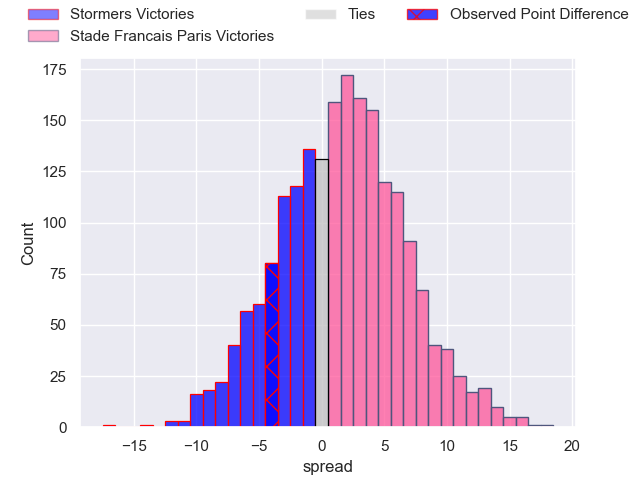
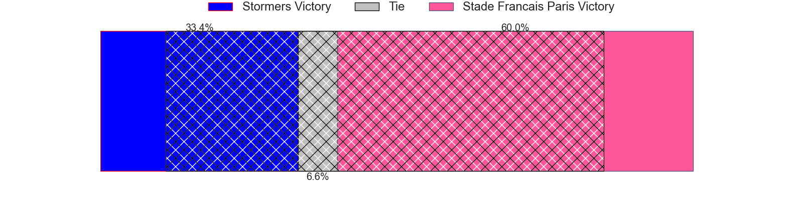
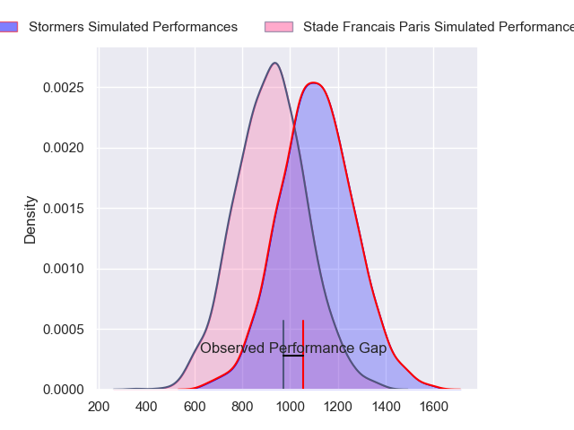
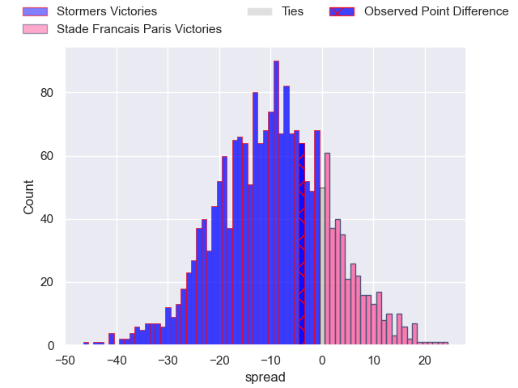
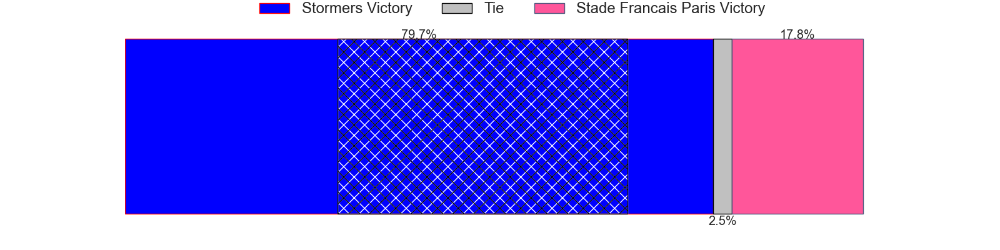
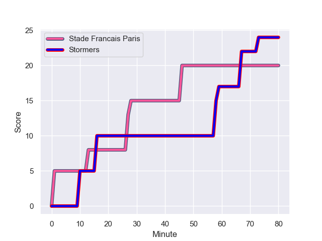
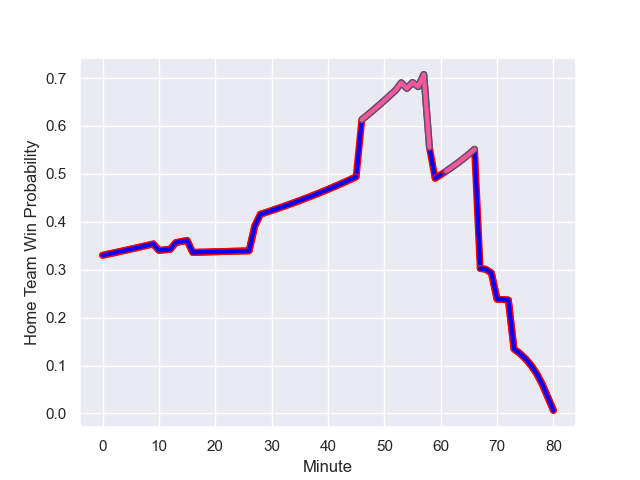

---  
layout: page  
title: Stormers at Stade Francais Paris; 24-20  
date: 2024-01-20 18:00:00 -0500  
categories: "European Rugby Champions Cup 2023" match review  
---
# Stormers at Stade Francais Paris; 24-20

# Club Level Predictions

The first set of predictions treats a club as the smallest object, as the club develops its members, organizes a gameplan, and deploys its players as needed for each match. This club model has a prediction of 0.55, which translates to predicting Stade Francais Paris to win by 1.8.

Our Over/Under is 53.5 - and combined with the spread above, we have a predicted scoreline of 26 to 28

Each club has a rating and a rating deviation (similar to a Glicko rating), and expected performances can be generated. This allows for simulated matches and spreads like the ones below.
## Projected Performances - Club Model

## Projected Spreads - Club Model

## Projected Results - Club Model

# Player Level Predictions - Version 2

Treating teams instead as an entity made up of the currently active players, I have ratings for each player in an altogether different system. These can be combined to form team ratings once teamsheets are announced, weighting starters a bit higher than the reserves. After the match is played, players can be weighted by their minutes on the field, allowing for an accurate measure of the team's composition. With these compiled team ratings, we can make predictions, measure inaccuracy, and update the individual player ratings.
## Prediction with Player Minutes: Stormers by 7.8

Stormers by 16.0 on a neutral field
## Prediction without Player Minutes: Stormers by 6.6

Stormers by 14.8 on a neutral pitch

## Projected Performances - Player Model

## Projected Spreads - Player Model

## Projected Results - Player Model

## Scores over Time

## Win Probability over Time

There were 10 large changes in win probability in this match

|   Away Minutes | Away Player          |   Away elo |   Number |   Home elo | Home Player             |   Home Minutes |
|---------------:|:---------------------|-----------:|---------:|-----------:|:------------------------|---------------:|
|             54 | Sti Sithole          |      44.92 |        1 |      37.89 | Clement Castets         |             69 |
|             53 | Joseph Dweba         |      49.6  |        2 |      43.72 | Lucas Peyresblanques    |             56 |
|             70 | Neethling Fouche     |      54.97 |        3 |      77.18 | Francisco Gomez Kodela  |             65 |
|             54 | Adre Smith           |      80.43 |        4 |      44.83 | Paul Gabrillagues       |             70 |
|             80 | Ruben van Heerden    |      51.01 |        5 |      46    | Pierre-Henri Azagoh     |             56 |
|             80 | Deon Fourie          |      67.16 |        6 |      24.23 | Mathieu Hirigoyen       |             57 |
|             54 | Willie Engelbrecht   |      46.65 |        7 |      46.65 | Andy Timo               |             65 |
|             54 | Keketso Morabe       |      48.77 |        8 |      92.99 | Giovanni Habel-Kueffner |             71 |
|             70 | Herschel Jantjies    |     102.64 |        9 |      46.65 | Rory Kockott            |             73 |
|             80 | Manie Libbok         |      77.95 |       10 |      45.08 | Joris Segonds           |             80 |
|             80 | Ben Loader           |      46.65 |       11 |      46.65 | Mathis Ibo              |             67 |
|             80 | Damian Willemse      |     137.47 |       12 |      46.65 | Lester Etien            |             80 |
|             80 | Daniel du Plessis    |     106.31 |       13 |      46.27 | Stephane Ahmed          |             80 |
|             54 | Angelo Davids        |      46.65 |       14 |      46.42 | Peniasi Dakuwaqa        |             80 |
|             80 | Warrick Gelant       |     133.94 |       15 |      46.65 | Leo Monin               |             53 |
|             27 | Andre-Hugo Venter    |      42.02 |       16 |      46.65 | Mickael Ivaldi          |             24 |
|             26 | Kwenzo Blose         |      46.65 |       17 |      24.21 | Vasil Kakovin           |             24 |
|             10 | Brok Harris          |     121.21 |       18 |      47.14 | Hugo Ndiaye             |             24 |
|             26 | Hendre Stassen       |      46.65 |       19 |      46.65 | Romain Briatte          |             23 |
|             26 | Ben-Jason Dixon      |      49.55 |       20 |      46.65 | Sekou Macalou           |             15 |
|             26 | Hacjivah Dayimani    |     118.16 |       21 |      19.76 | Jules Gimbert           |              7 |
|             10 | Stefan Ungerer       |      46.65 |       22 |      46.65 | Tanginoa Halaifonua     |             24 |
|             26 | Suleiman Hartzenberg |      47.47 |       23 |      46.65 | Leo Barre               |             27 |

