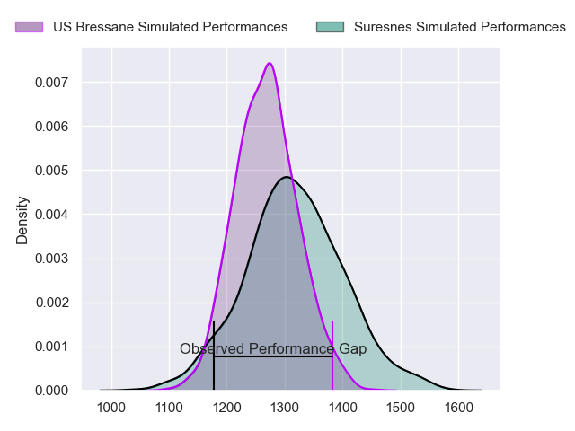
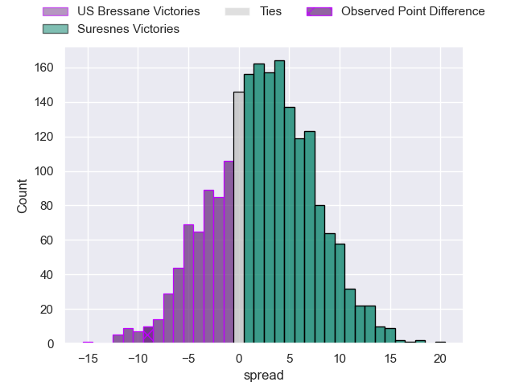
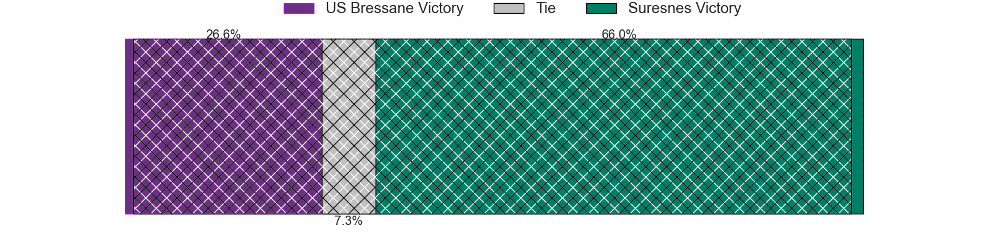
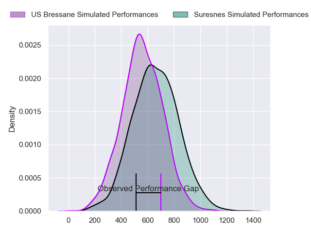
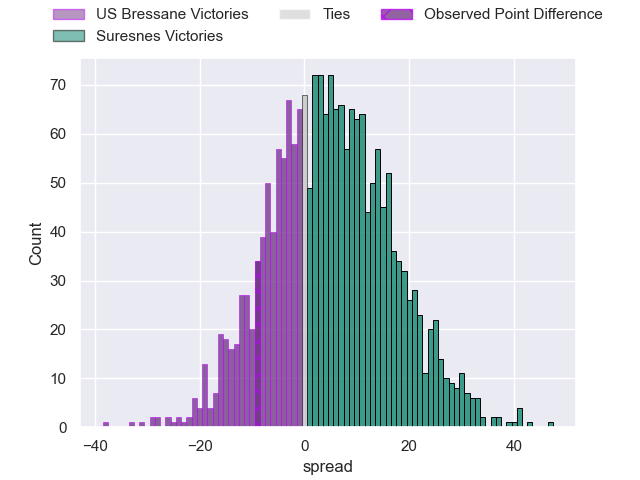
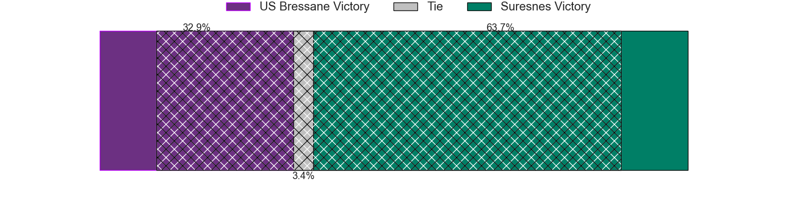
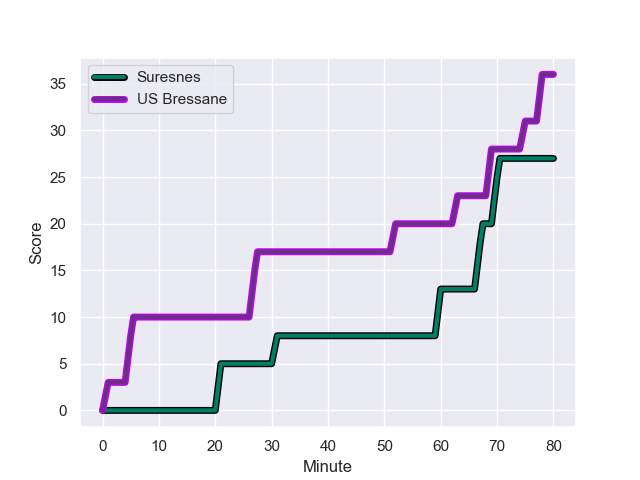
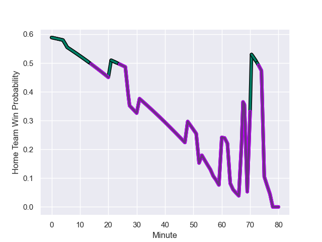

---  
layout: page  
title: US Bressane at Suresnes; 36-27  
date: 2024-01-20 18:00:00 -0500  
categories: "Nationale 2023" match review  
---
# US Bressane at Suresnes; 36-27

# Club Level Predictions

The first set of predictions treats a club as the smallest object, as the club develops its members, organizes a gameplan, and deploys its players as needed for each match. This club model has a prediction of 0.569, which translates to predicting Suresnes to win by 2.4.

Our Over/Under is 38.5 - and combined with the spread above, we have a predicted scoreline of 18 to 21

Each club has a rating and a rating deviation (similar to a Glicko rating), and expected performances can be generated. This allows for simulated matches and spreads like the ones below.
## Projected Performances - Club Model

## Projected Spreads - Club Model

## Projected Results - Club Model

# Player Level Predictions - Version 2

Treating teams instead as an entity made up of the currently active players, I have ratings for each player in an altogether different system. These can be combined to form team ratings once teamsheets are announced, weighting starters a bit higher than the reserves. After the match is played, players can be weighted by their minutes on the field, allowing for an accurate measure of the team's composition. With these compiled team ratings, we can make predictions, measure inaccuracy, and update the individual player ratings.
## Prediction with Player Minutes: Suresnes by 3.9

Suresnes by 0.5 on a neutral field
## Prediction without Player Minutes: Suresnes by 4.2

Suresnes by 0.7 on a neutral pitch

## Projected Performances - Player Model

## Projected Spreads - Player Model

## Projected Results - Player Model

## Scores over Time

## Win Probability over Time

There were 18 large changes in win probability in this match

|   Away Minutes | Away Player               |   Away elo |   Number |   Home elo | Home Player            |   Home Minutes |
|---------------:|:--------------------------|-----------:|---------:|-----------:|:-----------------------|---------------:|
|             69 | Vazha Kapanadze           |      46.29 |        1 |       7.71 | Lucas Dycke            |             53 |
|             48 | Louis Dasalmartini        |      30.86 |        2 |      28.67 | Jean-Étienne Lesueur   |             80 |
|             52 | Atonio Ulutuipalelei      |      21.28 |        3 |      42.17 | Victor Damian Arias    |             80 |
|             80 | Thomas Déliance           |      49.08 |        4 |      52.48 | Damien Bozic           |             80 |
|             46 | Louis Bruinsma            |      25.13 |        5 |      59.53 | Marvin Woki            |             64 |
|             80 | Pierre Reynaud            |      38.3  |        6 |      41.05 | Louis-Mathieu Jazeix   |             80 |
|             61 | Lucas Lyons               |      71.74 |        7 |      40.11 | Florian Desbordes      |             80 |
|             80 | Loic Baradel              |      42.33 |        8 |      47.96 | Lakisipone Lee         |             75 |
|             80 | Jeremy Valencot           |      39.66 |        9 |      29.42 | Thomas Lacroix         |             80 |
|             48 | Thibault Olender          |      58.81 |       10 |      63.38 | Jean Chezeau           |             59 |
|             69 | Élie De Fleurian          |      36.79 |       11 |      80.9  | Victor Barnier         |             80 |
|             80 | Parataiso Silafai-Lea'ana |      -3.74 |       12 |      15.77 | JJ Taulagi             |             80 |
|             57 | Maile Mamao               |      32.6  |       13 |      37.18 | Lilan Savioz Fouillet  |             80 |
|             80 | Kavekini Tabu             |      52.07 |       14 |       7.03 | Thomas Baudy           |             80 |
|             80 | Florent Massip            |      51.3  |       15 |       3.46 | Goulwen Gueho          |             80 |
|             34 | Josh Peters               |      23.33 |       16 |      69.22 | Sébastien Lafrancesca  |             27 |
|             32 | Clement Jullien           |      52.48 |       17 |      51.96 | Tanguy Lacoste         |             21 |
|             32 | Nicolas Faure             |     -21.71 |       18 |      30.45 | Yakine Djebarri        |             16 |
|             28 | Erich de Jager            |       6.35 |       19 |      57.65 | Jean-Baptiste Lachaise |              5 |
|             23 | Benjamin Doy              |      47.4  |       20 |     nan    | nan                    |            nan |
|             19 | Nail Ait Naceur           |      48.82 |       21 |     nan    | nan                    |            nan |
|             11 | Thibaut Perrette          |      21.31 |       22 |     nan    | nan                    |            nan |
|             11 | Teo Bordenave             |      35.12 |       23 |     nan    | nan                    |            nan |

