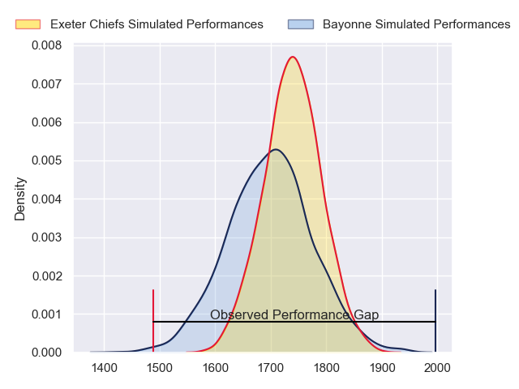
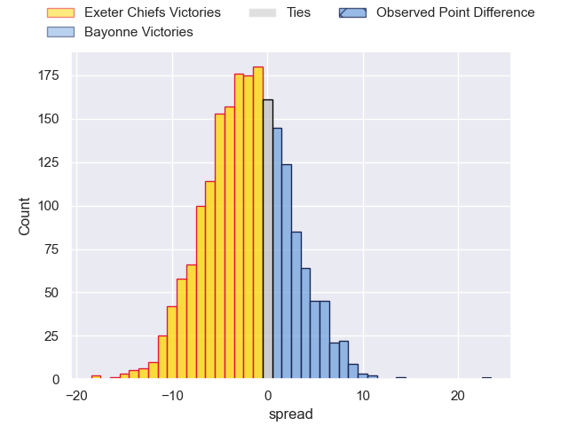
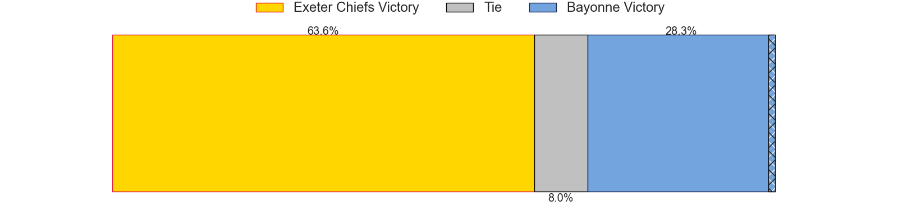
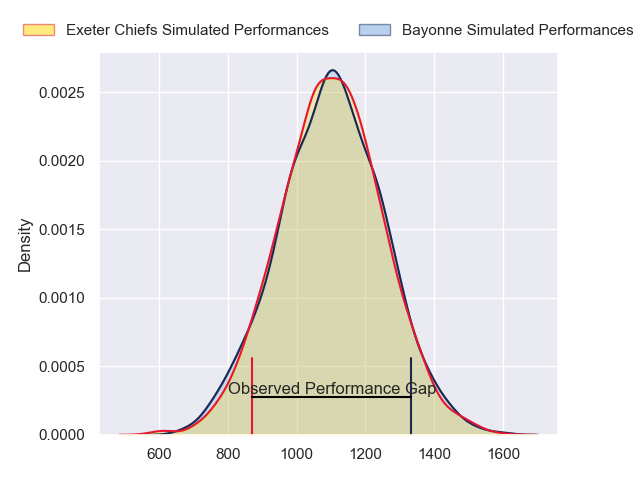
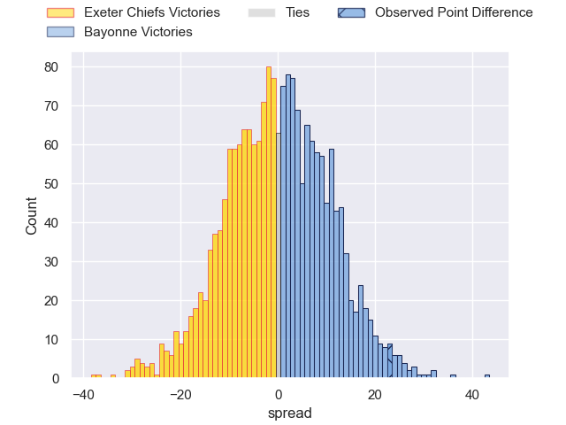
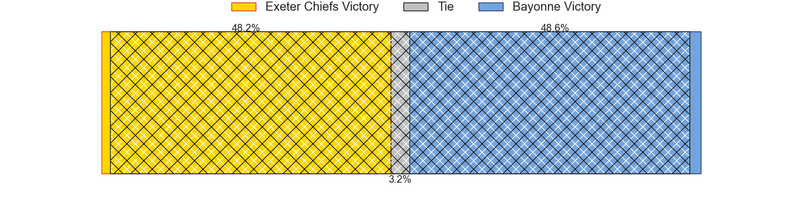
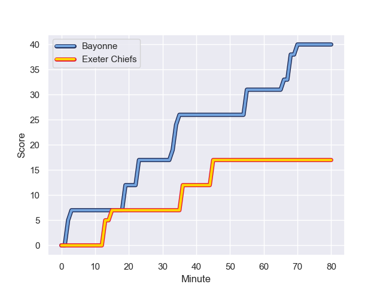
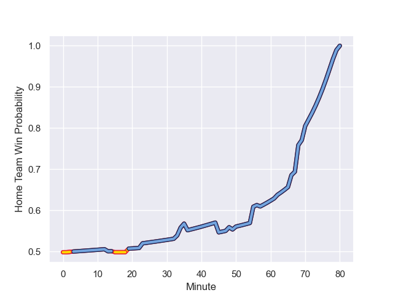

---  
layout: page  
title: Exeter Chiefs at Bayonne; 17-40  
date: 2024-01-21 18:00:00 -0500  
categories: "European Rugby Champions Cup 2023" match review  
---
# Exeter Chiefs at Bayonne; 17-40

# Club Level Predictions

The first set of predictions treats a club as the smallest object, as the club develops its members, organizes a gameplan, and deploys its players as needed for each match. This club model has a prediction of 0.438, which translates to predicting Exeter Chiefs to win by 2.2.

Our Over/Under is 45.5 - and combined with the spread above, we have a predicted scoreline of 24 to 22

Each club has a rating and a rating deviation (similar to a Glicko rating), and expected performances can be generated. This allows for simulated matches and spreads like the ones below.
## Projected Performances - Club Model

## Projected Spreads - Club Model

## Projected Results - Club Model

# Player Level Predictions - Version 2

Treating teams instead as an entity made up of the currently active players, I have ratings for each player in an altogether different system. These can be combined to form team ratings once teamsheets are announced, weighting starters a bit higher than the reserves. After the match is played, players can be weighted by their minutes on the field, allowing for an accurate measure of the team's composition. With these compiled team ratings, we can make predictions, measure inaccuracy, and update the individual player ratings.
## Prediction with Player Minutes: Exeter Chiefs by 0.1

Exeter Chiefs by 7.7 on a neutral field
## Prediction without Player Minutes: Exeter Chiefs by 0.3

Exeter Chiefs by 7.9 on a neutral pitch

## Projected Performances - Player Model

## Projected Spreads - Player Model

## Projected Results - Player Model

## Scores over Time

## Win Probability over Time

There were 4 large changes in win probability in this match

|   Away Minutes | Away Player       |   Away elo |   Number |   Home elo | Home Player            |   Home Minutes |
|---------------:|:------------------|-----------:|---------:|-----------:|:-----------------------|---------------:|
|             62 | Alec Hepburn      |      65.39 |        1 |      35.98 | Matis Perchaud         |             50 |
|             58 | Dan Frost         |      64.07 |        2 |      14.87 | Vincent Giudicelli     |             48 |
|             49 | Ehren Painter     |      54.72 |        3 |      46.65 | Luke Tagi              |             65 |
|             62 | Rusiate Tuima     |      31.96 |        4 |     118.92 | Denis Marchois         |             80 |
|             80 | Dafydd Jenkins    |      98.57 |        5 |      46.65 | Konstantine Mikautadze |             48 |
|             80 | Ethan Roots       |      83.34 |        6 |      51.53 | Pierre Huguet          |             67 |
|             79 | Jacques Vermeulen |      85.6  |        7 |      89.44 | Baptiste Heguy         |             80 |
|             62 | Greg Fisilau      |      82.88 |        8 |     124.36 | Rodrigo Bruni          |             80 |
|             57 | Tom Cairns        |      59.88 |        9 |      46.65 | Guillaume Rouet        |             59 |
|             80 | Harvey Skinner    |      56.39 |       10 |      50.31 | Thomas Dolhagaray      |             80 |
|             80 | Olly Woodburn     |     121.78 |       11 |      46.65 | Victor Hannoun         |             80 |
|             50 | Ollie Devoto      |      41.36 |       12 |      91.89 | Yan Lestrade           |             80 |
|             80 | Henry Slade       |     131.12 |       13 |      46.65 | Sireli Maqala          |             41 |
|             71 | Ben Hammersley    |      63.7  |       14 |      41.73 | Aurelien Callandret    |             80 |
|             80 | Josh Hodge        |      46.65 |       15 |      46.07 | Tom Spring             |             41 |
|             23 | Jack Yeandle      |      87.37 |       16 |      90.17 | Facundo Bosch          |             32 |
|             18 | Danny Southworth  |      46.65 |       17 |      55.36 | Swan Cormenier         |             30 |
|             31 | Josh Iosefa-Scott |      98.91 |       18 |      46.65 | Martin Villar          |             15 |
|             18 | Lewis Pearson     |      53.25 |       19 |      13.2  | Manuel Leindekar       |             32 |
|             18 | Ross Vintcent     |      52.57 |       20 |      46.65 | Manex Ariceta          |             13 |
|             23 | Stu Townsend      |      89.33 |       21 |      46.65 | Kleo Labarbe           |             21 |
|             30 | Joe Hawkins       |      29.62 |       22 |      46.65 | Federico Mori          |             39 |
|              9 | Zack Wimbush      |      48.5  |       23 |      46.65 | Bastien Pourailly      |             39 |

