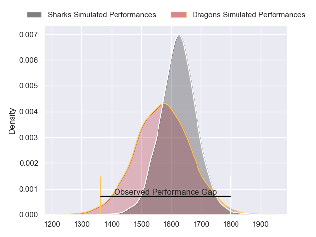
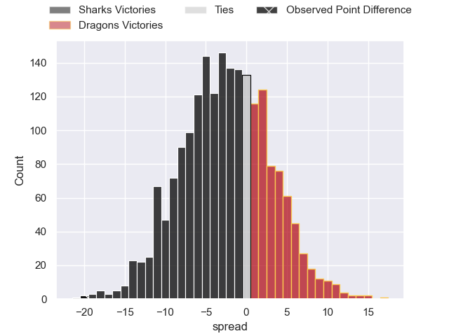
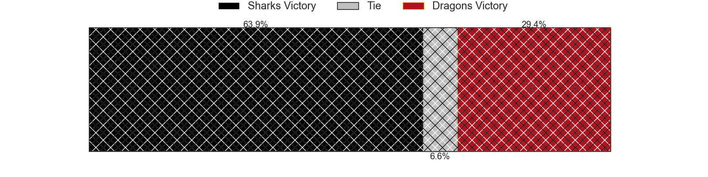
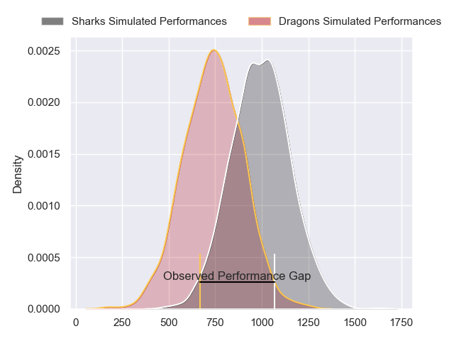
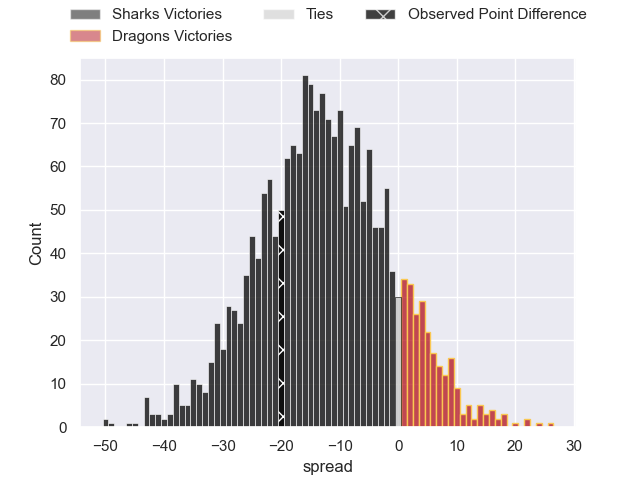
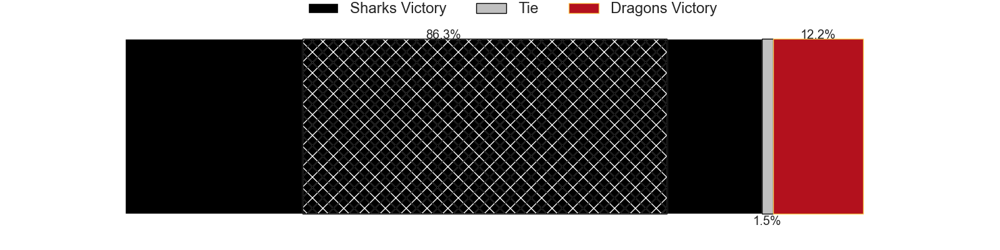
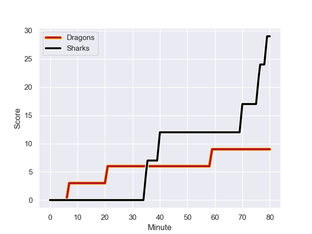
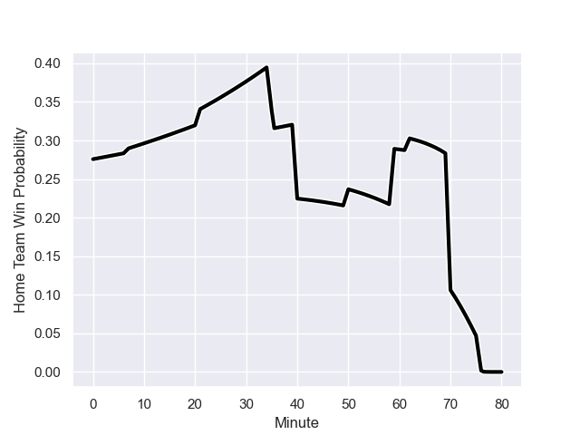

---  
layout: page  
title: Sharks at Dragons; 29-9  
date: 2024-01-21 18:00:00 -0500  
categories: "European Rugby Challenge Cup 2023" match review  
---
# Sharks at Dragons; 29-9

# Club Level Predictions

The first set of predictions treats a club as the smallest object, as the club develops its members, organizes a gameplan, and deploys its players as needed for each match. This club model has a prediction of 0.43, which translates to predicting Sharks to win by 2.5.

Our Over/Under is 38.5 - and combined with the spread above, we have a predicted scoreline of 20 to 18

Each club has a rating and a rating deviation (similar to a Glicko rating), and expected performances can be generated. This allows for simulated matches and spreads like the ones below.
## Projected Performances - Club Model

## Projected Spreads - Club Model

## Projected Results - Club Model

# Player Level Predictions - Version 2

Treating teams instead as an entity made up of the currently active players, I have ratings for each player in an altogether different system. These can be combined to form team ratings once teamsheets are announced, weighting starters a bit higher than the reserves. After the match is played, players can be weighted by their minutes on the field, allowing for an accurate measure of the team's composition. With these compiled team ratings, we can make predictions, measure inaccuracy, and update the individual player ratings.
## Prediction with Player Minutes: Sharks by 10.7

Sharks by 16.7 on a neutral field
## Prediction without Player Minutes: Sharks by 10.1

Sharks by 16.1 on a neutral pitch

## Projected Performances - Player Model

## Projected Spreads - Player Model

## Projected Results - Player Model

## Scores over Time

## Win Probability over Time

There were 5 large changes in win probability in this match

|   Away Minutes | Away Player               |   Away elo |   Number |   Home elo | Home Player      |   Home Minutes |
|---------------:|:--------------------------|-----------:|---------:|-----------:|:-----------------|---------------:|
|             62 | Ox Nche                   |     136.13 |        1 |      26.66 | Rhodri Jones     |             50 |
|             66 | Fez Mbatha                |      76.4  |        2 |      35.79 | Bradley Roberts  |             59 |
|             54 | Hanro Jacobs              |      43.98 |        3 |      36.85 | Leon Brown       |             66 |
|             59 | Corne Rahl                |      23.82 |        4 |      13.12 | Joseph Davies    |             80 |
|             80 | Gerbrandt Grobler         |      22.11 |        5 |     -13.18 | Matthew Screech  |             80 |
|             71 | James Venter              |      36.99 |        6 |      50.49 | Ryan Woodman     |             66 |
|             80 | Jeandre Labuschagne       |      43.36 |        7 |      86.17 | Ollie Griffiths  |             40 |
|             80 | Phepsi Buthelezi          |      53.8  |        8 |      80.03 | Aaron Wainwright |             80 |
|             59 | Jaden Hendrikse           |      81.13 |        9 |      17.49 | Dane Blacker     |             50 |
|             77 | Curwin Bosch              |      61.33 |       10 |      45.02 | Will Reed        |             71 |
|             80 | Makazole Mapimpi          |     144.68 |       11 |      14.78 | Jared Rosser     |             80 |
|             66 | Francois Venter           |      42.74 |       12 |      47.14 | Harri Ackerman   |             71 |
|             80 | Lukhanyo Am               |      61.14 |       13 |      88.08 | Steffan Hughes   |             80 |
|             80 | Werner Kok                |      56.59 |       14 |      24.81 | Rio Dyer         |             80 |
|             80 | Aphelele Fassi            |      96.35 |       15 |      26.82 | Cai Evans        |             80 |
|             18 | Ntuthuko Mchunu           |      27.27 |       16 |      58.56 | Rodrigo Martinez |             30 |
|             14 | Daniel Viljoen Jooste     |      44.86 |       17 |      32.64 | James Benjamin   |             21 |
|             26 | Coenie Oosthuizen         |     154.81 |       18 |      53.24 | Luke Yendle      |             14 |
|             21 | Le Roux Roets             |      20.86 |       19 |      48.35 | George Young     |             14 |
|              9 | Tinotenda Blithe Mavesere |      78.13 |       20 |      26.97 | Taine Basham     |             40 |
|             21 | Grant Williams            |      55.48 |       21 |      78.36 | Rhodri Williams  |             30 |
|              3 | Lionel Cronje             |     108.35 |       22 |      47.46 | Ewan Rosser      |              9 |
|             14 | Rohan Janse van Rensburg  |      70    |       23 |      46.65 | Joe Westwood     |              9 |

