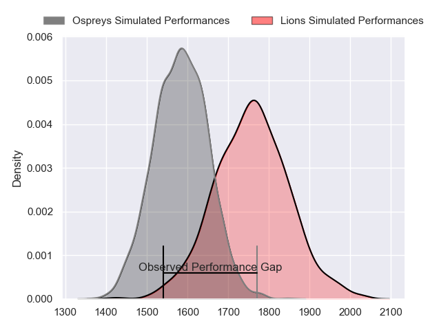
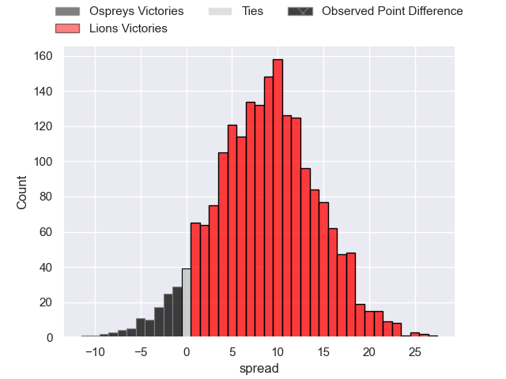
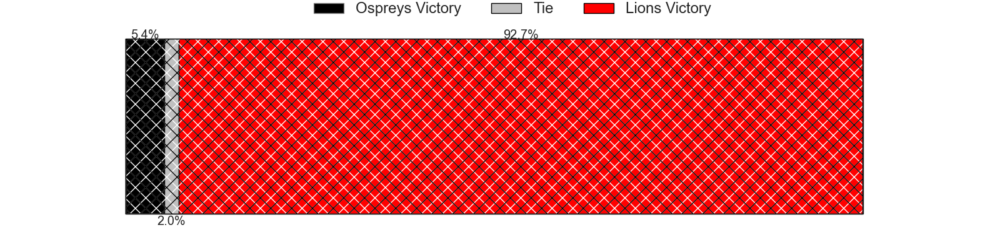
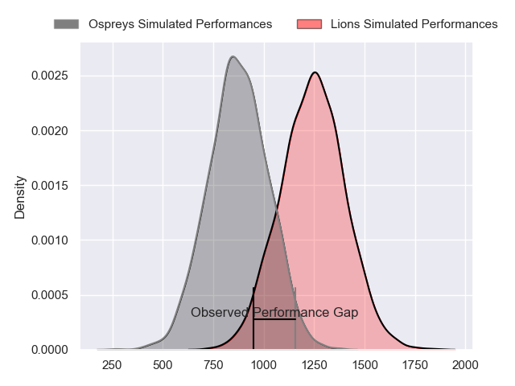
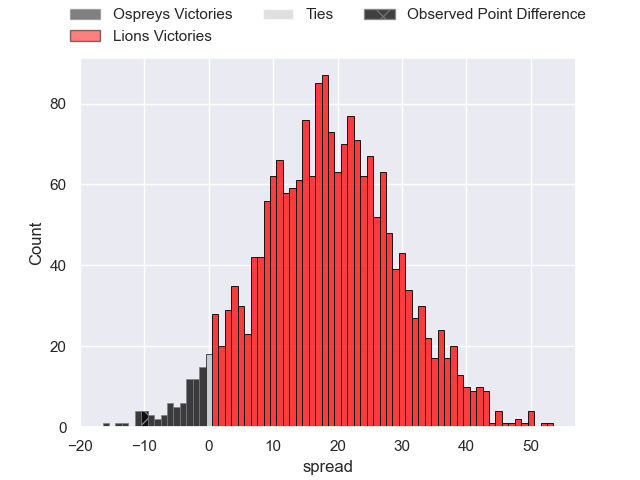
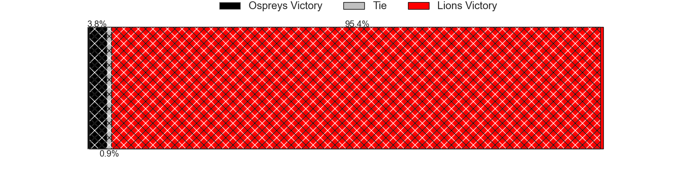
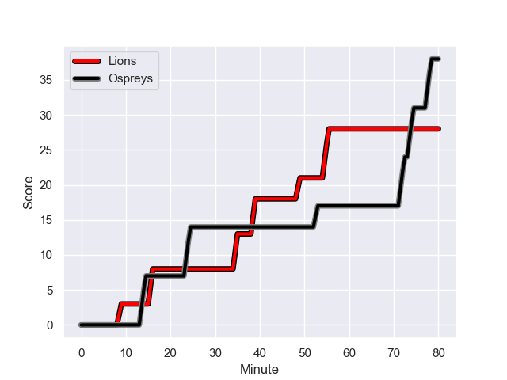
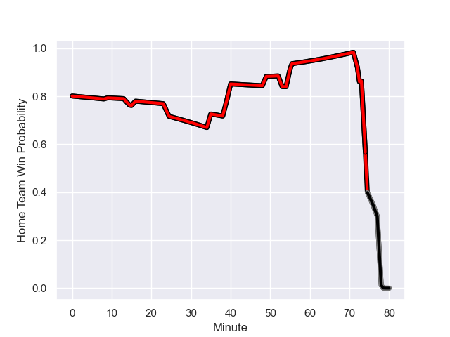

---  
layout: page  
title: Ospreys at Lions; 38-28  
date: 2024-01-21 18:00:00 -0500  
categories: "European Rugby Challenge Cup 2023" match review  
---
# Ospreys at Lions; 38-28

# Club Level Predictions

The first set of predictions treats a club as the smallest object, as the club develops its members, organizes a gameplan, and deploys its players as needed for each match. This club model has a prediction of 0.728, which translates to predicting Lions to win by 8.7.

Our Over/Under is 63.5 - and combined with the spread above, we have a predicted scoreline of 27 to 36

Each club has a rating and a rating deviation (similar to a Glicko rating), and expected performances can be generated. This allows for simulated matches and spreads like the ones below.
## Projected Performances - Club Model

## Projected Spreads - Club Model

## Projected Results - Club Model

# Player Level Predictions - Version 2

Treating teams instead as an entity made up of the currently active players, I have ratings for each player in an altogether different system. These can be combined to form team ratings once teamsheets are announced, weighting starters a bit higher than the reserves. After the match is played, players can be weighted by their minutes on the field, allowing for an accurate measure of the team's composition. With these compiled team ratings, we can make predictions, measure inaccuracy, and update the individual player ratings.
## Prediction with Player Minutes: Lions by 15.3

Lions by 10.9 on a neutral field
## Prediction without Player Minutes: Lions by 12.6

Lions by 8.2 on a neutral pitch

## Projected Performances - Player Model

## Projected Spreads - Player Model

## Projected Results - Player Model

## Scores over Time

## Win Probability over Time

There were 14 large changes in win probability in this match

|   Away Minutes | Away Player            |   Away elo |   Number |   Home elo | Home Player            |   Home Minutes |
|---------------:|:-----------------------|-----------:|---------:|-----------:|:-----------------------|---------------:|
|             50 | Rhys Henry             |      66.99 |        1 |      46.83 | Jean-Pierre Smith      |             49 |
|             63 | Sam Parry              |      69.01 |        2 |      32.52 | PJ Botha               |             49 |
|             53 | Tom Botha              |      62.04 |        3 |      24.34 | Asenathi Ntlabakanye   |             49 |
|             58 | James Ratti            |      41.51 |        4 |      83.16 | Ruben Schoeman         |             57 |
|             80 | Adam Beard             |      79.14 |        5 |     111.04 | Reinhard Nothnagel     |             80 |
|             50 | Will Hickey            |      50.63 |        6 |      74.69 | Johannes JC Pretorius  |             80 |
|             80 | Harri Deaves           |      56.82 |        7 |      51.43 | Emmanuel Tshituka      |             64 |
|             80 | Morgan Morse           |      47.62 |        8 |     126.31 | Francke Horn           |             80 |
|             73 | Reuben Morgan-Williams |      40.71 |        9 |     120.59 | Sanele Nohamba         |             76 |
|             53 | Dan Edwards            |      49.19 |       10 |      89.05 | Gianni Lombard         |             40 |
|             80 | Keelan Giles           |      -5.53 |       11 |      64.61 | Edwill van der Merwe   |             80 |
|             80 | Owen Watkin            |     106.8  |       12 |      99.42 | Marius Louw            |             76 |
|             27 | George North           |     115.03 |       13 |      73.23 | Henco van Wyk          |             80 |
|             80 | Matt Protheroe         |      96    |       14 |      50.2  | Richard Kriel          |             80 |
|             80 | Iestyn Hopkins         |      38.98 |       15 |      91.48 | Quan Horn              |             80 |
|             17 | Ethan Lewis            |      10.59 |       16 |      47.76 | Morgan Naude           |             31 |
|             27 | Ben Warren             |      54.82 |       17 |      51.29 | Jaco Visagie           |             31 |
|             22 | Lewis Jones            |      46.39 |       18 |      20.85 | Darrien-Lane Landsberg |             23 |
|             30 | Tristan Davies         |      49.25 |       19 |     124.99 | Ruan Dreyer            |             31 |
|              7 | Cam Jones              |      46.65 |       20 |     113.69 | Hanru Sirgel           |             16 |
|             27 | Jack Walsh             |      60.24 |       21 |      32.04 | Morne Van den Berg     |             40 |
|             30 | Cameron Jones          |      46.65 |       22 |      16.33 | Kade Wolhuter          |              4 |
|             53 | Keiran Williams        |      83.88 |       23 |       3.89 | Erich Cronje           |              4 |

