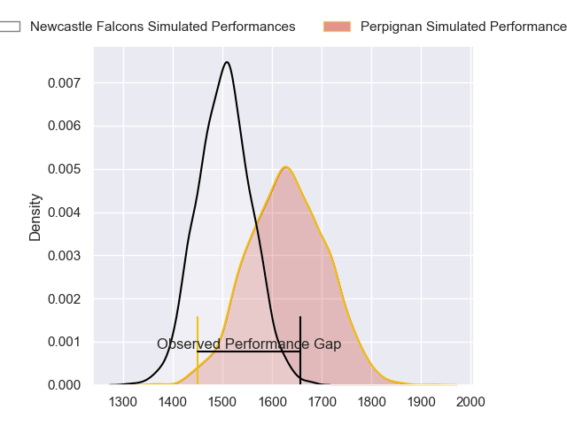
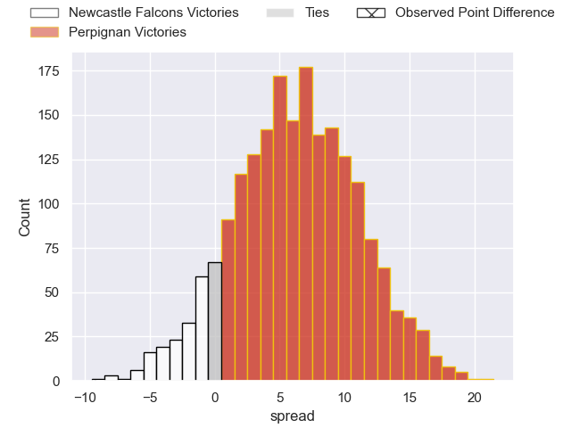
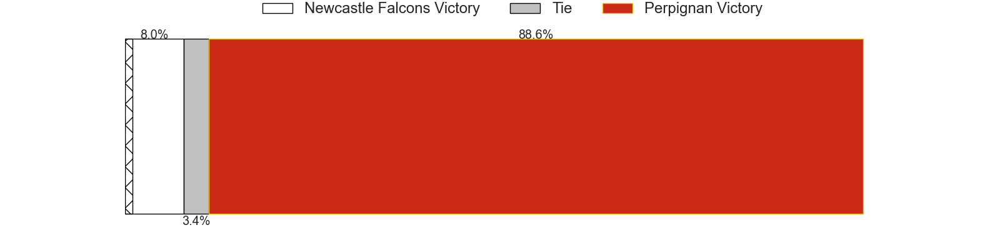
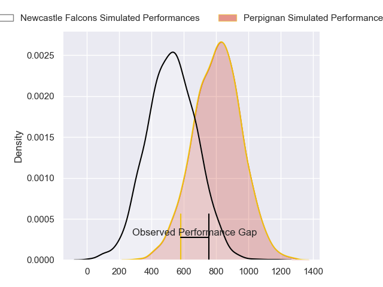
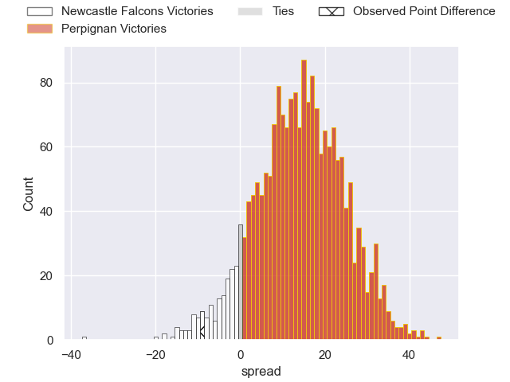
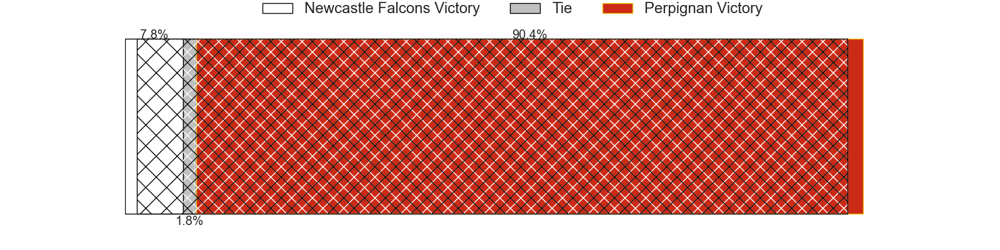
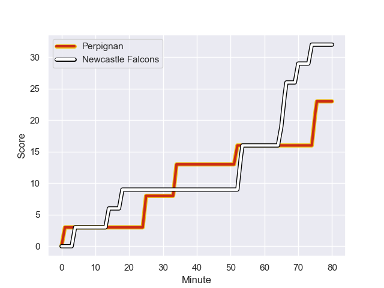
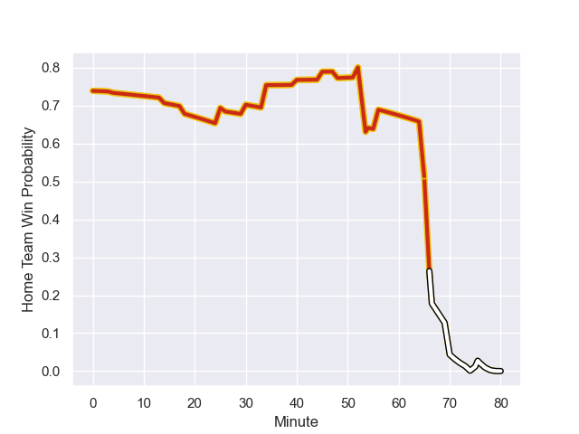

---  
layout: page  
title: Newcastle Falcons at Perpignan; 32-23  
date: 2024-01-21 18:00:00 -0500  
categories: "European Rugby Challenge Cup 2023" match review  
---
# Newcastle Falcons at Perpignan; 32-23

# Club Level Predictions

The first set of predictions treats a club as the smallest object, as the club develops its members, organizes a gameplan, and deploys its players as needed for each match. This club model has a prediction of 0.672, which translates to predicting Perpignan to win by 6.3.

Our Over/Under is 49.5 - and combined with the spread above, we have a predicted scoreline of 21 to 28

Each club has a rating and a rating deviation (similar to a Glicko rating), and expected performances can be generated. This allows for simulated matches and spreads like the ones below.
## Projected Performances - Club Model

## Projected Spreads - Club Model

## Projected Results - Club Model

# Player Level Predictions - Version 2

Treating teams instead as an entity made up of the currently active players, I have ratings for each player in an altogether different system. These can be combined to form team ratings once teamsheets are announced, weighting starters a bit higher than the reserves. After the match is played, players can be weighted by their minutes on the field, allowing for an accurate measure of the team's composition. With these compiled team ratings, we can make predictions, measure inaccuracy, and update the individual player ratings.
## Prediction with Player Minutes: Perpignan by 11.5

Perpignan by 3.4 on a neutral field
## Prediction without Player Minutes: Perpignan by 9.3

Perpignan by 1.2 on a neutral pitch

## Projected Performances - Player Model

## Projected Spreads - Player Model

## Projected Results - Player Model

## Scores over Time

## Win Probability over Time

There were 10 large changes in win probability in this match

|   Away Minutes | Away Player         |   Away elo |   Number |   Home elo | Home Player             |   Home Minutes |
|---------------:|:--------------------|-----------:|---------:|-----------:|:------------------------|---------------:|
|             74 | Adam Brocklebank    |      -1.75 |        1 |      21.01 | Xavier Chiocci          |             45 |
|             70 | Bryan Byrne         |      57.02 |        2 |      17.88 | Victor Montgaillard     |             61 |
|             54 | Murray McCallum     |      45.09 |        3 |      34.22 | Nemo Roelofse           |             56 |
|             70 | John Hawkins        |      14.63 |        4 |      44.32 | Bastien Chinarro        |             26 |
|             80 | Sebastian de Chaves |      -5.08 |        5 |      44.48 | Posolo Tuilagi          |             40 |
|             30 | Pedro Rubiolo       |      36.95 |        6 |      46.65 | Samuel M'Foudi Mezaache |             57 |
|             80 | Sam Cross           |      47.69 |        7 |      45.65 | Kelian Galletier        |             80 |
|             80 | Freddie Lockwood    |      35.4  |        8 |      39.61 | Valentin Moro           |             80 |
|             48 | Josh Barton         |       1.61 |        9 |      18.39 | Sadek Deghmache         |             52 |
|             80 | Brett Connon        |      41.87 |       10 |      34.17 | Matteo Rodor            |             80 |
|             80 | Ben Stevenson       |      43.35 |       11 |      52.78 | Lucas Dubois            |             80 |
|             48 | Cameron Hutchison   |      55.64 |       12 |      42.65 | Apisai Naqalevu         |             80 |
|             56 | Matias Moroni       |     118.67 |       13 |      46.65 | Job Poulet              |             56 |
|             80 | Ben Redshaw         |      45.24 |       14 |      46.65 | Maxim Granell           |             80 |
|             80 | Elliott Obatoyinbo  |      22.57 |       15 |      59.26 | Louis Dupichot          |             80 |
|             10 | Michael van Vuuren  |      51.8  |       16 |      59.01 | Sacha Lotrian           |             35 |
|              6 | Mark Dormer         |      46.65 |       17 |      43.75 | Vakhtang Jintcharadze   |             19 |
|             26 | Eduardo Bello       |      26.02 |       18 |      66.56 | Pietro Ceccarelli       |             24 |
|             10 | John Kelly          |      56.89 |       19 |      35.17 | Tristan Labouteley      |             54 |
|             50 | Josh Bainbridge     |       2.83 |       20 |      65.78 | Marvin Orie             |             40 |
|             32 | Hugh O'Sullivan     |      34.16 |       21 |      32.56 | Jean Pascal Barraque    |             28 |
|             32 | Rory Jennings       |      57.3  |       22 |      10.32 | Matthieu Ugena          |             23 |
|             24 | Oliver Spencer      |      43.54 |       23 |       0.45 | Alivereti Duguivalu     |             24 |

