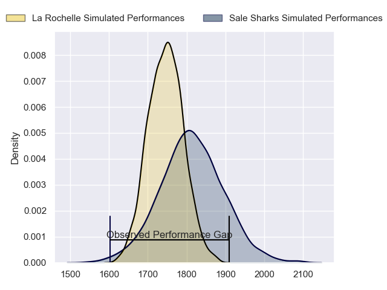
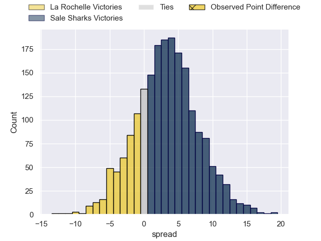
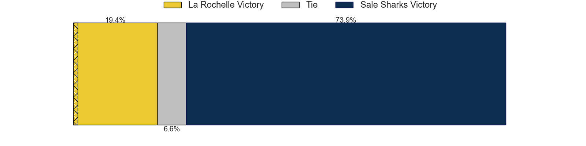
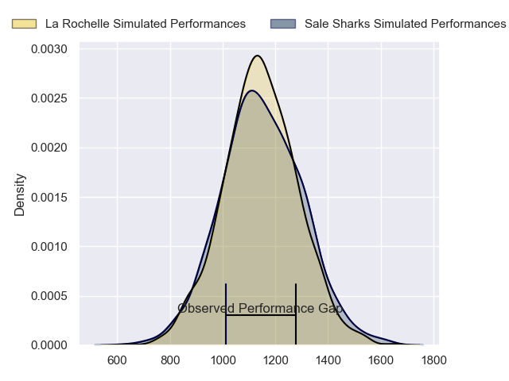
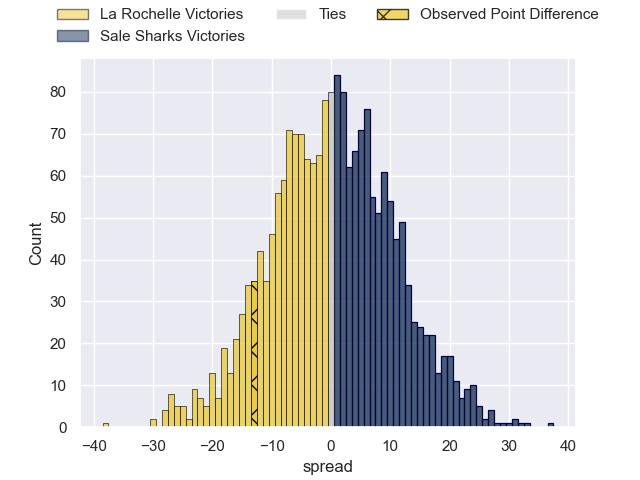
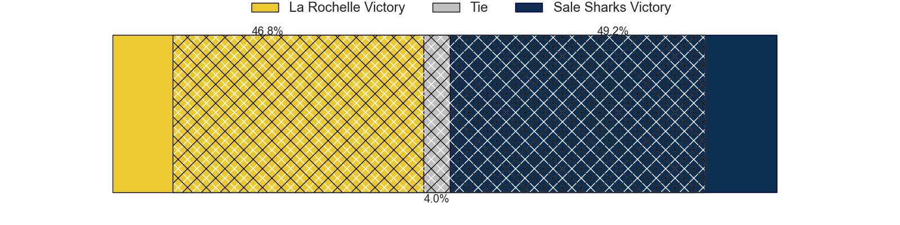
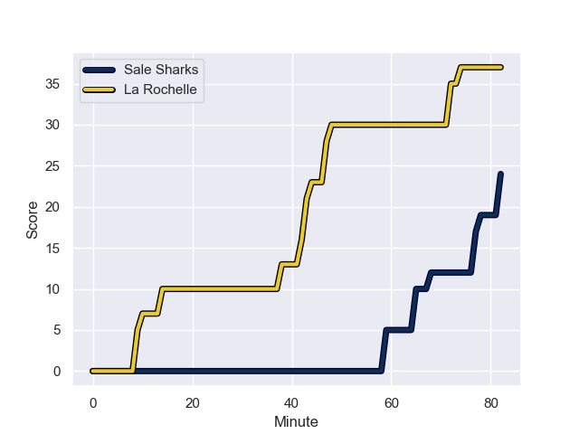
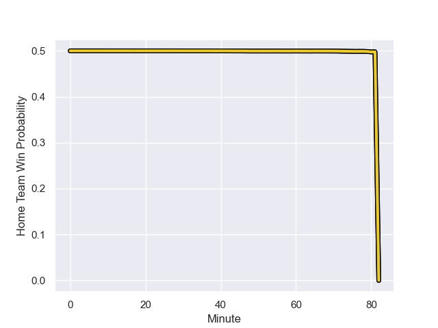

---  
layout: page  
title: La Rochelle at Sale Sharks; 37-24  
date: 2024-01-21 18:00:00 -0500  
categories: "European Rugby Champions Cup 2023" match review  
---
# La Rochelle at Sale Sharks; 37-24

# Club Level Predictions

The first set of predictions treats a club as the smallest object, as the club develops its members, organizes a gameplan, and deploys its players as needed for each match. This club model has a prediction of 0.591, which translates to predicting Sale Sharks to win by 3.2.

Our Over/Under is 47.5 - and combined with the spread above, we have a predicted scoreline of 22 to 26

Each club has a rating and a rating deviation (similar to a Glicko rating), and expected performances can be generated. This allows for simulated matches and spreads like the ones below.
## Projected Performances - Club Model

## Projected Spreads - Club Model

## Projected Results - Club Model

# Player Level Predictions - Version 2

Treating teams instead as an entity made up of the currently active players, I have ratings for each player in an altogether different system. These can be combined to form team ratings once teamsheets are announced, weighting starters a bit higher than the reserves. After the match is played, players can be weighted by their minutes on the field, allowing for an accurate measure of the team's composition. With these compiled team ratings, we can make predictions, measure inaccuracy, and update the individual player ratings.
## Prediction with Player Minutes: La Rochelle by 0.0

La Rochelle by 7.7 on a neutral field
## Prediction without Player Minutes: La Rochelle by 3.7

La Rochelle by 11.3 on a neutral pitch

## Projected Performances - Player Model

## Projected Spreads - Player Model

## Projected Results - Player Model

## Scores over Time

## Win Probability over Time

There were 1 large changes in win probability in this match

|   Away Minutes | Away Player        |   Away elo |   Number |   Home elo | Home Player          |   Home Minutes |
|---------------:|:-------------------|-----------:|---------:|-----------:|:---------------------|---------------:|
|             63 | Reda Wardi         |     104.57 |        1 |      47.86 | Tumy Onasanya        |             82 |
|             70 | Quentin Lespiaucq  |      55.57 |        2 |      88.34 | Luke Cowan-Dickie    |             45 |
|             54 | Uini Atonio        |     131.91 |        3 |      40.53 | Nic Schonert         |             48 |
|             41 | Ultan Dillane      |      54.46 |        4 |      46.65 | Ben Bamber           |             82 |
|             61 | Will Skelton       |      97.89 |        5 |      46.46 | Jonny Hill           |             20 |
|             82 | Paul Boudehent     |      24.41 |        6 |      35.08 | Sam Dugdale          |             82 |
|             51 | Levani Botia       |     106.25 |        7 |      37.57 | Ben Curry            |             74 |
|             82 | Gregory Alldritt   |     138.02 |        8 |      62.12 | Josh Beaumont        |             82 |
|             53 | Tawera Kerr-Barlow |     113.23 |        9 |      41.57 | Gus Warr             |             56 |
|             82 | Antoine Hastoy     |      42.48 |       10 |     106.92 | George Ford          |             82 |
|             51 | Dillyn Leyds       |     109.31 |       11 |      82.4  | Arron Reed           |             67 |
|             82 | Yoan Tanga         |      58.06 |       12 |      79.83 | Sam Bedlow           |             82 |
|             71 | Ulupano Seuteni    |      43.3  |       13 |      39.82 | Robert du Preez      |             54 |
|             82 | Teddy Thomas       |      72.74 |       14 |      63.37 | Tom Roebuck          |             82 |
|             82 | Brice Dulin        |     108.94 |       15 |      99.18 | Sam James            |             82 |
|             21 | Tolu Latu          |      46.65 |       16 |      90.73 | Agustin Creevy       |             37 |
|             19 | Joel Sclavi        |      65.62 |       17 |      47.85 | Asher Opoku-Fordjour |              8 |
|             28 | Alexandre Kuntelia |      46.65 |       18 |      60.39 | James Harper         |             34 |
|             41 | Thomas Lavault     |      46.65 |       19 |      46.65 | Tom Ellis            |             28 |
|             31 | Judicael Cancoriet |      38.43 |       20 |      46.65 | Daniel du Preez      |             34 |
|             29 | Thomas Berjon      |      82.77 |       21 |      46.69 | Nye Thomas           |             26 |
|             23 | Hugo Reus          |      46.65 |       22 |      48.33 | Rekeiti Ma'asi-White |             15 |
|             31 | Jack Nowell        |      46.65 |       23 |     143.65 | Telusa Veainu        |             28 |

