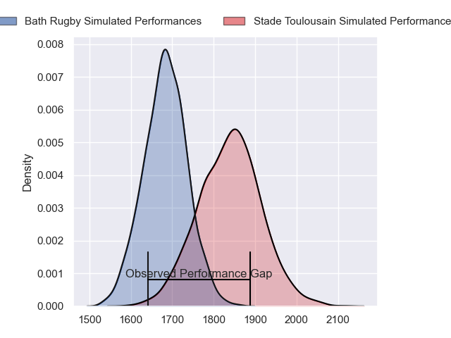
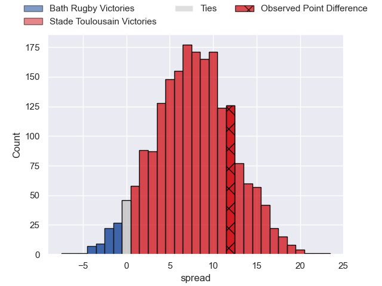
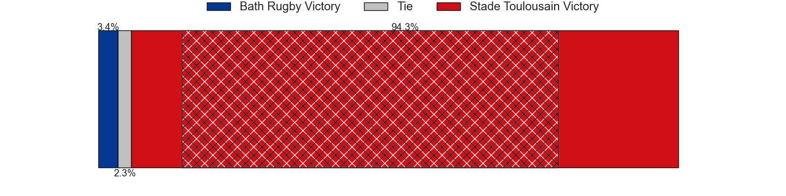
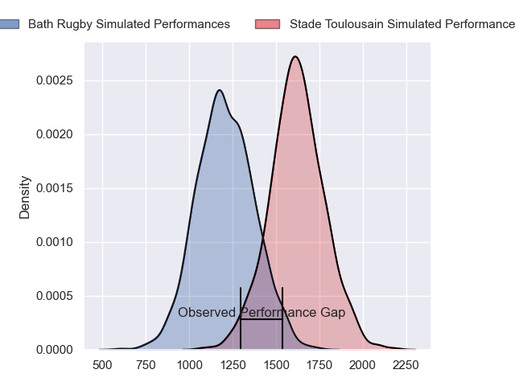
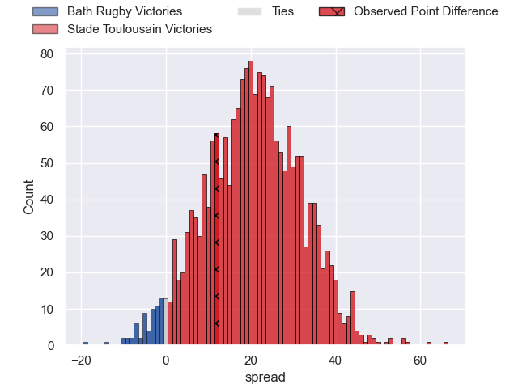
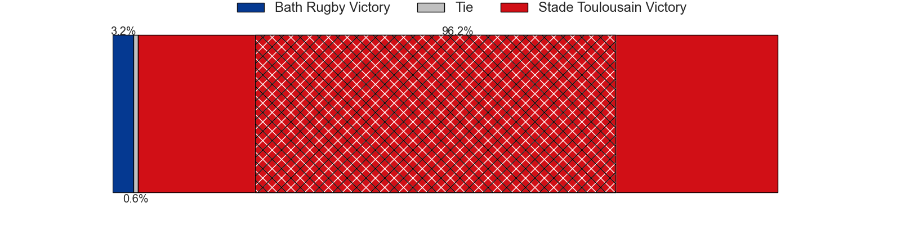
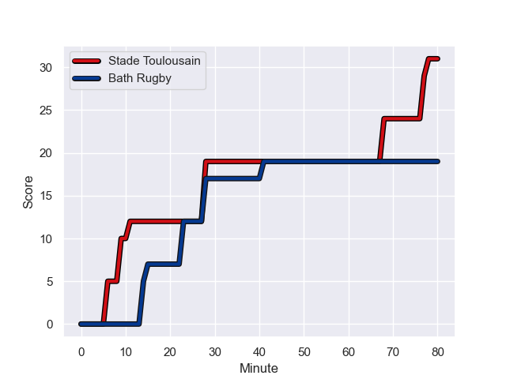
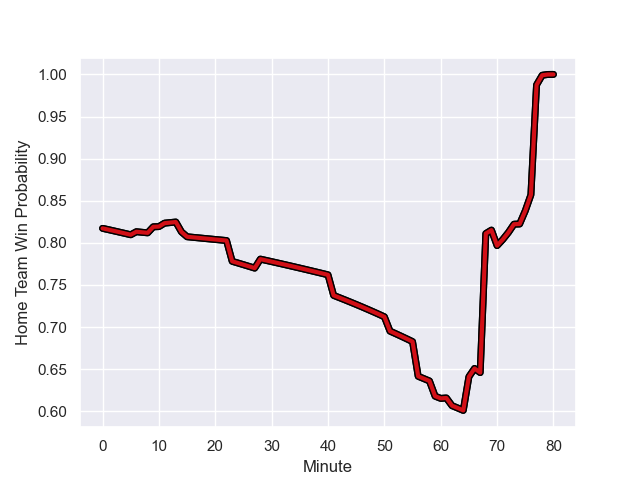

---  
layout: page  
title: Bath Rugby at Stade Toulousain; 19-31  
date: 2024-01-21 18:00:00 -0500  
categories: "European Rugby Champions Cup 2023" match review  
---
# Bath Rugby at Stade Toulousain; 19-31

# Club Level Predictions

The first set of predictions treats a club as the smallest object, as the club develops its members, organizes a gameplan, and deploys its players as needed for each match. This club model has a prediction of 0.708, which translates to predicting Stade Toulousain to win by 7.8.

Our Over/Under is 41.5 - and combined with the spread above, we have a predicted scoreline of 17 to 25

Each club has a rating and a rating deviation (similar to a Glicko rating), and expected performances can be generated. This allows for simulated matches and spreads like the ones below.
## Projected Performances - Club Model

## Projected Spreads - Club Model

## Projected Results - Club Model

# Player Level Predictions - Version 2

Treating teams instead as an entity made up of the currently active players, I have ratings for each player in an altogether different system. These can be combined to form team ratings once teamsheets are announced, weighting starters a bit higher than the reserves. After the match is played, players can be weighted by their minutes on the field, allowing for an accurate measure of the team's composition. With these compiled team ratings, we can make predictions, measure inaccuracy, and update the individual player ratings.
## Prediction with Player Minutes: Stade Toulousain by 16.6

Stade Toulousain by 8.8 on a neutral field
## Prediction without Player Minutes: Stade Toulousain by 18.3

Stade Toulousain by 10.5 on a neutral pitch

## Projected Performances - Player Model

## Projected Spreads - Player Model

## Projected Results - Player Model

## Scores over Time

## Win Probability over Time

There were 4 large changes in win probability in this match

|   Away Minutes | Away Player     |   Away elo |   Number |   Home elo | Home Player      |   Home Minutes |
|---------------:|:----------------|-----------:|---------:|-----------:|:-----------------|---------------:|
|             66 | Beno Obano      |      78.63 |        1 |      96.5  | Cyril Baille     |             59 |
|             65 | Niall Annett    |      55.26 |        2 |     105.05 | Peato Mauvaka    |             56 |
|             65 | Thomas du Toit  |      97.55 |        3 |     103.96 | Dorian Aldegheri |             51 |
|             61 | Quinn Roux      |      94.47 |        4 |      30.04 | Richie Arnold    |             80 |
|             80 | Charlie Ewels   |      54.1  |        5 |      65.59 | Emmanuel Meafou  |             74 |
|             80 | Josh Bayliss    |      36.7  |        6 |     117.32 | Francois Cros    |             80 |
|             80 | Chris Cloete    |     164.01 |        7 |     112.43 | Jack Willis      |             80 |
|             80 | Miles Reid      |     114.36 |        8 |     128.14 | Anthony Jelonch  |             56 |
|             61 | Ben Spencer     |      44.46 |        9 |     140.99 | Antoine Dupont   |             80 |
|             80 | Finn Russell    |     162.37 |       10 |     115.87 | Thomas Ramos     |             80 |
|             70 | Will Muir       |      -0.8  |       11 |     130.42 | Matthis Lebel    |             70 |
|             80 | Ollie Lawrence  |      65.27 |       12 |      22.24 | Pita Ahki        |             80 |
|             65 | Max Ojomoh      |      60.22 |       13 |      63.08 | Dimitri Delibes  |             62 |
|             80 | Joe Cokanasiga  |     100.62 |       14 |     104.26 | Juan Cruz Mallia |             74 |
|             80 | Matt Gallagher  |     114.78 |       15 |     157.9  | Blair Kinghorn   |             80 |
|             15 | Hame Faiva      |     -14.13 |       16 |      95.82 | Julien Marchand  |             24 |
|             14 | Juan Schoeman   |      35.9  |       17 |      59.13 | David Ainu'u     |             21 |
|             15 | Will Stuart     |      37.15 |       18 |      71.82 | Nepo Laulala     |             29 |
|             19 | Elliott Stooke  |      84.39 |       19 |      48.62 | Joshua Brennan   |              6 |
|              0 | Ewan Richards   |      32.22 |       20 |      46.65 | Alban Placines   |             24 |
|             19 | Louis Schreuder |      46.37 |       21 |      46.65 | Arthur Retiere   |             10 |
|             10 | Orlando Bailey  |      27.79 |       22 |      46.65 | Sofiane Guitoune |             18 |
|             15 | Cameron Redpath |      66.45 |       23 |      46.65 | Ange Capuozzo    |              6 |

