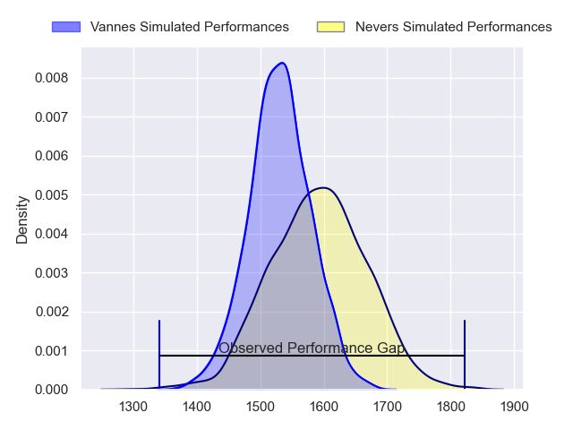
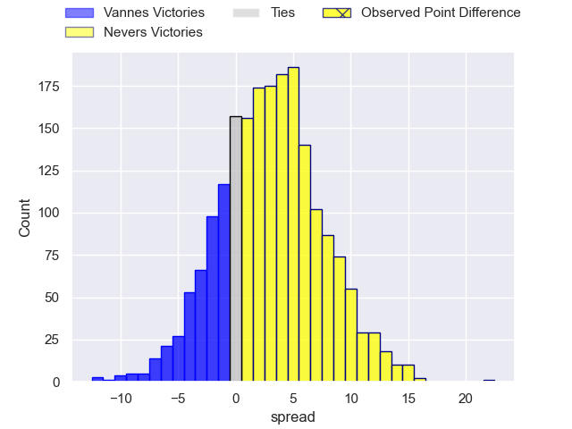
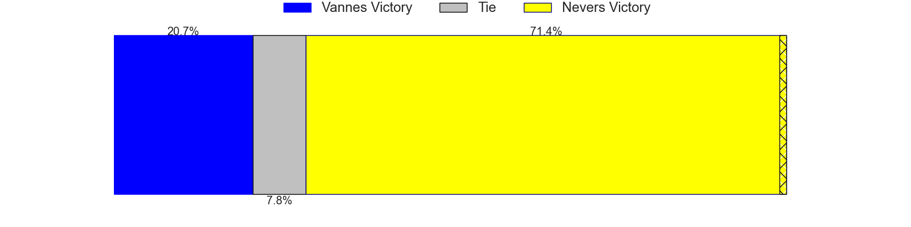
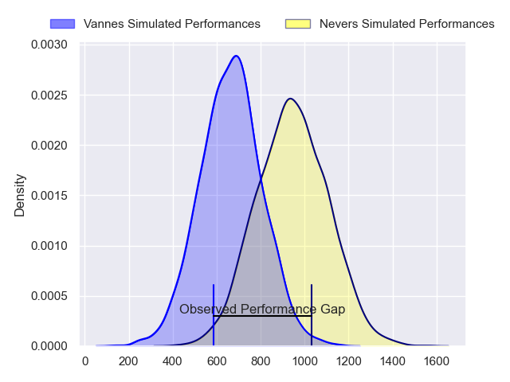
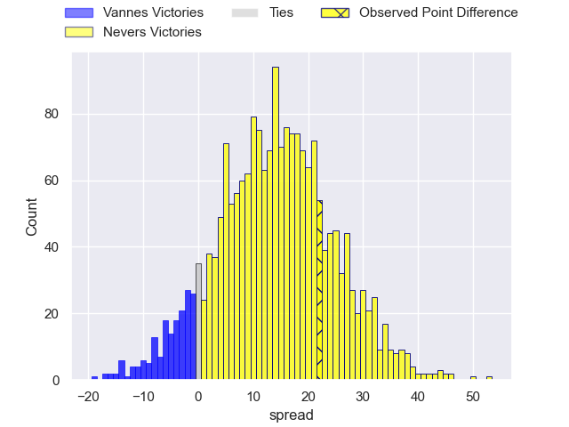
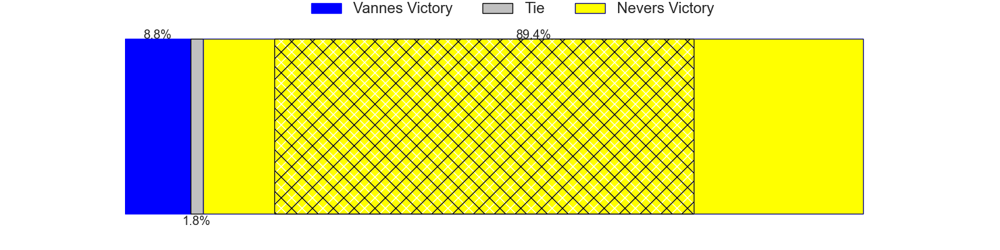
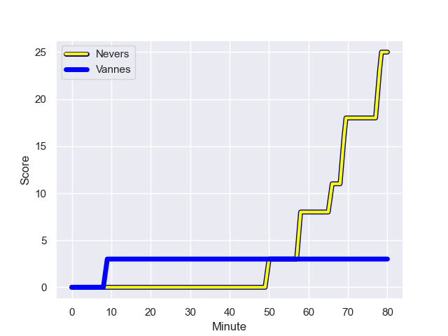
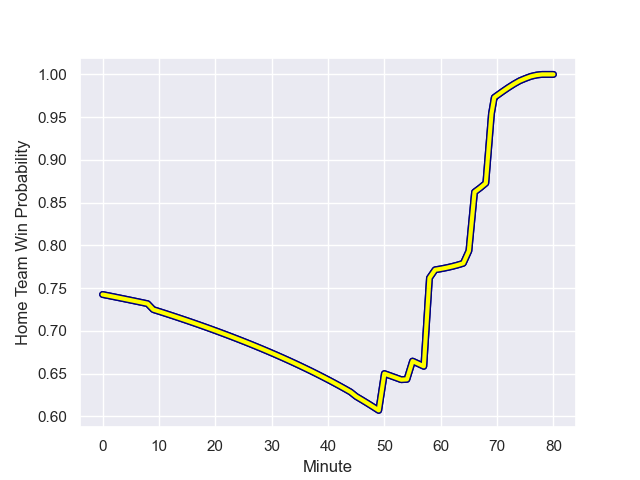

---  
layout: page  
title: Vannes at Nevers; 3-25  
date: 2024-01-25 18:00:00 -0500  
categories: "Pro D2 2023" match review  
---
# Vannes at Nevers; 3-25

# Club Level Predictions

The first set of predictions treats a club as the smallest object, as the club develops its members, organizes a gameplan, and deploys its players as needed for each match. This club model has a prediction of 0.587, which translates to predicting Nevers to win by 3.1.

Our Over/Under is 37.5 - and combined with the spread above, we have a predicted scoreline of 17 to 20

Each club has a rating and a rating deviation (similar to a Glicko rating), and expected performances can be generated. This allows for simulated matches and spreads like the ones below.
## Projected Performances - Club Model

## Projected Spreads - Club Model

## Projected Results - Club Model

# Player Level Predictions - Version 2

Treating teams instead as an entity made up of the currently active players, I have ratings for each player in an altogether different system. These can be combined to form team ratings once teamsheets are announced, weighting starters a bit higher than the reserves. After the match is played, players can be weighted by their minutes on the field, allowing for an accurate measure of the team's composition. With these compiled team ratings, we can make predictions, measure inaccuracy, and update the individual player ratings.
## Prediction with Player Minutes: Nevers by 11.6

Nevers by 7.4 on a neutral field
## Prediction without Player Minutes: Nevers by 13.0

Nevers by 8.8 on a neutral pitch

## Projected Performances - Player Model

## Projected Spreads - Player Model

## Projected Results - Player Model

## Scores over Time

## Win Probability over Time

There were 4 large changes in win probability in this match

|   Away Minutes | Away Player             |   Away elo |   Number |   Home elo | Home Player              |   Home Minutes |
|---------------:|:------------------------|-----------:|---------:|-----------:|:-------------------------|---------------:|
|             54 | Charles-Henri Berguet   |      42.12 |        1 |      54.45 | Jordan Seneca            |             45 |
|             54 | Pat Leafa               |      54.5  |        2 |      44.69 | Elia Elia                |             75 |
|             45 | Simon Bourgeois         |      47.02 |        3 |      50    | Ilia Kaikatsishvili      |             50 |
|             45 | Anton Bresler           |      46.41 |        4 |      -7.77 | Christiaan van der Merwe |             80 |
|             45 | Mattéo Desjeux          |      29.22 |        5 |      97.89 | Will Skelton             |             15 |
|             80 | Juan Bautista Pedemonte |      25.16 |        6 |      47.37 | Luka Plataret            |             80 |
|             80 | Francisco Gorrissen     |      97.1  |        7 |      82.16 | Hugues Bastide           |             80 |
|             65 | Karl Chateau            |       5.31 |        8 |     107.37 | Jason-Colin Fraser       |             55 |
|             55 | Michael Ruru            |     102.34 |        9 |      18.16 | Hugo Bouyssou            |             75 |
|             45 | Jean Cotarmanac'h       |      44.54 |       10 |      51.06 | Shaun Reynolds           |             59 |
|             80 | Romaric Camou           |      33.21 |       11 |      58.23 | Arthur Mathiron          |             75 |
|             80 | Andres Vilaseca         |      17.18 |       12 |      87.62 | Alifereti Loaloa         |             80 |
|             80 | Theo Costosseque        |      36.05 |       13 |      56.05 | Rudy Derrieux            |             80 |
|             80 | Martin Alonso Munoz     |      26.55 |       14 |      72.04 | Christian Ambadiang      |             80 |
|             80 | Paul Surano             |      55.22 |       15 |      80.91 | Kylian Jaminet           |             80 |
|             35 | Eric Marks              |      -7.01 |       16 |      45.91 | Kevin Noah               |             65 |
|             35 | Hamish Bain             |      50.04 |       17 |      52.49 | Kamaliele Tufele         |             35 |
|             35 | Phil Kite               |      61.11 |       18 |      38.22 | Cleopas Kundiona         |             30 |
|             35 | Maxime Lafage           |     102.88 |       19 |      78.5  | Julien Kazubek           |             25 |
|             26 | Théo Beziat             |      47.65 |       20 |      44.36 | Yohan Le Bourhis         |             21 |
|             26 | Thomas Moukoro          |      42.01 |       21 |      54.36 | Quentin Beaudaux         |              5 |
|             25 | Erwan Nicolas           |      42.92 |       22 |      46.65 | Johan Georg Wasserman    |              5 |
|             15 | Gregoire Bazin          |      26.57 |       23 |      26.86 | Guillaume Manevy         |              5 |

