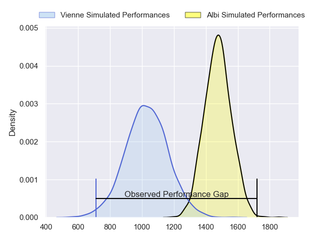
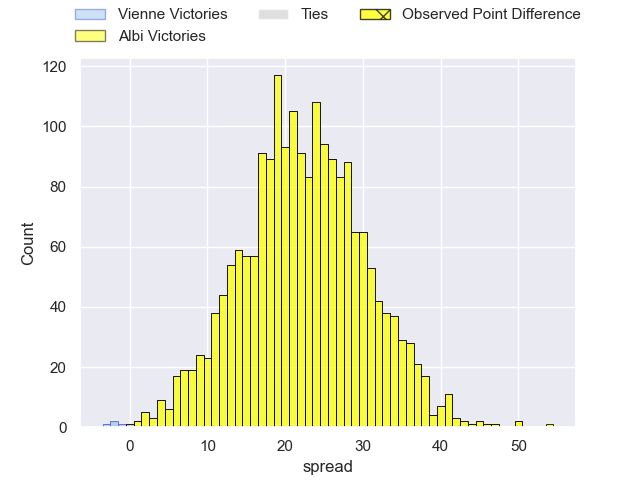
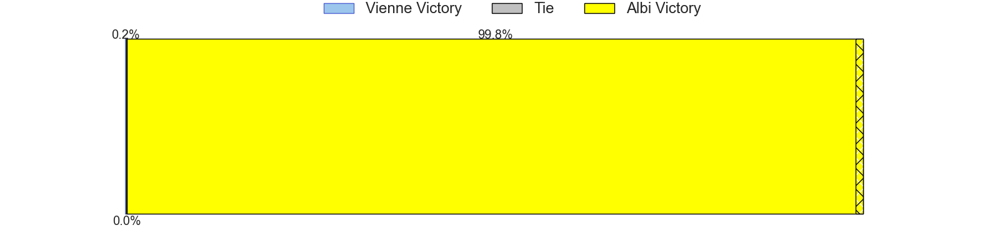
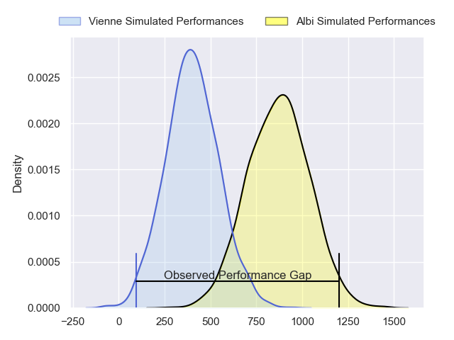
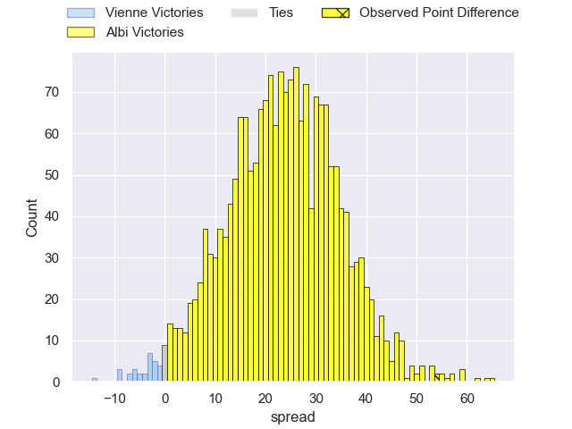
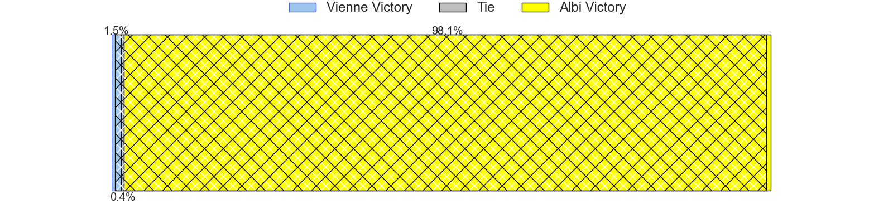
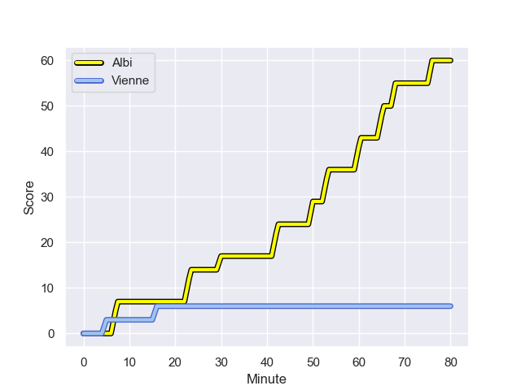
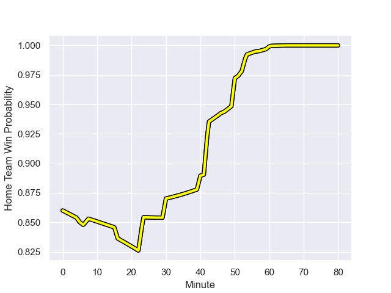

---  
layout: page  
title: Vienne at Albi; 6-60  
date: 2024-01-26 18:00:00 -0500  
categories: "Nationale 2023" match review  
---
# Vienne at Albi; 6-60

# Club Level Predictions

The first set of predictions treats a club as the smallest object, as the club develops its members, organizes a gameplan, and deploys its players as needed for each match. This club model has a prediction of 0.914, which translates to predicting Albi to win by 22.3.

Our Over/Under is 36.5 - and combined with the spread above, we have a predicted scoreline of 7 to 29

Each club has a rating and a rating deviation (similar to a Glicko rating), and expected performances can be generated. This allows for simulated matches and spreads like the ones below.
## Projected Performances - Club Model

## Projected Spreads - Club Model

## Projected Results - Club Model

# Player Level Predictions - Version 2

Treating teams instead as an entity made up of the currently active players, I have ratings for each player in an altogether different system. These can be combined to form team ratings once teamsheets are announced, weighting starters a bit higher than the reserves. After the match is played, players can be weighted by their minutes on the field, allowing for an accurate measure of the team's composition. With these compiled team ratings, we can make predictions, measure inaccuracy, and update the individual player ratings.
## Prediction with Player Minutes: Albi by 19.9

Albi by 13.5 on a neutral field
## Prediction without Player Minutes: Albi by 18.6

Albi by 12.2 on a neutral pitch

## Projected Performances - Player Model

## Projected Spreads - Player Model

## Projected Results - Player Model

## Scores over Time

## Win Probability over Time

There were 1 large changes in win probability in this match

|   Away Minutes | Away Player              |   Away elo |   Number |   Home elo | Home Player        |   Home Minutes |
|---------------:|:-------------------------|-----------:|---------:|-----------:|:-------------------|---------------:|
|             40 | Loïc Reynaud             |      45.91 |        1 |      46.58 | Dylan Jacquot      |             80 |
|             47 | Dimitri Gibierge         |      30.18 |        2 |      60.26 | Romain Maurice     |             60 |
|             60 | Pierre-Mathieu Fernandes |      25.49 |        3 |      31.17 | Simon Renaud       |             52 |
|             80 | Victor Comptat           |      18.22 |        4 |      46.65 | Yanis Horvath      |             78 |
|             40 | Antoine Frambourg        |      36.39 |        5 |      14.14 | Dion Evrard Oulai  |             80 |
|             40 | Léon Peyrat              |      22.87 |        6 |      31.45 | Vincent Calas      |             80 |
|             80 | Romain Falcoz            |      25.44 |        7 |      67.54 | Simon Meka         |             80 |
|             80 | Guillaume Moroldo        |      18.11 |        8 |      79.87 | Sandrick Maciotta  |             53 |
|             57 | Malory Piet              |       4.34 |        9 |      86.87 | Théo Vidal         |             80 |
|             40 | Charles Hager            |      40.81 |       10 |      53.7  | Benjamin Pehau     |             63 |
|             80 | Hippolyte Massa          |      36.43 |       11 |      41    | Charly Trussardi   |             63 |
|             53 | Anzize Said Omar         |      17.68 |       12 |      44.6  | Gabriel Aviragnet  |             80 |
|             80 | Axel Derderian           |      33.94 |       13 |       3.7  | Sean Robinson      |             63 |
|             80 | Martin Arfi              |      32.74 |       14 |      46.65 | Matis Pacchiana    |             80 |
|             80 | Tom Richard              |       5.89 |       15 |      84.04 | Paul Clergue       |             80 |
|             40 | Romain Eliot             |      29.27 |       16 |      58.98 | Dimitri Tchapnga   |             28 |
|             33 | Axel Benjamin            |      35.54 |       17 |      28.48 | Guillem Calmon     |             27 |
|             20 | Tau Junior Fifita        |      42.69 |       18 |      23.67 | Reinach Venter     |             20 |
|             40 | Nathanael Grosu          |      36.26 |       19 |     -19.32 | Pierre Roussel     |              2 |
|             40 | Steven Giroud            |      14.86 |       20 |      61.84 | Gilen Queheille    |             17 |
|             23 | Enzo Ravanello           |      42.59 |       21 |      28.37 | Kamilieni Raivono  |             17 |
|             40 | Julien Hervouet          |      30.58 |       22 |      17.62 | James Haydn Tedder |             17 |
|             27 | Matthias Giovale         |      19.97 |       23 |     nan    | nan                |            nan |

