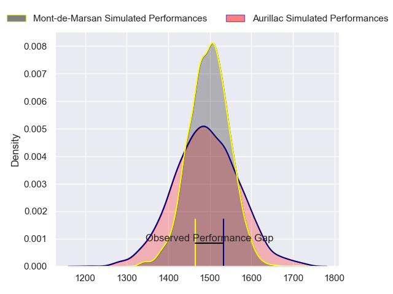
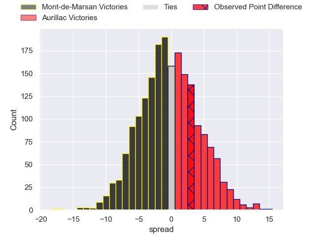
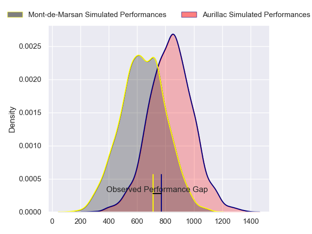
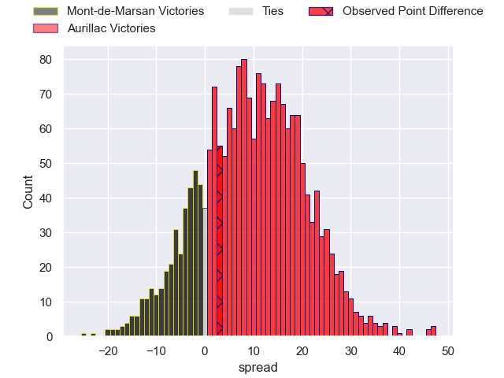
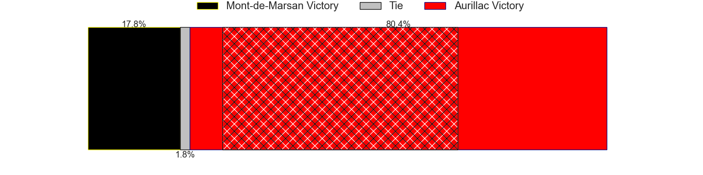
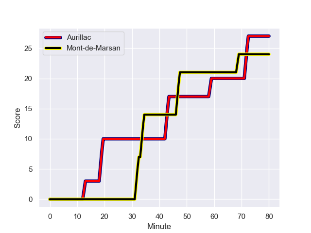
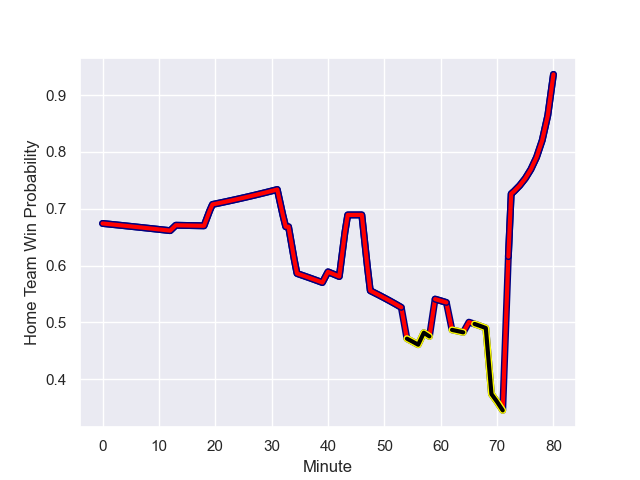

---  
layout: page  
title: Mont-de-Marsan at Aurillac; 24-27  
date: 2024-01-26 18:00:00 -0500  
categories: "Pro D2 2023" match review  
---
# Mont-de-Marsan at Aurillac; 24-27

# Club Level Predictions

The first set of predictions treats a club as the smallest object, as the club develops its members, organizes a gameplan, and deploys its players as needed for each match. This club model has a prediction of 0.492, which translates to predicting Mont-de-Marsan to win by 0.3.

Our Over/Under is 32.5 - and combined with the spread above, we have a predicted scoreline of 16 to 16

Each club has a rating and a rating deviation (similar to a Glicko rating), and expected performances can be generated. This allows for simulated matches and spreads like the ones below.
## Projected Performances - Club Model

## Projected Spreads - Club Model

## Projected Results - Club Model

# Player Level Predictions - Version 2

Treating teams instead as an entity made up of the currently active players, I have ratings for each player in an altogether different system. These can be combined to form team ratings once teamsheets are announced, weighting starters a bit higher than the reserves. After the match is played, players can be weighted by their minutes on the field, allowing for an accurate measure of the team's composition. With these compiled team ratings, we can make predictions, measure inaccuracy, and update the individual player ratings.
## Prediction with Player Minutes: Aurillac by 8.0

Aurillac by 0.7 on a neutral field
## Prediction without Player Minutes: Aurillac by 7.8

Aurillac by 0.6 on a neutral pitch

## Projected Performances - Player Model

## Projected Spreads - Player Model

## Projected Results - Player Model

## Scores over Time

## Win Probability over Time

There were 17 large changes in win probability in this match

|   Away Minutes | Away Player          |   Away elo |   Number |   Home elo | Home Player           |   Home Minutes |
|---------------:|:---------------------|-----------:|---------:|-----------:|:----------------------|---------------:|
|             59 | Jean-Luc Innocente   |      22.64 |        1 |      17.81 | Robert Rodgers        |             40 |
|             59 | Simon Labouyrie      |      32.46 |        2 |      18.87 | Luka Nioradze         |             62 |
|             57 | Anthony Alves        |      22.53 |        3 |      52.04 | Giorgi Kartvelishvili |             65 |
|             80 | Nicolas Garrault     |      21.12 |        4 |      39.6  | Martial Rolland       |             80 |
|             80 | Myles Edwards        |      16.82 |        5 |      41.91 | Mehdi Slamani         |             62 |
|             69 | Yann Brethous        |      30.1  |        6 |      79.06 | Eoghan Masterson      |             80 |
|             80 | William Wavrin       |      62.67 |        7 |      59.96 | Hugo Huurman          |             40 |
|             52 | Mike Faleafa         |      33.49 |        8 |      54.24 | Didier Tison          |             62 |
|             60 | Christophe Loustalot |      27.83 |        9 |      34.85 | Mikheil Alania        |             54 |
|             65 | Willie du Plessis    |      63.47 |       10 |      31.82 | Antoine Aucagne       |             80 |
|             80 | Pierre Sayerse       |      53.96 |       11 |      57.94 | AJ Coertzen           |             80 |
|             69 | Jules Even           |      61.56 |       12 |      10.29 | Christa Powell        |             65 |
|             80 | Nacani Wakaya        |      97.86 |       13 |      62.18 | Ofa Manuofetoa        |             80 |
|             80 | Semi Lagivala        |      46.46 |       14 |      47.06 | Juun Pieters          |             80 |
|             80 | Simao Broeiro Bento  |      28.4  |       15 |      34.53 | Marc Palmier          |             80 |
|             28 | Raphaël Robic        |      58.32 |       16 |      49.38 | Irakli Mtchedlidze    |             40 |
|             23 | Mattéo Lalanne       |      46.38 |       17 |      63.78 | Beka Shvangiradze     |             40 |
|             21 | Samuel Lagrange      |      50.92 |       18 |      31.46 | David Delarue         |             26 |
|             21 | Thomas Bultel        |      35.34 |       19 |      43.33 | Basa Khonelidze       |             18 |
|             20 | Kevin Viallard       |      45.87 |       20 |      22.96 | Mosa'ati Moala        |             18 |
|             15 | Joris Pialot         |      24.2  |       21 |      23.12 | Théo Cambon           |             18 |
|             11 | Jules Dussutour      |      45.82 |       22 |      50.34 | Hugo Bastard          |             15 |
|             11 | Gatien Masse         |      43.92 |       23 |      46.67 | Thomas Cretu          |             15 |

