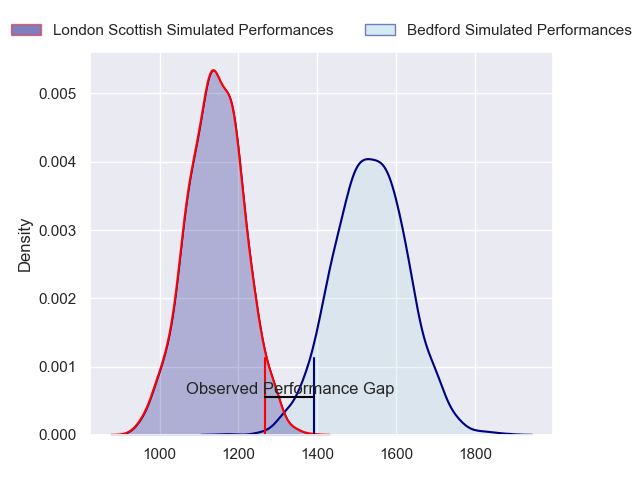
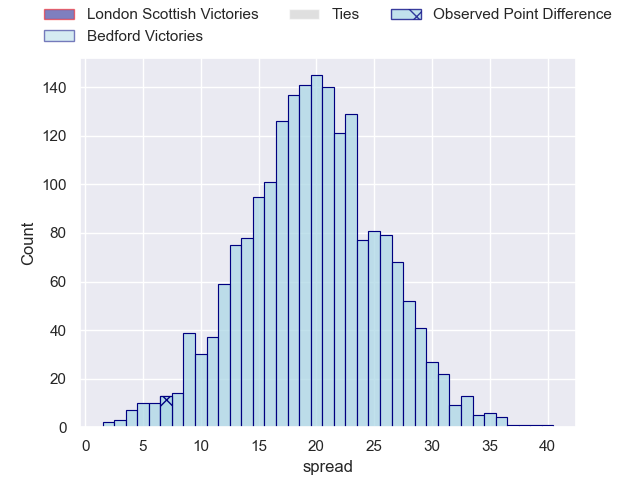
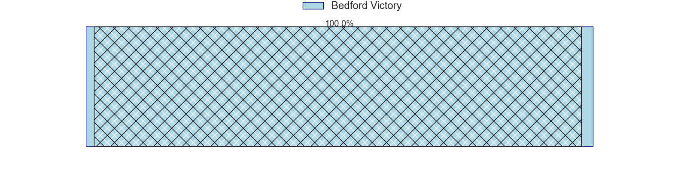
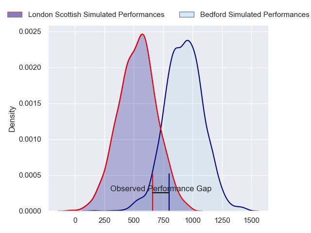
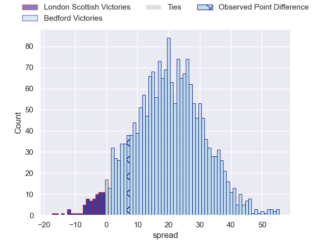
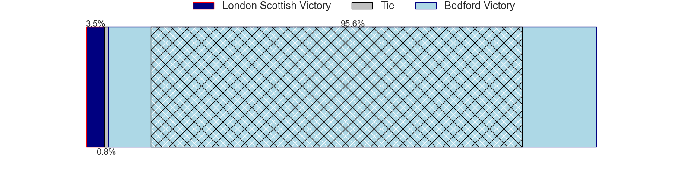
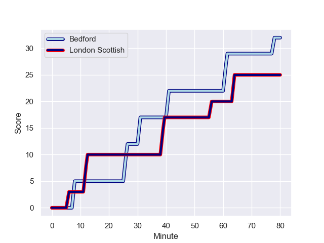
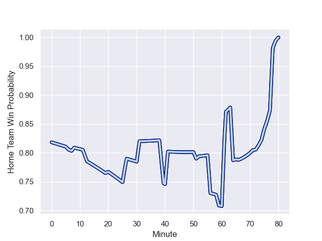

---  
layout: page  
title: London Scottish at Bedford; 25-32  
date: 2024-01-26 18:00:00 -0500  
categories: "RFU Championship 2023" match review  
---
# London Scottish at Bedford; 25-32

# Club Level Predictions

The first set of predictions treats a club as the smallest object, as the club develops its members, organizes a gameplan, and deploys its players as needed for each match. This club model has a prediction of 0.9, which translates to predicting Bedford to win by 19.6.

Our Over/Under is 53.5 - and combined with the spread above, we have a predicted scoreline of 17 to 37

Each club has a rating and a rating deviation (similar to a Glicko rating), and expected performances can be generated. This allows for simulated matches and spreads like the ones below.
## Projected Performances - Club Model

## Projected Spreads - Club Model

## Projected Results - Club Model

# Player Level Predictions - Version 2

Treating teams instead as an entity made up of the currently active players, I have ratings for each player in an altogether different system. These can be combined to form team ratings once teamsheets are announced, weighting starters a bit higher than the reserves. After the match is played, players can be weighted by their minutes on the field, allowing for an accurate measure of the team's composition. With these compiled team ratings, we can make predictions, measure inaccuracy, and update the individual player ratings.
## Prediction with Player Minutes: Bedford by 16.6

Bedford by 12.9 on a neutral field
## Prediction without Player Minutes: Bedford by 16.3

Bedford by 12.6 on a neutral pitch

## Projected Performances - Player Model

## Projected Spreads - Player Model

## Projected Results - Player Model

## Scores over Time

## Win Probability over Time

There were 9 large changes in win probability in this match

|   Away Minutes | Away Player           |   Away elo |   Number |   Home elo | Home Player          |   Home Minutes |
|---------------:|:----------------------|-----------:|---------:|-----------:|:---------------------|---------------:|
|             52 | Will Prior            |      57.82 |        1 |      61.54 | Joey Conway          |             56 |
|             52 | George Head           |      51.36 |        2 |      53.63 | James Fish           |             56 |
|             66 | William Hobson        |      54.03 |        3 |      63.34 | Ed Prowse            |             56 |
|             64 | Harry Browne          |      54.47 |        4 |      70.24 | Robin Williams       |             51 |
|             80 | Bailey Ransom         |      50.98 |        5 |      56.65 | Tom Lockett          |             80 |
|             80 | Jack Ingall           |      14.27 |        6 |      16.12 | Luke Frost           |             75 |
|             66 | Lewis Barrett         |      31.82 |        7 |      60.66 | Kieran Curran        |             59 |
|             80 | Tom Marshall          |      28.04 |        8 |      37.64 | Joe Howard           |             80 |
|             72 | Daniel Nutton         |       9.11 |        9 |      76.3  | Alex Day             |             80 |
|             20 | Alexander Lloyd-Seed  |      51.57 |       10 |      27.13 | Louis Grimoldby      |             80 |
|             80 | Noah Ferdinand        |     -39.42 |       11 |      77.18 | Dean Adamson         |             80 |
|             80 | Will Simonds          |      46.53 |       12 |      84.27 | Michael Le Bourgeois |             59 |
|             80 | Hayden Hyde           |      26.52 |       13 |      58.09 | Jordan Venter        |             80 |
|             80 | Will Brown            |      66.69 |       14 |      56.52 | Sean French          |             80 |
|             80 | William Talbot-Davies |      49.69 |       15 |      67.29 | Matthew Worley       |             80 |
|             44 | Connor Slevin         |      42.35 |       16 |      40.29 | Jac Arthur           |             29 |
|             28 | Jack Musk             |      55.97 |       17 |      36.09 | Jamie Jack           |             24 |
|             28 | Tom Osborne           |      43.69 |       18 |      81.87 | Oisin Heffernan      |             24 |
|             16 | Harry Sheppard        |     -10.66 |       19 |      50.61 | Craig Wright         |             24 |
|             16 | Marijn Huis           |      37.85 |       20 |      83.5  | William Maisey       |             21 |
|             14 | Rhys Charalambous     |      48.66 |       21 |      17.83 | Cameron King         |             21 |
|              8 | Jonny Law             |      32.75 |       22 |      64.4  | Alex Woolford        |              5 |
|             14 | John Ireland          |      46.65 |       23 |     nan    | nan                  |            nan |

