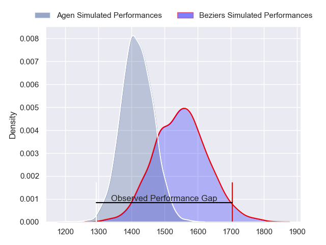
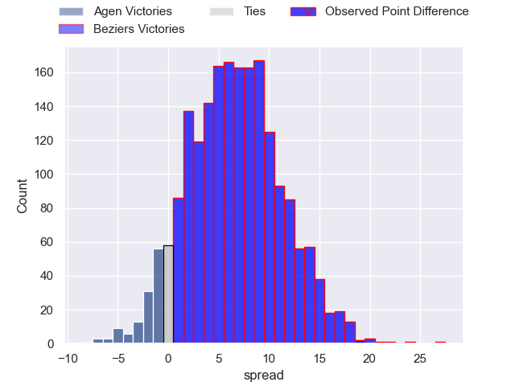
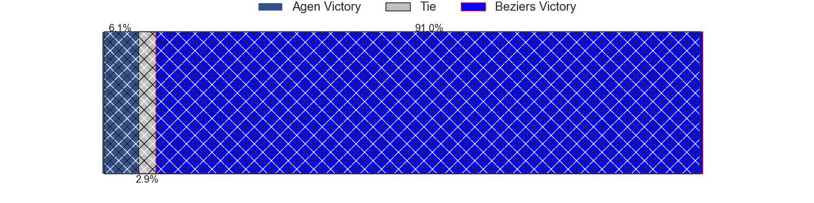
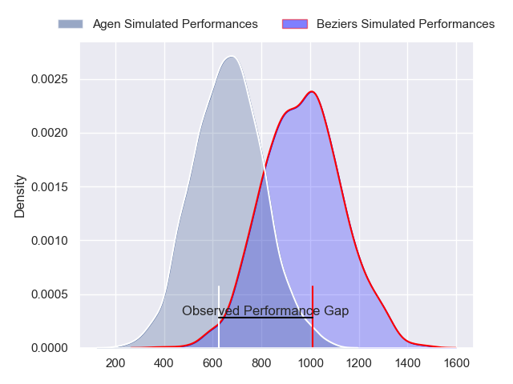
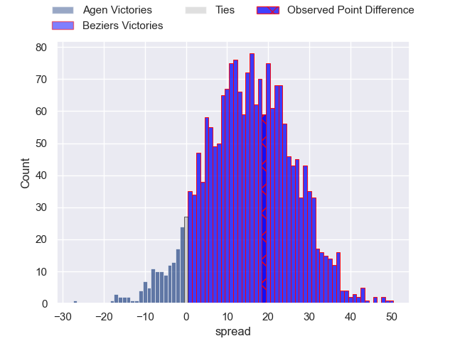
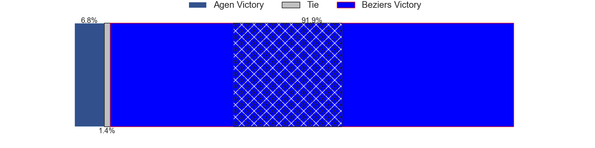
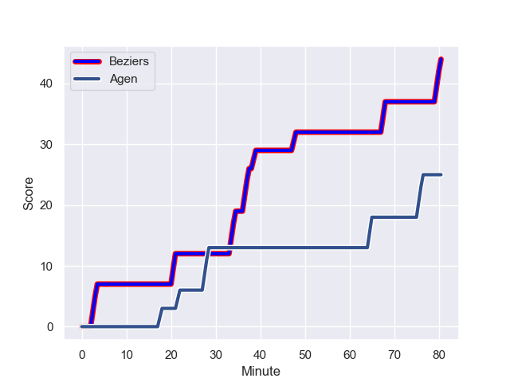
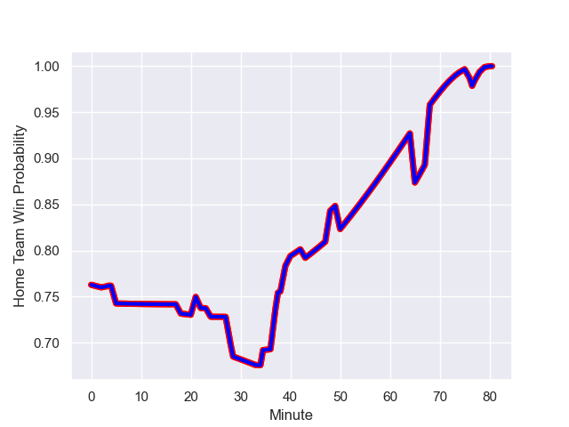

---  
layout: page  
title: Agen at Beziers; 25-44  
date: 2024-01-26 18:00:00 -0500  
categories: "Pro D2 2023" match review  
---
# Agen at Beziers; 25-44

# Club Level Predictions

The first set of predictions treats a club as the smallest object, as the club develops its members, organizes a gameplan, and deploys its players as needed for each match. This club model has a prediction of 0.682, which translates to predicting Beziers to win by 6.7.

Our Over/Under is 43.5 - and combined with the spread above, we have a predicted scoreline of 18 to 25

Each club has a rating and a rating deviation (similar to a Glicko rating), and expected performances can be generated. This allows for simulated matches and spreads like the ones below.
## Projected Performances - Club Model

## Projected Spreads - Club Model

## Projected Results - Club Model

# Player Level Predictions - Version 2

Treating teams instead as an entity made up of the currently active players, I have ratings for each player in an altogether different system. These can be combined to form team ratings once teamsheets are announced, weighting starters a bit higher than the reserves. After the match is played, players can be weighted by their minutes on the field, allowing for an accurate measure of the team's composition. With these compiled team ratings, we can make predictions, measure inaccuracy, and update the individual player ratings.
## Prediction with Player Minutes: Beziers by 12.8

Beziers by 5.5 on a neutral field
## Prediction without Player Minutes: Beziers by 15.0

Beziers by 7.8 on a neutral pitch

## Projected Performances - Player Model

## Projected Spreads - Player Model

## Projected Results - Player Model

## Scores over Time

## Win Probability over Time

There were 7 large changes in win probability in this match

|   Away Minutes | Away Player        |   Away elo |   Number |   Home elo | Home Player         |   Home Minutes |
|---------------:|:-------------------|-----------:|---------:|-----------:|:--------------------|---------------:|
|             52 | Hans Lombard-Buret |      48.38 |        1 |      32.27 | Youssef Amrouni     |             54 |
|             23 | Pierre Jouvin      |      38.04 |        2 |      61.67 | Yvann Lalevee       |              5 |
|             50 | Alex Burin         |      57.1  |        3 |      62.99 | Yannick Arroyo      |             52 |
|             80 | Joe Maksymiw       |       6.34 |        4 |      59.71 | Clément Bitz        |             50 |
|             43 | Zak Farrance       |      32.05 |        5 |      10.29 | John Madigan        |             80 |
|             24 | Vincent Farre      |      61.51 |        6 |      37.96 | William van Bost    |             50 |
|             80 | Valentin Gayraud   |      51.51 |        7 |      31.45 | Clement Ancely      |             80 |
|             80 | Matthieu Bonnet    |      54.15 |        8 |      62.26 | Sias Koen           |             60 |
|             52 | Theo Idjellidaine  |      32.85 |        9 |      77.87 | Samuel Marques      |             71 |
|             40 | Thomas Vincent     |      59.44 |       10 |      70.82 | Charly Malie        |             80 |
|             34 | Loris Tolot        |     -21.16 |       11 |      61.1  | Paul Reau           |             80 |
|             80 | Clement Garrigues  |      55    |       12 |      54.92 | Taleta Tupuola      |             80 |
|             80 | Theo Belan         |      29.88 |       13 |      43.49 | Maxime Espeut       |             80 |
|             80 | George Tilsley     |      71.6  |       14 |      99.95 | Raffaele Storti     |             80 |
|             80 | Romain Darchen     |      46.62 |       15 |     103.24 | Gabin Lorre         |             80 |
|             57 | Clement Martinez   |      46.51 |       16 |      25.13 | Francisco Fernandes |             75 |
|             56 | Arnaud Duputs      |      57.56 |       17 |      -0.56 | Hans N'kinsi        |             30 |
|             46 | Tevita Railevu     |      62.01 |       18 |      22.16 | Gillian Benoy       |             30 |
|             40 | Emile Dayral       |      39.23 |       19 |      73.55 | Jon Zabala Arrieta  |             28 |
|             37 | William Demotte    |      71.9  |       20 |      37.74 | Giorgi Akhaladze    |             26 |
|             30 | Beau Farrance      |      43.4  |       21 |      23    | Thomas Hoarau       |             20 |
|             28 | Florent Guion      |       0.09 |       22 |      34.9  | Mitch Short         |              9 |
|             28 | Dorian Bellot      |      45.32 |       23 |     nan    | nan                 |            nan |

