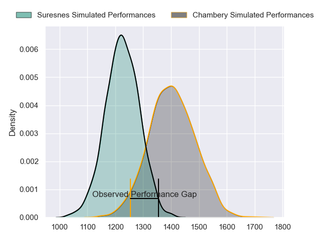
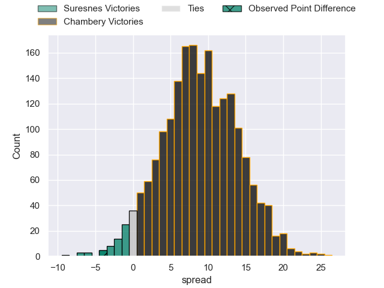
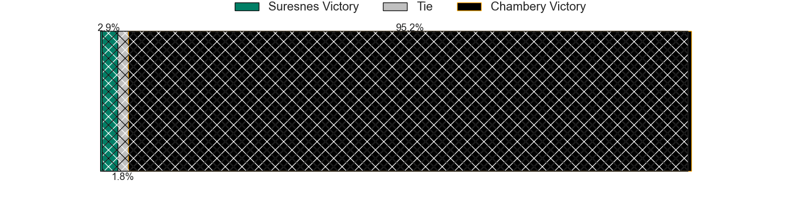
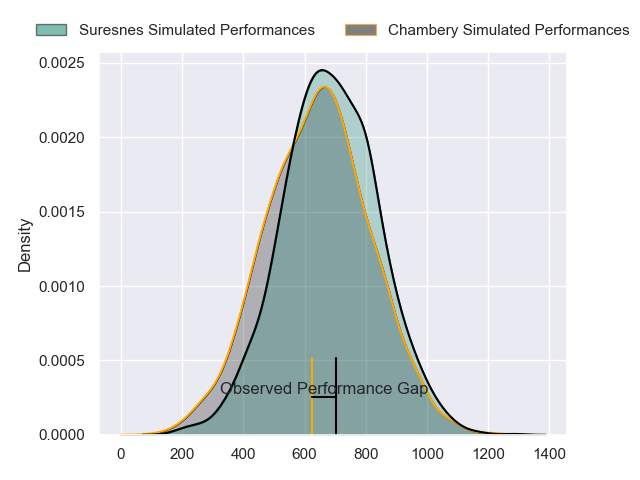
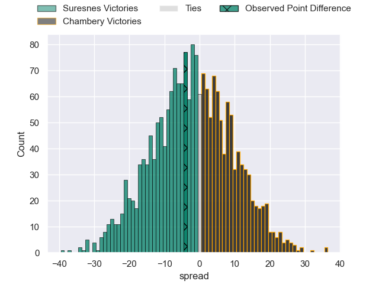
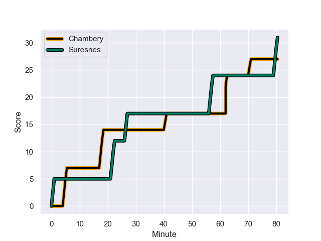
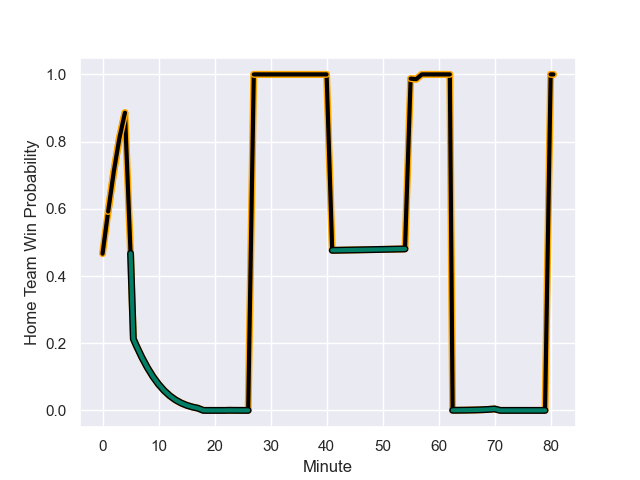

---  
layout: page  
title: Suresnes at Chambery; 31-27  
date: 2024-01-26 18:00:00 -0500  
categories: "Nationale 2023" match review  
---
# Suresnes at Chambery; 31-27

# Club Level Predictions

The first set of predictions treats a club as the smallest object, as the club develops its members, organizes a gameplan, and deploys its players as needed for each match. This club model has a prediction of 0.732, which translates to predicting Chambery to win by 8.9.

Our Over/Under is 30.5 - and combined with the spread above, we have a predicted scoreline of 11 to 19

Each club has a rating and a rating deviation (similar to a Glicko rating), and expected performances can be generated. This allows for simulated matches and spreads like the ones below.
## Projected Performances - Club Model

## Projected Spreads - Club Model

## Projected Results - Club Model

# Player Level Predictions - Version 2

Treating teams instead as an entity made up of the currently active players, I have ratings for each player in an altogether different system. These can be combined to form team ratings once teamsheets are announced, weighting starters a bit higher than the reserves. After the match is played, players can be weighted by their minutes on the field, allowing for an accurate measure of the team's composition. With these compiled team ratings, we can make predictions, measure inaccuracy, and update the individual player ratings.
## Prediction with Player Minutes: Suresnes by 1.5

Suresnes by 4.9 on a neutral field
## Prediction without Player Minutes: Suresnes by 0.6

Suresnes by 4.1 on a neutral pitch

## Projected Performances - Player Model

## Projected Spreads - Player Model

## Projected Results - Player Model

## Scores over Time

## Win Probability over Time

There were 14 large changes in win probability in this match

|   Away Minutes | Away Player            |   Away elo |   Number |   Home elo | Home Player                  |   Home Minutes |
|---------------:|:-----------------------|-----------:|---------:|-----------:|:-----------------------------|---------------:|
|             55 | Elias Coulibaly        |      57.43 |        1 |      51.13 | Nugzar Somkhishvili          |             58 |
|             55 | Jean-Étienne Lesueur   |      28.67 |        2 |      47.46 | Gauthier Brute de Remur      |             73 |
|             55 | Victor Damian Arias    |      42.17 |        3 |      47.43 | Giorgi Pertaia               |             73 |
|             74 | Sacha Yahi             |      41.52 |        4 |      36.33 | Fabien Witz                  |             80 |
|             63 | Yakine Djebarri        |      30.45 |        5 |      54.33 | Corentin Astier              |             80 |
|             80 | Damien Bozic           |      52.48 |        6 |      36.49 | Thomas Coignat               |             55 |
|             80 | Wian Vosloo            |      31.81 |        7 |      78.39 | Matheo Triki                 |             63 |
|             80 | Lakisipone Lee         |      47.96 |        8 |      40.08 | Taniela Matakaiongo          |             80 |
|             74 | Thomas Lacroix         |      29.42 |        9 |      25.85 | Thibault Dufau               |             73 |
|             59 | Tanguy Lacoste         |      51.96 |       10 |      32.07 | Jean-Luc Alewyn Cilliers     |             80 |
|             59 | Thomas Baudy           |       7.03 |       11 |      -4.79 | Vereniki Goneva              |             80 |
|             80 | Petero Tuwai           |      61.28 |       12 |      20.47 | Mickael Blanc                |             80 |
|             80 | Victor Barnier         |      80.9  |       13 |      53.38 | Bastien Reymond              |             74 |
|             80 | Faraj Fartass          |      84.28 |       14 |      29.36 | Maewen Sao                   |             80 |
|             80 | Goulwen Gueho          |       3.46 |       15 |      19.64 | Paul Baptiste Florent Altier |             79 |
|             25 | Sébastien Lafrancesca  |      69.22 |       16 |      35.17 | Colin Lebian                 |             25 |
|             25 | Leandro Mario Assi     |      39.03 |       17 |      57.08 | Géraud Clermont              |             22 |
|             25 | Hayam El Bibouji       |      37.89 |       18 |      51.24 | Ahmed Tidiane Kane           |             17 |
|             21 | Jean Chezeau           |      63.38 |       19 |      21.25 | Hugo Deschaux                |              7 |
|             21 | Jean Delbecq           |      46.65 |       20 |      29.06 | Zauri Tevdorashvili          |              7 |
|             17 | Jean-Baptiste Lachaise |      57.65 |       21 |      33.87 | Luka Begic                   |              7 |
|              6 | Peïo Etchebest         |      54.37 |       22 |      20.99 | Victor Pisano                |              6 |
|              6 | Florian Desbordes      |      40.11 |       23 |      51.36 | Jules Dorrival               |              1 |

