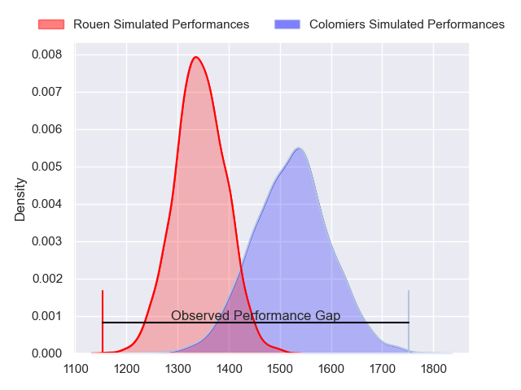
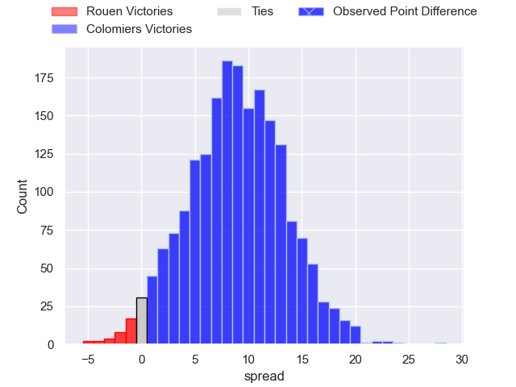
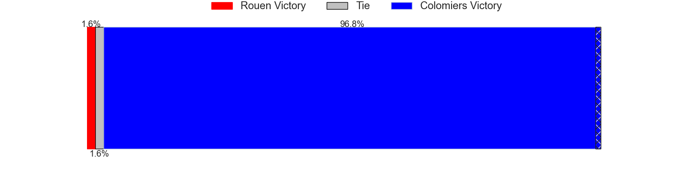
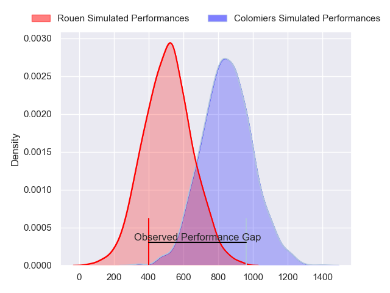
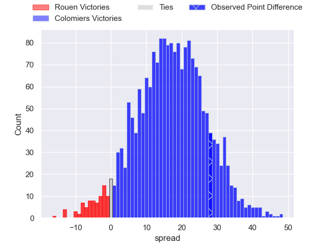
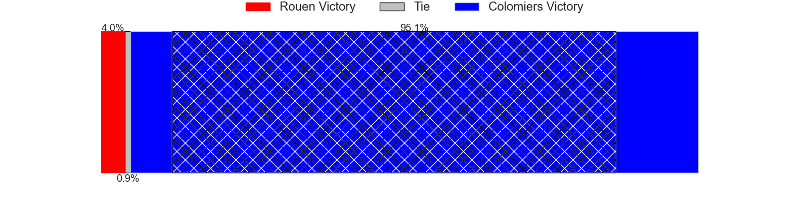
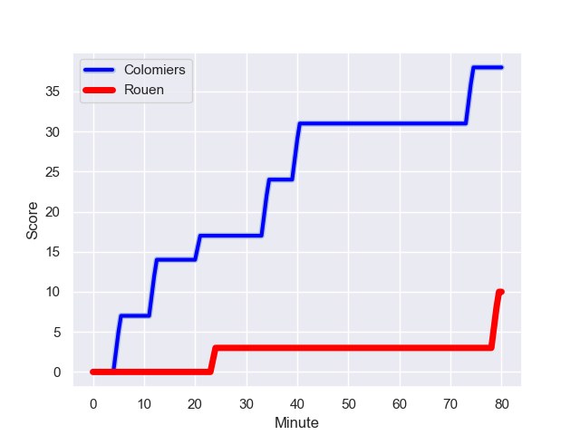
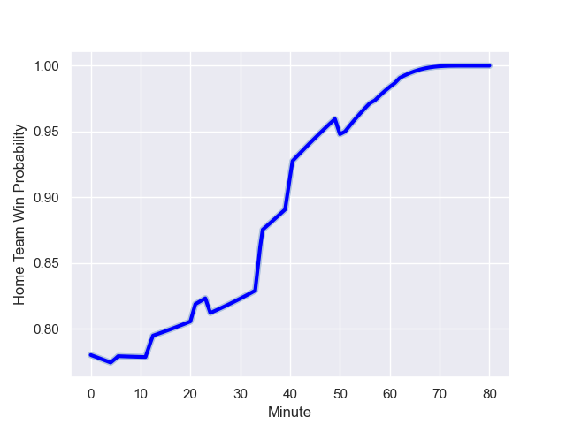

---  
layout: page  
title: Rouen at Colomiers; 10-38  
date: 2024-01-26 18:00:00 -0500  
categories: "Pro D2 2023" match review  
---
# Rouen at Colomiers; 10-38

# Club Level Predictions

The first set of predictions treats a club as the smallest object, as the club develops its members, organizes a gameplan, and deploys its players as needed for each match. This club model has a prediction of 0.732, which translates to predicting Colomiers to win by 8.9.

Our Over/Under is 41.5 - and combined with the spread above, we have a predicted scoreline of 16 to 25

Each club has a rating and a rating deviation (similar to a Glicko rating), and expected performances can be generated. This allows for simulated matches and spreads like the ones below.
## Projected Performances - Club Model

## Projected Spreads - Club Model

## Projected Results - Club Model

# Player Level Predictions - Version 2

Treating teams instead as an entity made up of the currently active players, I have ratings for each player in an altogether different system. These can be combined to form team ratings once teamsheets are announced, weighting starters a bit higher than the reserves. After the match is played, players can be weighted by their minutes on the field, allowing for an accurate measure of the team's composition. With these compiled team ratings, we can make predictions, measure inaccuracy, and update the individual player ratings.
## Prediction with Player Minutes: Colomiers by 13.8

Colomiers by 7.0 on a neutral field
## Prediction without Player Minutes: Colomiers by 14.9

Colomiers by 8.1 on a neutral pitch

## Projected Performances - Player Model

## Projected Spreads - Player Model

## Projected Results - Player Model

## Scores over Time

## Win Probability over Time

There were 2 large changes in win probability in this match

|   Away Minutes | Away Player        |   Away elo |   Number |   Home elo | Home Player           |   Home Minutes |
|---------------:|:-------------------|-----------:|---------:|-----------:|:----------------------|---------------:|
|             40 | Elias El Ansari    |      -2.2  |        1 |      54.08 | Hugo Djehi            |             50 |
|             32 | Jeremie Maurouard  |     -25.21 |        2 |      -2.7  | Thomas Larrieu        |             40 |
|             40 | Soso Bekoshvili    |      45.7  |        3 |      45.26 | Hugo Pirlet           |             51 |
|             80 | John-Charles Astle |      10.88 |        4 |      18.56 | Anthony Coletta       |             80 |
|             40 | Jimi Maximin       |      35.68 |        5 |      47.86 | Jean Thomas           |             51 |
|             80 | Tienie Burger      |      46.57 |        6 |      46.65 | Alexis Caumel         |             51 |
|             40 | Samuel Maximin     |       5.98 |        7 |      67.85 | Aldric Lescure        |             80 |
|             40 | Tino Mapapalangi   |      20.04 |        8 |      29.62 | Jorick Dastugue       |             50 |
|             40 | Maxime Sidobre     |      52.69 |        9 |      29.48 | Ugo Seguela           |             62 |
|             57 | Franck Pourteau    |      61.63 |       10 |      26.23 | Maxime Javaux         |             57 |
|             80 | Paul Vallee        |      34.16 |       11 |     104.72 | Rodrigo Marta         |             80 |
|             80 | Taylor Gontineac   |      65.98 |       12 |      54.63 | Ray Nu'u              |             80 |
|             80 | Pablo Patilla      |      32.06 |       13 |      39.59 | Fabien Perrin         |             80 |
|             80 | Alex Luatua        |       3.19 |       14 |      73.31 | Vincent Pinto         |             80 |
|             80 | Baptiste Mouchous  |      50.09 |       15 |      26.33 | Valentin Saurs        |             80 |
|             48 | Efi Ma'afu         |      27.77 |       16 |      38.6  | Pablo Dimcheff        |             40 |
|             40 | Antoine Fournier   |      37.15 |       17 |      38.02 | Pierre-Samuel Pacheco |             30 |
|             40 | Cody Thomas        |      32.83 |       18 |      36.48 | Waël Ponpon           |             30 |
|             40 | Julien Ruaud       |      76.03 |       19 |      32.28 | Janse Roux            |             29 |
|             40 | Abdelkarim Fofana  |      32.04 |       20 |      67.3  | Michael Simutoga      |             29 |
|             40 | Florent Campeggia  |      20.87 |       21 |      49.36 | Romain Bezian         |             29 |
|             40 | Lucas Costa        |      56.65 |       22 |      -8.54 | Brett Herron          |             23 |
|             23 | Benjamin Descamps  |      51.62 |       23 |      83.25 | Edoardo Gori          |             18 |

