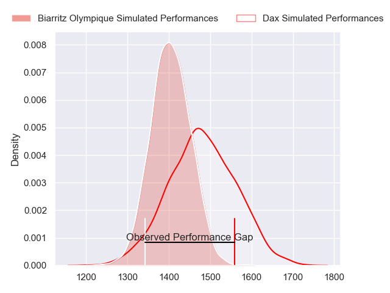
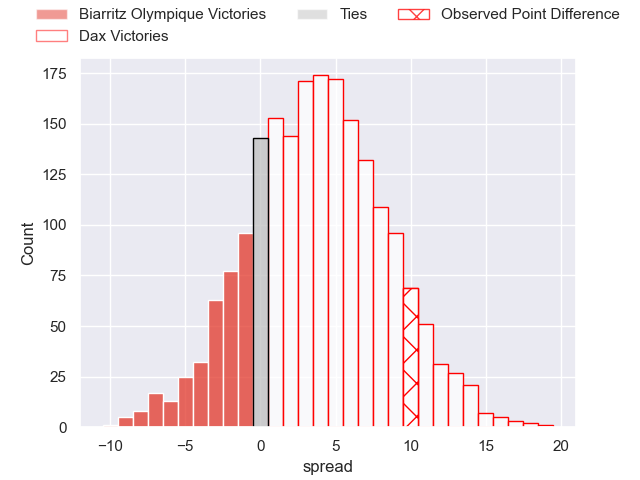
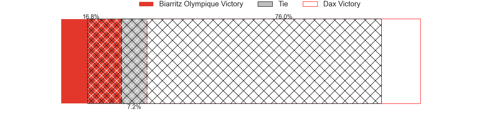
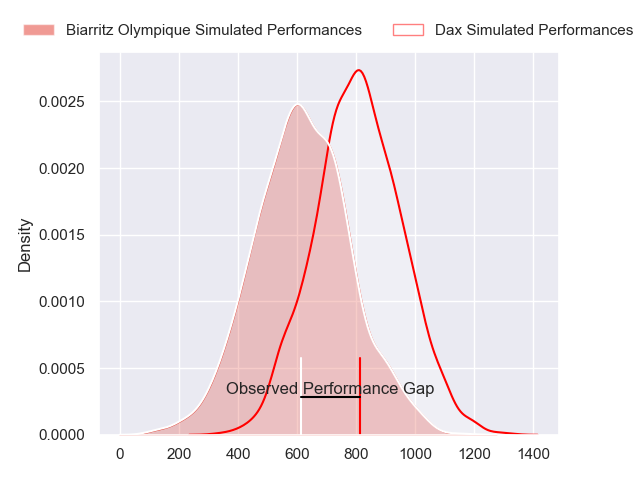
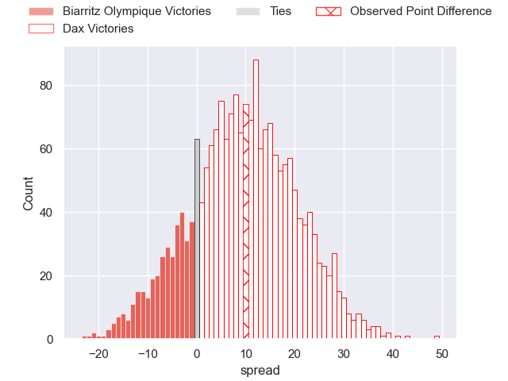
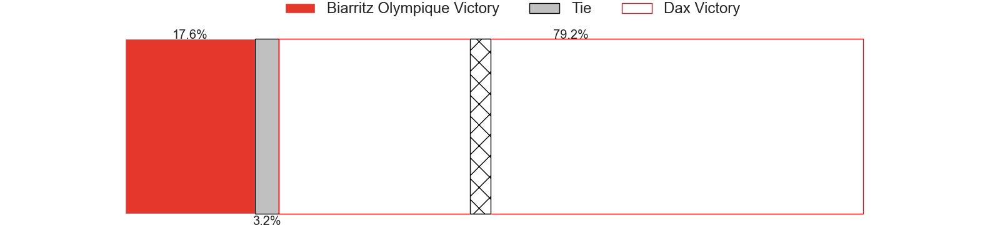
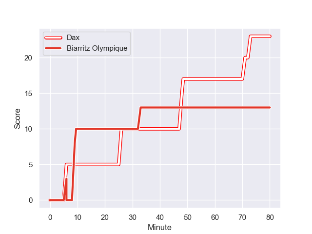
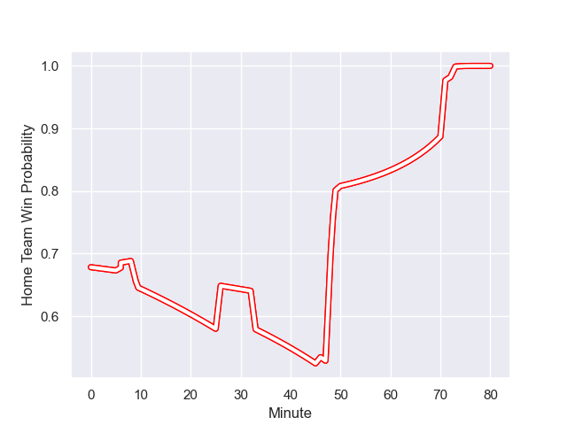

---  
layout: page  
title: Biarritz Olympique at Dax; 13-23  
date: 2024-01-26 18:00:00 -0500  
categories: "Pro D2 2023" match review  
---
# Biarritz Olympique at Dax; 13-23

# Club Level Predictions

The first set of predictions treats a club as the smallest object, as the club develops its members, organizes a gameplan, and deploys its players as needed for each match. This club model has a prediction of 0.609, which translates to predicting Dax to win by 3.9.

Our Over/Under is 33.5 - and combined with the spread above, we have a predicted scoreline of 15 to 19

Each club has a rating and a rating deviation (similar to a Glicko rating), and expected performances can be generated. This allows for simulated matches and spreads like the ones below.
## Projected Performances - Club Model

## Projected Spreads - Club Model

## Projected Results - Club Model

# Player Level Predictions - Version 2

Treating teams instead as an entity made up of the currently active players, I have ratings for each player in an altogether different system. These can be combined to form team ratings once teamsheets are announced, weighting starters a bit higher than the reserves. After the match is played, players can be weighted by their minutes on the field, allowing for an accurate measure of the team's composition. With these compiled team ratings, we can make predictions, measure inaccuracy, and update the individual player ratings.
## Prediction with Player Minutes: Dax by 8.2

Dax by 1.5 on a neutral field
## Prediction without Player Minutes: Dax by 7.3

Dax by 0.5 on a neutral pitch

## Projected Performances - Player Model

## Projected Spreads - Player Model

## Projected Results - Player Model

## Scores over Time

## Win Probability over Time

There were 7 large changes in win probability in this match

|   Away Minutes | Away Player         |   Away elo |   Number |   Home elo | Home Player           |   Home Minutes |
|---------------:|:--------------------|-----------:|---------:|-----------:|:----------------------|---------------:|
|             49 | Killian Taofifenua  |      31.88 |        1 |       9.47 | David Lolohea         |             49 |
|             66 | Thomas Sauveterre   |      62.2  |        2 |      38.23 | Maxime Delonca        |             49 |
|             66 | Mohamed Haouas      |      53.02 |        3 |      13.65 | Diogo Hasse Ferreira  |             49 |
|             80 | Charlie Matthews    |      61.16 |        4 |      26.46 | Josh Furno            |             80 |
|             55 | Adrian Motoc        |     -10.21 |        5 |       7.47 | Jean-Baptiste Singer  |             49 |
|             50 | Dave O'Callaghan    |      15.87 |        6 |      32.28 | Jean-Baptiste Barrère |             80 |
|             80 | Simon Augry         |      36.48 |        7 |      35.45 | Ratu Nacika           |             49 |
|             80 | Temo Matiu          |      37.18 |        8 |      88.74 | Genesis Mamea Lemalu  |             80 |
|             66 | Imanol Biscay       |      44.12 |        9 |      43.16 | Sylvère Reteau        |             64 |
|             80 | Billy Searle        |       3.58 |       10 |      40.09 | Romuald Séguy         |             46 |
|             80 | Baptiste Fariscot   |      56.57 |       11 |      88.93 | Hugo Fourquet         |             80 |
|             71 | Tyler Morgan        |      70.38 |       12 |      36.21 | Ilikena Bolakoro      |             60 |
|             80 | Jonathan Joseph     |      86.91 |       13 |      16.01 | Benjamin Puntous      |             80 |
|             80 | Zach Kibirige       |      16.21 |       14 |      45.57 | Théo Gatelier         |             80 |
|             80 | Joe Jonas           |      61.59 |       15 |      55.96 | Théo Duprat           |             80 |
|             31 | Kevin Tougne        |      43.65 |       16 |      54.42 | Hugo Cerisier         |             34 |
|             30 | Charlie Francoz     |      -1.08 |       17 |      55.77 | Iban Hiriart-Urruty   |             31 |
|             25 | Johnny Dyer         |      -3.92 |       18 |      62.69 | Louis Mary            |             31 |
|             14 | Kerman Aurrekoetxea |      48.31 |       19 |      66.29 | Mat Luamanu           |             31 |
|             14 | Brendan Lebrun      |      38.06 |       20 |      49.14 | Arnaud Aletti         |             31 |
|             14 | Alfie Petch         |      22.45 |       21 |       8.59 | Nephi Leatigaga       |             31 |
|              9 | Vincent Martin      |      19.18 |       22 |      61.31 | Bastien Daguerre      |             20 |
|            nan | nan                 |     nan    |       23 |      71.15 | Simon Garrouteigt     |             16 |

