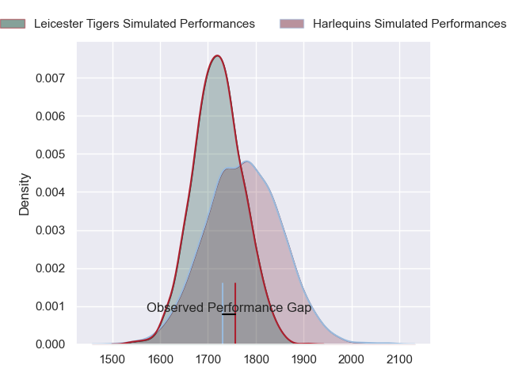
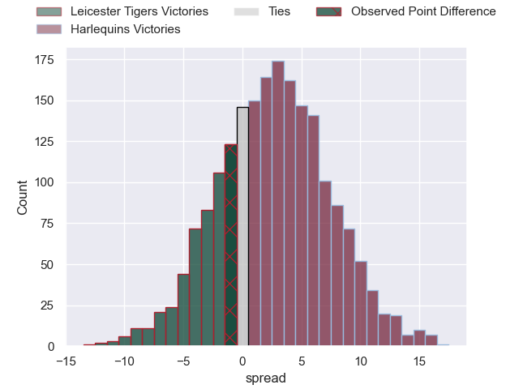
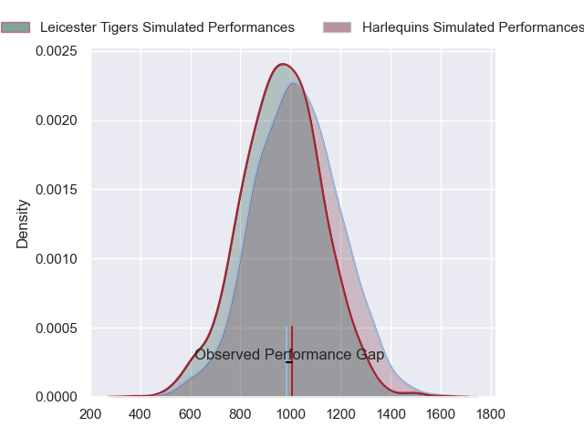
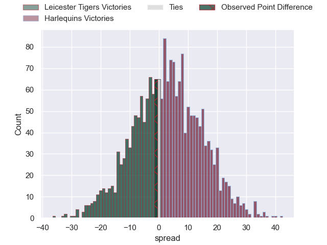
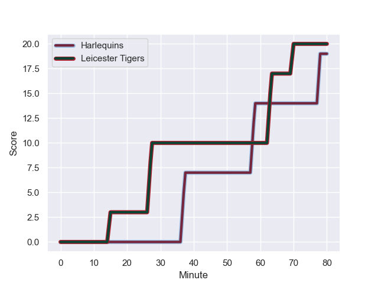
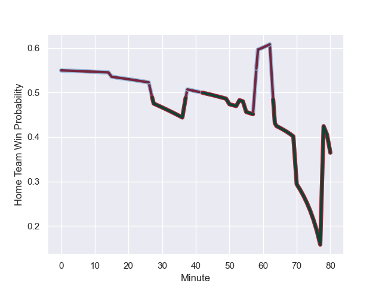

---  
layout: page  
title: Leicester Tigers at Harlequins; 20-19  
date: 2024-01-26 18:00:00 -0500  
categories: "Gallagher Premiership 2023" match review  
---
# Leicester Tigers at Harlequins; 20-19

# Club Level Predictions

The first set of predictions treats a club as the smallest object, as the club develops its members, organizes a gameplan, and deploys its players as needed for each match. This club model has a prediction of 0.575, which translates to predicting Harlequins to win by 2.7.

Our Over/Under is 51.5 - and combined with the spread above, we have a predicted scoreline of 24 to 27

Each club has a rating and a rating deviation (similar to a Glicko rating), and expected performances can be generated. This allows for simulated matches and spreads like the ones below.
## Projected Performances - Club Model

## Projected Spreads - Club Model

## Projected Results - Club Model

# Player Level Predictions - Version 2

Treating teams instead as an entity made up of the currently active players, I have ratings for each player in an altogether different system. These can be combined to form team ratings once teamsheets are announced, weighting starters a bit higher than the reserves. After the match is played, players can be weighted by their minutes on the field, allowing for an accurate measure of the team's composition. With these compiled team ratings, we can make predictions, measure inaccuracy, and update the individual player ratings.
## Prediction with Player Minutes: Harlequins by 2.2

Leicester Tigers by 5.2 on a neutral field
## Prediction without Player Minutes: Harlequins by 3.0

Leicester Tigers by 4.3 on a neutral pitch

## Projected Performances - Player Model

## Projected Spreads - Player Model

## Projected Results - Player Model

## Scores over Time

## Win Probability over Time

There were 10 large changes in win probability in this match

|   Away Minutes | Away Player           |   Away elo |   Number |   Home elo | Home Player       |   Home Minutes |
|---------------:|:----------------------|-----------:|---------:|-----------:|:------------------|---------------:|
|             53 | James Cronin          |      87.09 |        1 |      17.71 | Fin Baxter        |             80 |
|             79 | Julian Montoya        |     108.61 |        2 |      24.18 | Jack Walker       |             70 |
|             80 | Dan Richardson        |      52.94 |        3 |      67.87 | Will Collier      |             64 |
|             75 | Harry Wells           |      64.84 |        4 |     111.2  | Joe Launchbury    |             80 |
|             64 | Kyle Hatherell        |     -19.24 |        5 |      52.8  | Irne Herbst       |             60 |
|             80 | Hanro Liebenberg      |      83.51 |        6 |      -6.76 | George Hammond    |             80 |
|             53 | Olly Cracknell        |      59.46 |        7 |      46.79 | Will Evans        |             80 |
|             80 | Jasper Wiese          |      78.37 |        8 |      73.14 | James Chisholm    |             80 |
|             55 | Tom Whiteley          |      19.46 |        9 |      33.77 | Max Green         |             77 |
|             80 | Handre Pollard        |     102.76 |       10 |      92.73 | Jarrod Evans      |             80 |
|             80 | Ollie Hassell-Collins |      62.69 |       11 |      62.89 | Louis Lynagh      |             50 |
|             64 | Solomone Kata         |      46.66 |       12 |     108.35 | Andre Esterhuizen |             80 |
|             80 | Dan Kelly             |      88.96 |       13 |      63.93 | Will Joseph       |             70 |
|             80 | Mike Brown            |      80.73 |       14 |      29.47 | Nick David        |             80 |
|             80 | James Shillcock       |      33.67 |       15 |      71.42 | Tyrone Green      |             80 |
|             27 | James Whitcombe       |      39.25 |       16 |      42.4  | Sam Riley         |             10 |
|              1 | Finn Theobald-Thomas  |      47.73 |       17 |     102.36 | Dillon Lewis      |             16 |
|              5 | Sam Carter            |     107.68 |       18 |      38.18 | Lewis Gjaltema    |              3 |
|             27 | Matt Rogerson         |      66.68 |       19 |      50.43 | Freddie Clarke    |             20 |
|             16 | Finn Carnduff         |      46.65 |       20 |      37.19 | Cadan Murley      |             30 |
|             25 | Ben Youngs            |      77.6  |       21 |      58.68 | Will Edwards      |             10 |
|             16 | Matt Scott            |      59.24 |       22 |     nan    | nan               |            nan |

