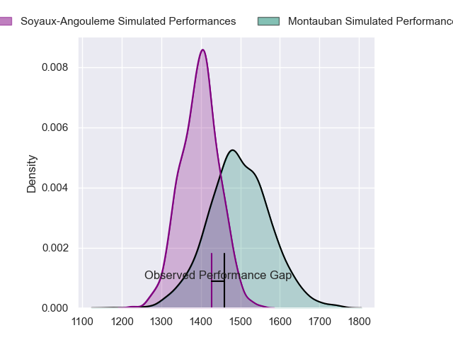
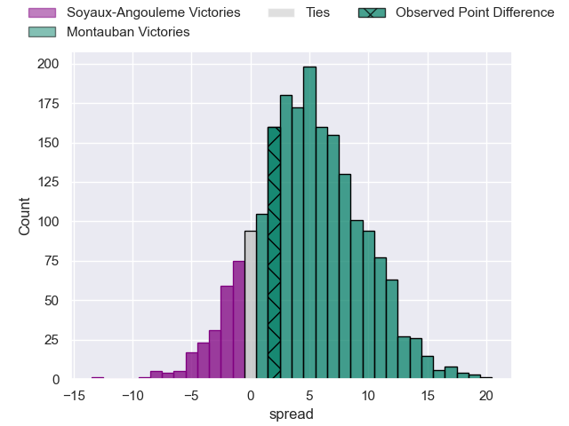
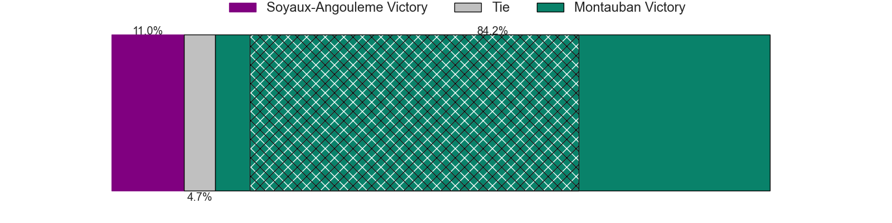
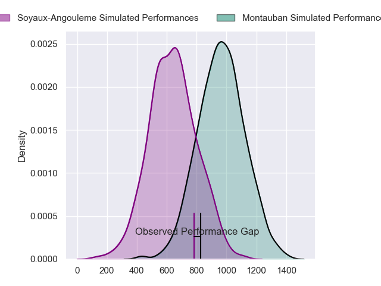
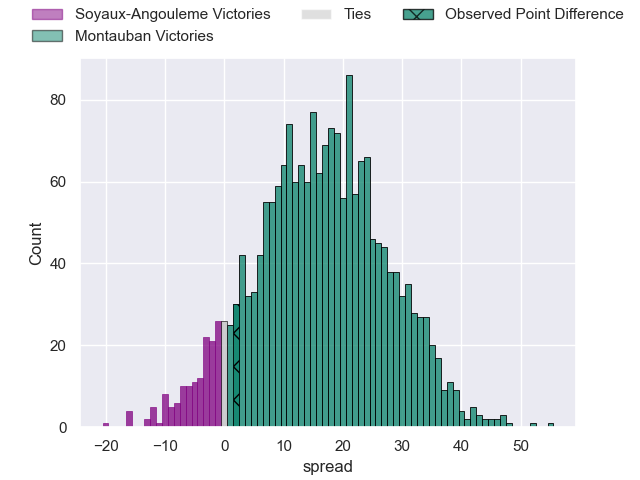
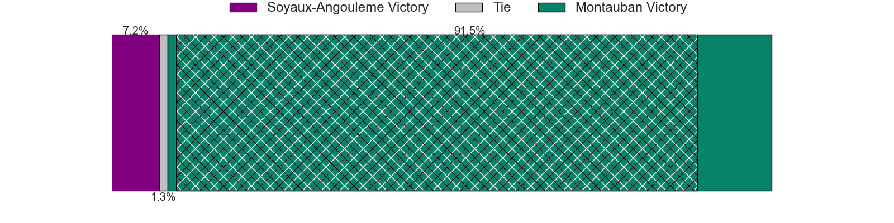
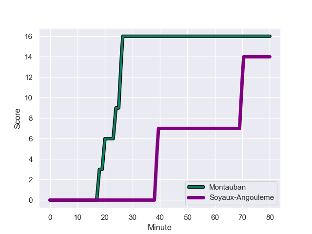
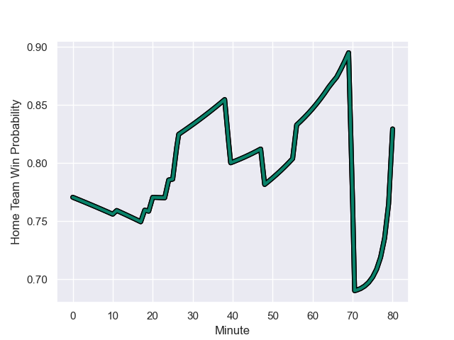

---  
layout: page  
title: Soyaux-Angouleme at Montauban; 14-16  
date: 2024-01-26 18:00:00 -0500  
categories: "Pro D2 2023" match review  
---
# Soyaux-Angouleme at Montauban; 14-16

# Club Level Predictions

The first set of predictions treats a club as the smallest object, as the club develops its members, organizes a gameplan, and deploys its players as needed for each match. This club model has a prediction of 0.64, which translates to predicting Montauban to win by 5.1.

Our Over/Under is 38.5 - and combined with the spread above, we have a predicted scoreline of 17 to 22

Each club has a rating and a rating deviation (similar to a Glicko rating), and expected performances can be generated. This allows for simulated matches and spreads like the ones below.
## Projected Performances - Club Model

## Projected Spreads - Club Model

## Projected Results - Club Model

# Player Level Predictions - Version 2

Treating teams instead as an entity made up of the currently active players, I have ratings for each player in an altogether different system. These can be combined to form team ratings once teamsheets are announced, weighting starters a bit higher than the reserves. After the match is played, players can be weighted by their minutes on the field, allowing for an accurate measure of the team's composition. With these compiled team ratings, we can make predictions, measure inaccuracy, and update the individual player ratings.
## Prediction with Player Minutes: Montauban by 13.4

Montauban by 7.3 on a neutral field
## Prediction without Player Minutes: Montauban by 13.1

Montauban by 7.1 on a neutral pitch

## Projected Performances - Player Model

## Projected Spreads - Player Model

## Projected Results - Player Model

## Scores over Time

## Win Probability over Time

There were 8 large changes in win probability in this match

|   Away Minutes | Away Player            |   Away elo |   Number |   Home elo | Home Player       |   Home Minutes |
|---------------:|:-----------------------|-----------:|---------:|-----------:|:------------------|---------------:|
|             66 | Luca Tabarot           |      48.96 |        1 |      50.26 | Thomas Bue        |             48 |
|             65 | Patxi Bidart           |      42.48 |        2 |      41.11 | Ru-Hann Greyling  |             48 |
|             51 | Yassine Boutemane      |       7.79 |        3 |      82.04 | Tietie Tuimauga   |             48 |
|             80 | Matthew Dalton         |       1.76 |        4 |      29.61 | Tjuee Uanivi      |             48 |
|             11 | Sikeli Nabou           |      59.7  |        5 |      53.08 | Dimitri Vaotoa    |             48 |
|             80 | Germain Burgaud        |      60.58 |        6 |      34.63 | Quentin Witt      |             80 |
|             80 | Nicolas Martins        |      76.68 |        7 |      55.03 | Karl Wilkins      |             80 |
|             56 | Alexander Masibaka     |      42.32 |        8 |      40.41 | Corentin Coularis |             53 |
|             48 | Alexis Levron          |      23.82 |        9 |      26.87 | Shaun Venter      |             80 |
|             80 | Corentin Glenat        |      30.08 |       10 |      95.98 | Jérôme Bosviel    |             80 |
|             80 | Marvin Lestremau       |      30.66 |       11 |      37.57 | Raphael Sanchez   |             80 |
|             56 | Nasoni Naqiri Kunavore |      63.07 |       12 |      76.36 | Dan Goggin        |             80 |
|             80 | Akuila Joeli Tabualevu |      54.72 |       13 |      76.4  | Yvan Reilhac      |             80 |
|             80 | Matthys Gratien        |      53.74 |       14 |      45.84 | Josua Vici        |             80 |
|             80 | Pierre Lafitte         |      34.71 |       15 |     105.81 | Semesa Rokoduguni |             80 |
|             69 | Léo Morand-Bruyat      |      51.69 |       16 |      23.36 | Lucas Seyrolle    |             32 |
|             32 | Jacob Botica           |      40.71 |       17 |      14.92 | Kevin Firmin      |             32 |
|             29 | Seydou Diakité         |      33.17 |       18 |      52.74 | Lewis Bean        |             32 |
|             24 | Inaki Ayarza           |      39.14 |       19 |      70.91 | Frank Bradshaw    |             32 |
|             24 | Hubert Texier          |      47.69 |       20 |       7.18 | Mirian Burduli    |             32 |
|             15 | Rayne Barka            |      58.49 |       21 |      38.6  | Kyllian Ringuet   |             27 |
|             14 | Georgy Balakarev       |      50.35 |       22 |     nan    | nan               |            nan |

