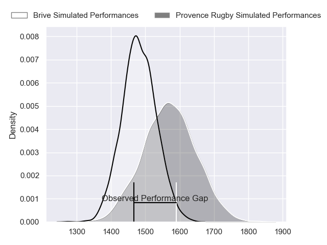
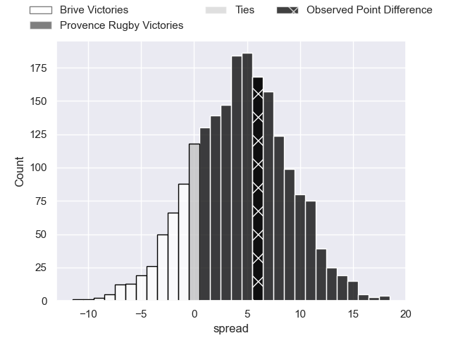
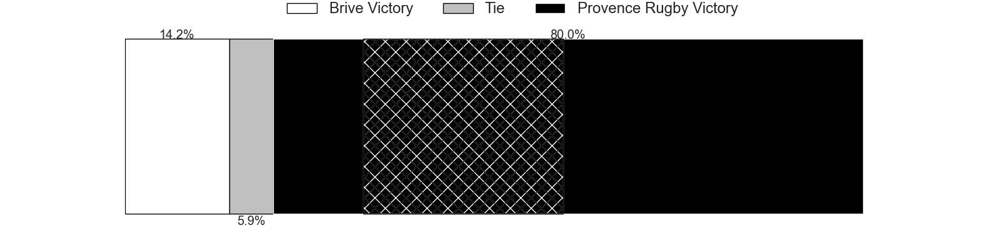
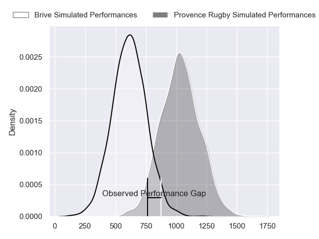
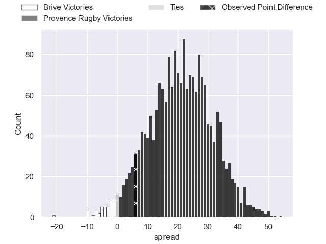
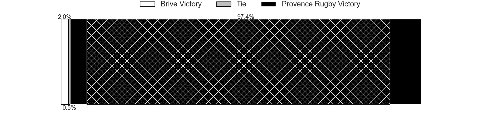
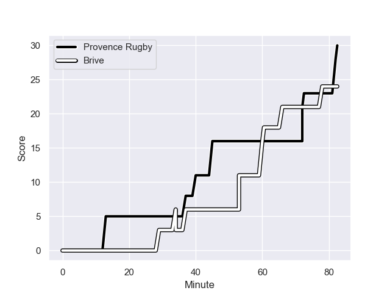
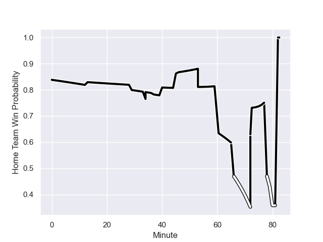

---  
layout: page  
title: Brive at Provence Rugby; 24-30  
date: 2024-01-26 18:00:00 -0500  
categories: "Pro D2 2023" match review  
---
# Brive at Provence Rugby; 24-30

# Club Level Predictions

The first set of predictions treats a club as the smallest object, as the club develops its members, organizes a gameplan, and deploys its players as needed for each match. This club model has a prediction of 0.627, which translates to predicting Provence Rugby to win by 4.6.

Our Over/Under is 33.5 - and combined with the spread above, we have a predicted scoreline of 15 to 19

Each club has a rating and a rating deviation (similar to a Glicko rating), and expected performances can be generated. This allows for simulated matches and spreads like the ones below.
## Projected Performances - Club Model

## Projected Spreads - Club Model

## Projected Results - Club Model

# Player Level Predictions - Version 2

Treating teams instead as an entity made up of the currently active players, I have ratings for each player in an altogether different system. These can be combined to form team ratings once teamsheets are announced, weighting starters a bit higher than the reserves. After the match is played, players can be weighted by their minutes on the field, allowing for an accurate measure of the team's composition. With these compiled team ratings, we can make predictions, measure inaccuracy, and update the individual player ratings.
## Prediction with Player Minutes: Provence Rugby by 18.0

Provence Rugby by 12.6 on a neutral field
## Prediction without Player Minutes: Provence Rugby by 16.9

Provence Rugby by 11.5 on a neutral pitch

## Projected Performances - Player Model

## Projected Spreads - Player Model

## Projected Results - Player Model

## Scores over Time

## Win Probability over Time

There were 14 large changes in win probability in this match

|   Away Minutes | Away Player               |   Away elo |   Number |   Home elo | Home Player           |   Home Minutes |
|---------------:|:--------------------------|-----------:|---------:|-----------:|:----------------------|---------------:|
|             46 | Hugo Reilhes              |      51.2  |        1 |      52.02 | Federico Wegrzyn      |             64 |
|             46 | Benjamin Boudou           |      31.68 |        2 |      88.15 | Lucas Martin          |             64 |
|             46 | Marcel van der Merwe      |      17.99 |        3 |     143.04 | Tomas Francis         |             71 |
|             80 | Renger Van Eerten         |      39.9  |        4 |      -5.77 | Andres Zafra Tarazona |             50 |
|             46 | Julien Delannoy           |      36.07 |        5 |      74.13 | Josh Tyrell           |             80 |
|             37 | Sasha Gue                 |      28.72 |        6 |      65.56 | Teimana Harrison      |             54 |
|             46 | Ross Moriarty             |      80.79 |        7 |      52.02 | Charly Gambini        |             80 |
|             46 | Rahboni Warren-Vosayaco   |      71.53 |        8 |      44.41 | Carl Axtens           |             52 |
|             50 | Julien Blanc              |      47.77 |        9 |      48.24 | Arthur Coville        |             80 |
|             80 | Tom Raffy                 |      22.06 |       10 |      61    | Jimmy Gopperth        |             80 |
|             80 | Asaeli Tuivuaka           |      42.42 |       11 |      46.51 | Léo Drouet            |             80 |
|             80 | Sammy Arnold              |      16.83 |       12 |     107.26 | Kaveinga Finau        |             80 |
|             80 | Kevin Fabien              |      48.71 |       13 |      49.09 | Eto Bainivalu         |             80 |
|             80 | Benjamin Lefranc          |      42.11 |       14 |      78.42 | Sione Tui             |             70 |
|             80 | Mathis Ferté              |      28.01 |       15 |      19.06 | Adrien Lapegue-Lafaye |             80 |
|             45 | Retief Marais             |      37.47 |       16 |      62.78 | Clément Chartier      |             32 |
|             36 | Taniela Sadrugu           |      47.91 |       17 |      49.61 | Malohi Suta           |             30 |
|             36 | Said Hireche              |      80.47 |       18 |      -4.03 | Loick Jammes          |             28 |
|             36 | Francisco Coria Marchetti |      29.21 |       19 |      47.46 | Thomas Vernet         |             11 |
|             36 | Issam Hamel               |      52.18 |       20 |      54.13 | Nicolas Toth          |             18 |
|             36 | Nathan Fraissenon         |      48.02 |       21 |      35.1  | Nicolas Mousties      |             18 |
|             36 | Tevita Ratuva             |      50.99 |       22 |      61.55 | Enzo Selponi          |             12 |
|             32 | Leo Carbonneau            |      -1.95 |       23 |     nan    | nan                   |            nan |

