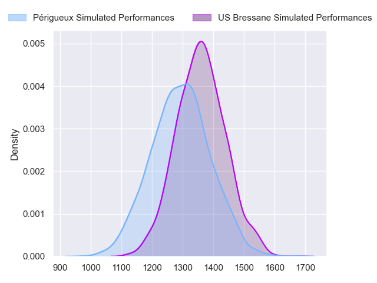
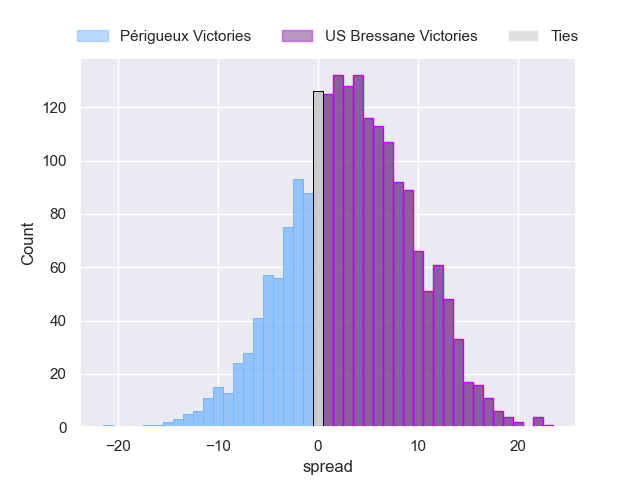
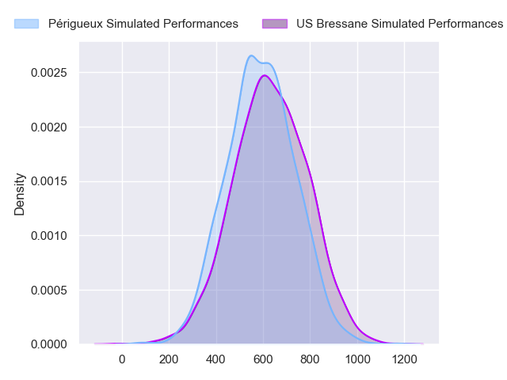
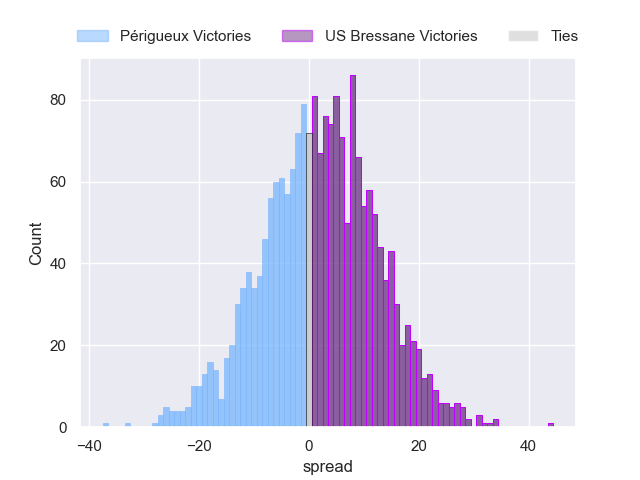
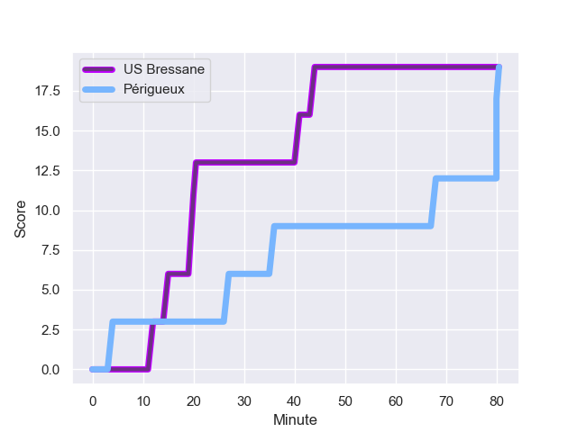
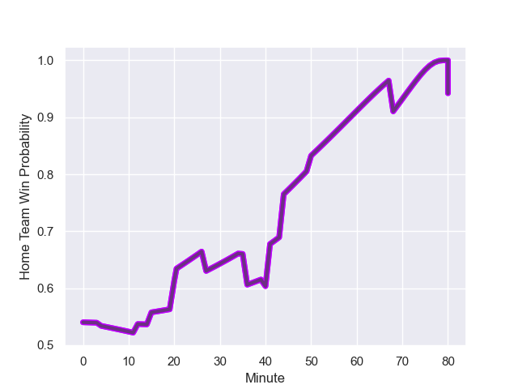

---  
layout: page  
title: Perigueux at US Bressane; 19-19  
date: 2024-01-26 18:00:00 -0500  
categories: "Nationale 2023" match review  
---
# Perigueux at US Bressane; 19-19

# Club Level Predictions

The first set of predictions treats a club as the smallest object, as the club develops its members, organizes a gameplan, and deploys its players as needed for each match. This club model has a prediction of 0.588, which translates to predicting US Bressane to win by 3.2.

Our Over/Under is 36.5 - and combined with the spread above, we have a predicted scoreline of 16 to 20

Each club has a rating and a rating deviation (similar to a Glicko rating), and expected performances can be generated. This allows for simulated matches and spreads like the ones below.
## Projected Performances - Club Model

## Projected Spreads - Club Model

## Projected Results - Club Model

# Player Level Predictions - Version 2

Treating teams instead as an entity made up of the currently active players, I have ratings for each player in an altogether different system. These can be combined to form team ratings once teamsheets are announced, weighting starters a bit higher than the reserves. After the match is played, players can be weighted by their minutes on the field, allowing for an accurate measure of the team's composition. With these compiled team ratings, we can make predictions, measure inaccuracy, and update the individual player ratings.
## Prediction with Player Minutes: US Bressane by 1.8

Périgueux by 2.3 on a neutral field
## Prediction without Player Minutes: US Bressane by 1.5

Périgueux by 2.6 on a neutral pitch

## Projected Performances - Player Model

## Projected Spreads - Player Model

## Projected Results - Player Model

## Scores over Time

## Win Probability over Time

There were 8 large changes in win probability in this match

|   Away Minutes | Away Player        |   Away elo |   Number |   Home elo | Home Player               |   Home Minutes |
|---------------:|:-------------------|-----------:|---------:|-----------:|:--------------------------|---------------:|
|             35 | Jason Tindiliere   |      37.82 |        1 |      39.76 | Nicolas Lemaire           |             64 |
|             50 | Lucas Marijon      |      47.95 |        2 |      32.19 | Arnaud Feltrin            |             52 |
|             50 | Martin Augeix      |      37.75 |        3 |      21.28 | Atonio Ulutuipalelei      |             40 |
|             80 | Damien Lavergne    |      34.13 |        4 |      49.08 | Thomas Déliance           |             57 |
|             80 | Jaco Willemse      |      18.72 |        5 |      23.33 | Josh Peters               |             64 |
|             50 | Nicolas Labattut   |      51.65 |        6 |      38.3  | Pierre Reynaud            |             80 |
|             50 | Hendri Storm       |      59.17 |        7 |      71.74 | Lucas Lyons               |             57 |
|             80 | Clement Lanen      |      24.13 |        8 |      42.33 | Loic Baradel              |             80 |
|             50 | Gaëtan Chapon      |      44.66 |        9 |      39.66 | Jeremy Valencot           |             57 |
|             60 | Greg Hutley        |      47.59 |       10 |      12.09 | Christian Lacombe         |             80 |
|             80 | Rory Scholes       |      49.84 |       11 |      52.07 | Kavekini Tabu             |             80 |
|             56 | Henry Tuilagi      |      42.68 |       12 |      -3.74 | Parataiso Silafai-Lea'ana |             80 |
|             80 | Vincent Fouillade  |      53.58 |       13 |      32.6  | Maile Mamao               |             60 |
|             80 | Benjamin Yarde     |      28.17 |       14 |      36.79 | Élie De Fleurian          |             80 |
|             80 | Thibault Rabourdin |      32.54 |       15 |      51.3  | Florent Massip            |             80 |
|             45 | Emilien Borges     |      43.19 |       16 |       6.35 | Erich de Jager            |             40 |
|             30 | Baptiste Arvouet   |      39.66 |       17 |      52.48 | Clement Jullien           |             28 |
|             30 | Anthony Pelmard    |      39.86 |       18 |      25.13 | Louis Bruinsma            |             23 |
|             30 | Afaesetiti Amosa   |      59.46 |       19 |      64.01 | Joseph Penitito           |             23 |
|             30 | Enzo Hardy         |      34.04 |       20 |      27.72 | Robin Graulle             |             23 |
|             30 | Richard Fourcade   |      24.95 |       21 |      48.82 | Nail Ait Naceur           |             16 |
|             24 | Paul Piveteau      |      32.98 |       22 |      45.84 | Dimitri Doucet            |             20 |
|             20 | Yann Caillat       |      31.13 |       23 |      35.12 | Teo Bordenave             |             16 |

