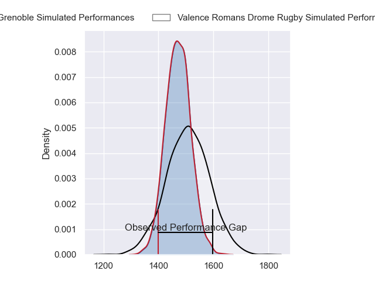
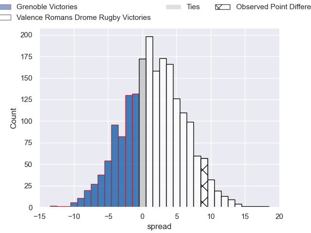
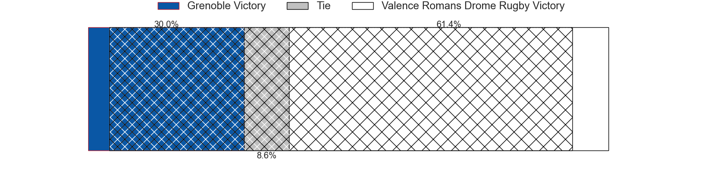
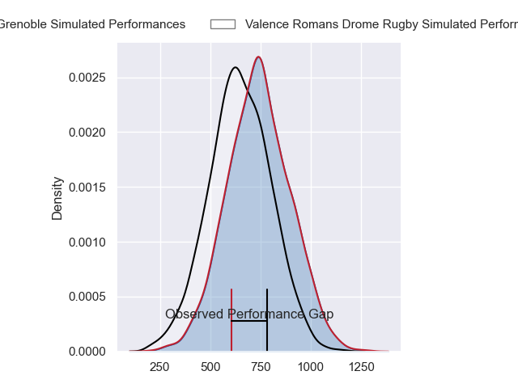
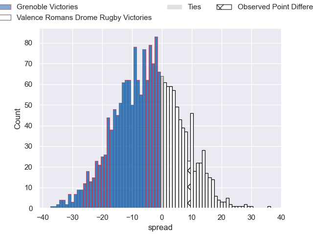
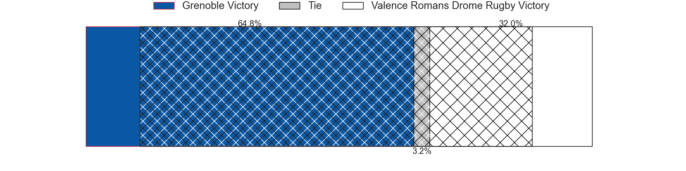
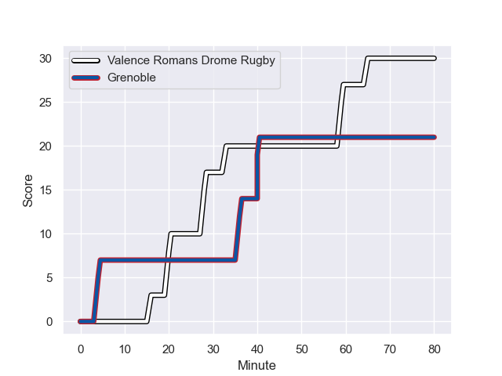
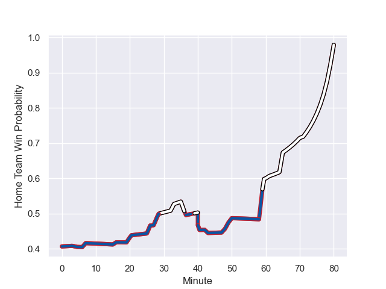

---  
layout: page  
title: Grenoble at Valence Romans Drome Rugby; 21-30  
date: 2024-01-26 18:00:00 -0500  
categories: "Pro D2 2023" match review  
---
# Grenoble at Valence Romans Drome Rugby; 21-30

# Club Level Predictions

The first set of predictions treats a club as the smallest object, as the club develops its members, organizes a gameplan, and deploys its players as needed for each match. This club model has a prediction of 0.551, which translates to predicting Valence Romans Drome Rugby to win by 1.8.

Our Over/Under is 39.5 - and combined with the spread above, we have a predicted scoreline of 19 to 21

Each club has a rating and a rating deviation (similar to a Glicko rating), and expected performances can be generated. This allows for simulated matches and spreads like the ones below.
## Projected Performances - Club Model

## Projected Spreads - Club Model

## Projected Results - Club Model

# Player Level Predictions - Version 2

Treating teams instead as an entity made up of the currently active players, I have ratings for each player in an altogether different system. These can be combined to form team ratings once teamsheets are announced, weighting starters a bit higher than the reserves. After the match is played, players can be weighted by their minutes on the field, allowing for an accurate measure of the team's composition. With these compiled team ratings, we can make predictions, measure inaccuracy, and update the individual player ratings.
## Prediction with Player Minutes: Grenoble by 4.2

Grenoble by 7.7 on a neutral field
## Prediction without Player Minutes: Grenoble by 6.8

Grenoble by 10.4 on a neutral pitch

## Projected Performances - Player Model

## Projected Spreads - Player Model

## Projected Results - Player Model

## Scores over Time

## Win Probability over Time

There were 9 large changes in win probability in this match

|   Away Minutes | Away Player         |   Away elo |   Number |   Home elo | Home Player         |   Home Minutes |
|---------------:|:--------------------|-----------:|---------:|-----------:|:--------------------|---------------:|
|             65 | Eli Eglaine         |      19.29 |        1 |     -12.04 | Julien Royer        |             49 |
|             63 | Barnabé Massa       |      48.47 |        2 |     -22.32 | Cyril Deligny       |             59 |
|             61 | Regis Montagne      |      51.78 |        3 |      57.57 | Kevin Goze          |             63 |
|             80 | Pierce Phillips     |      58.09 |        4 |      18.17 | Ryan McCauley       |             80 |
|             61 | Georgi Javakhia     |      65.03 |        5 |      39.01 | Florian Goumat      |             48 |
|             80 | Thibaut Martel      |      48.63 |        6 |       9.7  | Axel Bruchet        |             71 |
|             80 | Steeve Blanc-Mappaz |       6.8  |        7 |      41.1  | Loan Real           |             80 |
|             71 | Tala Gray           |      33.56 |        8 |      64.12 | Ioane Iashagashvili |             80 |
|             61 | Barnabe Couilloud   |      13.5  |        9 |      56.86 | Tim Menzel          |             80 |
|             26 | Sam Davies          |      77.84 |       10 |       0.18 | Lucas Meret         |             80 |
|             80 | Wilfried Hulleu     |      49.37 |       11 |      65.03 | Mosese Mawalu       |             80 |
|             80 | Bautista Ezcurra    |      91.94 |       12 |      30.17 | Mathieu Guillomot   |             50 |
|             80 | Romain Trouilloud   |      49.73 |       13 |      50.04 | Ben Neiceru         |             80 |
|             65 | Erwan Dridi         |      48.96 |       14 |      29.11 | Jonathan Quinnez    |              7 |
|             80 | Julien Farnoux      |     115.04 |       15 |      40.9  | Gauthier Minguillon |             80 |
|             54 | Romain Fusier       |      15.98 |       16 |      58.63 | Anatole Pauvert     |             36 |
|             19 | Irakli Aptsiauri    |      58.01 |       17 |      26.57 | Isaac Te Tamaki     |             37 |
|             19 | Thomas Lainault     |      42.72 |       18 |      77.93 | Thembelani Bholi    |             32 |
|             19 | Eric Escande        |      61.73 |       19 |      78.89 | Thomas Lhusero      |             30 |
|             17 | Lilian Rossi        |      36.85 |       20 |      53.52 | Andrea Pontanier    |             31 |
|             15 | Giorgi Mamaiashvili |      46.65 |       21 |      45.34 | Dorian Marco Pena   |             21 |
|             15 | Geoffrey Cros       |      23.85 |       22 |      35.65 | Chris Talakai       |             17 |
|              9 | Diego Pinheiro Ruiz |      45.32 |       23 |      44.19 | Charles Brayer      |              9 |

