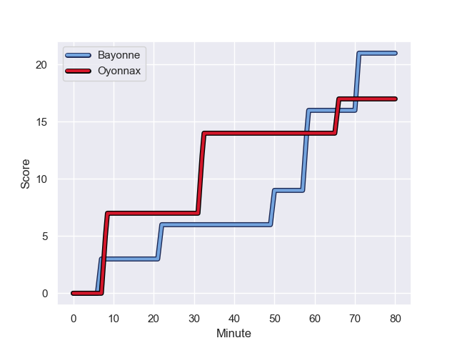
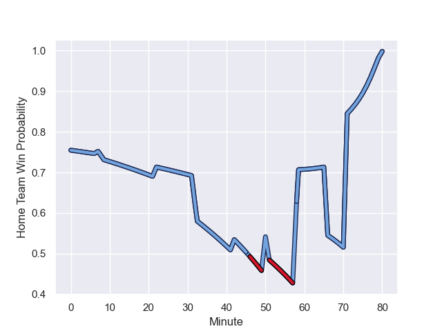

---  
layout: page  
title: Oyonnax at Bayonne; 17-21  
date: 2024-01-27 18:00:00 -0500  
categories: "Top 14 Orange 2023" match review  
---
# Oyonnax at Bayonne; 17-21

# Club Level Predictions

The first set of predictions treats a club as the smallest object, as the club develops its members, organizes a gameplan, and deploys its players as needed for each match. This club model has a prediction of 0.66, which translates to predicting Bayonne to win by 5.8.

Our Over/Under is 38.5 - and combined with the spread above, we have a predicted scoreline of 16 to 22

Each club has a rating and a rating deviation (similar to a Glicko rating), and expected performances can be generated. This allows for simulated matches and spreads like the ones below.
## Projected Performances - Club Model

## Projected Spreads - Club Model

## Projected Results - Club Model

# Player Level Predictions - Version 2

Treating teams instead as an entity made up of the currently active players, I have ratings for each player in an altogether different system. These can be combined to form team ratings once teamsheets are announced, weighting starters a bit higher than the reserves. After the match is played, players can be weighted by their minutes on the field, allowing for an accurate measure of the team's composition. With these compiled team ratings, we can make predictions, measure inaccuracy, and update the individual player ratings.
## Prediction with Player Minutes: Bayonne by 12.3

Bayonne by 4.7 on a neutral field
## Prediction without Player Minutes: Bayonne by 11.3

Bayonne by 3.7 on a neutral pitch

## Projected Performances - Player Model

## Projected Spreads - Player Model

## Projected Results - Player Model

## Scores over Time

## Win Probability over Time

There were 9 large changes in win probability in this match

|   Away Minutes | Away Player        |   Away elo |   Number |   Home elo | Home Player             |   Home Minutes |
|---------------:|:-------------------|-----------:|---------:|-----------:|:------------------------|---------------:|
|             56 | Tommy Raynaud      |      53.79 |        1 |      35.98 | Matis Perchaud          |             52 |
|             52 | Teddy Durand       |      27.42 |        2 |      90.17 | Facundo Bosch           |             51 |
|             59 | Christopher Vaotoa |      38.07 |        3 |      47.91 | Tevita Tatafu           |             51 |
|             52 | Phoenix Battye     |     112.9  |        4 |     118.92 | Denis Marchois          |             51 |
|             55 | Hugo Fabregue      |      39.9  |        5 |      71.33 | Lucas Paulos            |             80 |
|             80 | Kevin Lebreton     |      38.4  |        6 |      51.53 | Pierre Huguet           |             51 |
|             80 | Loïc Credoz        |      51.05 |        7 |      89.44 | Baptiste Heguy          |             80 |
|             65 | Rory Grice         |      78.24 |        8 |      79.18 | Uzair Cassiem           |             80 |
|             55 | Jonathan Ruru      |      97.56 |        9 |      59.13 | Guillaume Rouet Piffard |             74 |
|             80 | Domingo Miotti     |     110.7  |       10 |     115.24 | Camille Lopez           |             80 |
|             80 | Gavin Stark        |      34.81 |       11 |      46.65 | Victor Hannoun          |             52 |
|             80 | Theo Millet        |      76.58 |       12 |      41.62 | Federico Mori           |             80 |
|             80 | Pedro Bettencourt  |      13.87 |       13 |      21.4  | Guillaume Martocq       |             80 |
|             80 | Daniel Ikpefan     |      62.39 |       14 |      41.73 | Aurelien Callandret     |             80 |
|             42 | Darren Sweetnam    |      63.71 |       15 |      13.75 | Cheikh Tiberghien       |             80 |
|             38 | Justin Bouraux     |      25.87 |       16 |      66.43 | Thomas Acquier          |             29 |
|             28 | Victor Lebas       |      17.29 |       17 |      82.52 | Arthur Iturria          |             29 |
|             28 | Manu Leiataua      |      -7.72 |       18 |      84.74 | Remi Bourdeau           |             29 |
|             25 | Charlie Cassang    |      88.4  |       19 |      38.4  | Luke Tagi               |             29 |
|             25 | Steve Mafi         |      34    |       20 |      94.32 | Remy Baget              |             28 |
|             24 | Antoine Abraham    |      50.39 |       21 |      55.36 | Swan Cormenier          |             28 |
|             21 | Thibault Berthaud  |      40.67 |       22 |      72.16 | Maxime Machenaud        |              6 |
|             15 | Loic Godener       |      27.99 |       23 |     nan    | nan                     |            nan |

