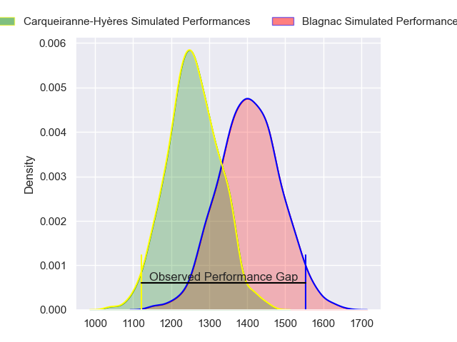
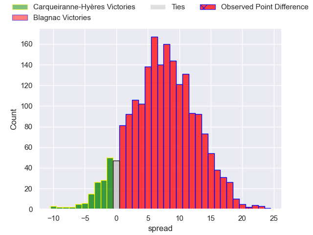
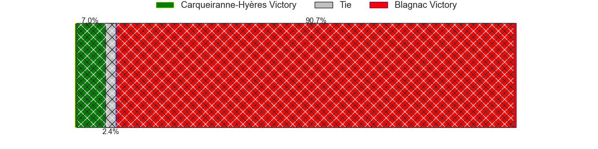
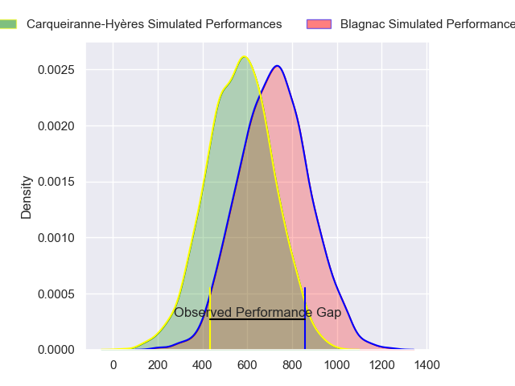
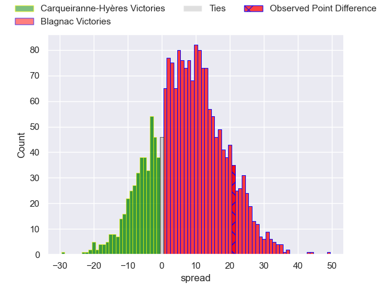
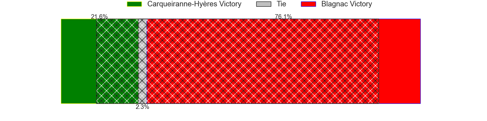
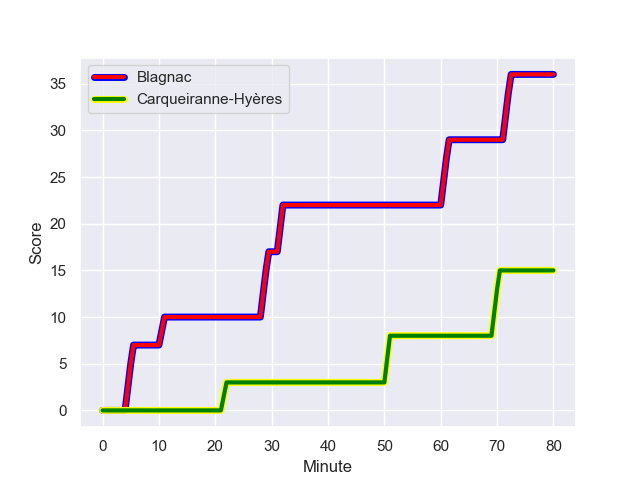
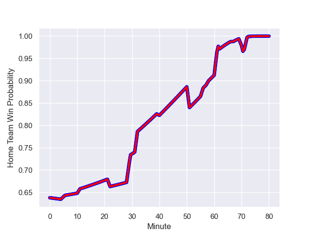

---  
layout: page  
title: Carqueiranne-Hyeres at Blagnac; 15-36  
date: 2024-01-27 18:00:00 -0500  
categories: "Nationale 2023" match review  
---
# Carqueiranne-Hyeres at Blagnac; 15-36

# Club Level Predictions

The first set of predictions treats a club as the smallest object, as the club develops its members, organizes a gameplan, and deploys its players as needed for each match. This club model has a prediction of 0.697, which translates to predicting Blagnac to win by 7.4.

Our Over/Under is 32.5 - and combined with the spread above, we have a predicted scoreline of 13 to 20

Each club has a rating and a rating deviation (similar to a Glicko rating), and expected performances can be generated. This allows for simulated matches and spreads like the ones below.
## Projected Performances - Club Model

## Projected Spreads - Club Model

## Projected Results - Club Model

# Player Level Predictions - Version 2

Treating teams instead as an entity made up of the currently active players, I have ratings for each player in an altogether different system. These can be combined to form team ratings once teamsheets are announced, weighting starters a bit higher than the reserves. After the match is played, players can be weighted by their minutes on the field, allowing for an accurate measure of the team's composition. With these compiled team ratings, we can make predictions, measure inaccuracy, and update the individual player ratings.
## Prediction with Player Minutes: Blagnac by 6.2

Blagnac by 2.6 on a neutral field
## Prediction without Player Minutes: Blagnac by 5.9

Blagnac by 2.3 on a neutral pitch

## Projected Performances - Player Model

## Projected Spreads - Player Model

## Projected Results - Player Model

## Scores over Time

## Win Probability over Time

There were 5 large changes in win probability in this match

|   Away Minutes | Away Player         |   Away elo |   Number |   Home elo | Home Player         |   Home Minutes |
|---------------:|:--------------------|-----------:|---------:|-----------:|:--------------------|---------------:|
|             58 | Sti Sithole         |      44.92 |        1 |      38.41 | Benjamin Bertrand   |             51 |
|             58 | Theo Lachaud        |      28.1  |        2 |      42.75 | Antoine Marty-Rybak |             51 |
|             58 | Lasha Mchelidze     |      58.48 |        3 |      56.24 | Baptiste Collet     |             51 |
|             80 | Adam Peters         |      21.18 |        4 |      31.11 | Vincent Mutel       |             80 |
|             65 | Lucas Cazac         |       9.45 |        5 |     -15.15 | Victor Fromenteze   |             56 |
|             80 | Nicolas Baquer      |      21.02 |        6 |      52.22 | Simon Veyrac        |             62 |
|             65 | Spike Salman        |      29.5  |        7 |      74.9  | Nikita Bekov        |             80 |
|             80 | Andre Gorin         |      59.18 |        8 |      58.29 | Ianis Ponsole       |             62 |
|             58 | Rémi Dubié          |      28.3  |        9 |      46.65 | Ruben Courties      |             67 |
|             80 | Juan Kotze          |      48.21 |       10 |      53.18 | Ugo Seunes          |             80 |
|             80 | Vincent Alessi      |       3.06 |       11 |      27.12 | Dorian Terrou       |             80 |
|             80 | Romain Leveque      |      58.11 |       12 |      43.45 | Baptiste Serrano    |             80 |
|             80 | Dylan Sage          |      39.02 |       13 |      43.3  | Lukas Doyhenard     |             80 |
|             40 | Josselyn Bouchon    |      31.87 |       14 |      35.68 | Peïo Retegui        |             64 |
|             65 | Ionel Melinte       |      65.96 |       15 |      28.93 | Gérald Augustin     |             80 |
|             22 | Eli Serra-Miglietti |      41.99 |       16 |      58.2  | Alexis Decaux       |             29 |
|             22 | Michael Tyumenev    |      17.11 |       17 |      49.42 | Enzo Rivier         |             29 |
|             22 | Miguel Mathieu      |      35.18 |       18 |      52.52 | Victor Delmas       |             29 |
|             15 | Shade Barkallah     |      42.68 |       19 |      34.32 | Lucas Tolofua       |             24 |
|             15 | Joachim Beaumont    |      58.07 |       20 |      20.77 | Matthieu Thomas     |             18 |
|             22 | Thomas Sonetti      |      62.88 |       21 |      52.49 | Mathieu Vachon      |             18 |
|             40 | Amaury Bobillon     |      54.11 |       22 |      58.76 | Jean-Andre Vernetti |             13 |
|             15 | Theo Moitrier       |      50.43 |       23 |       6.72 | Clément Vareilles   |             16 |

