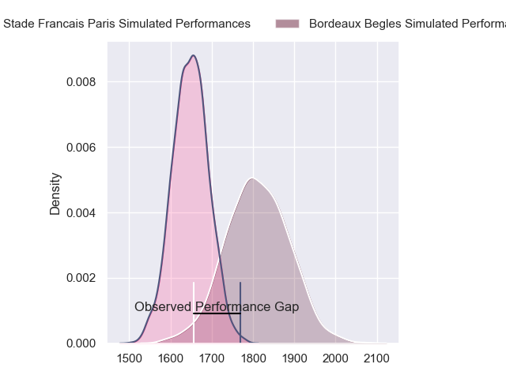
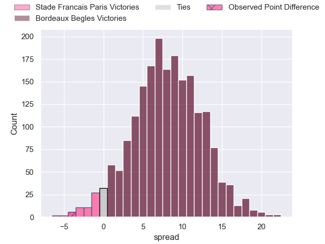
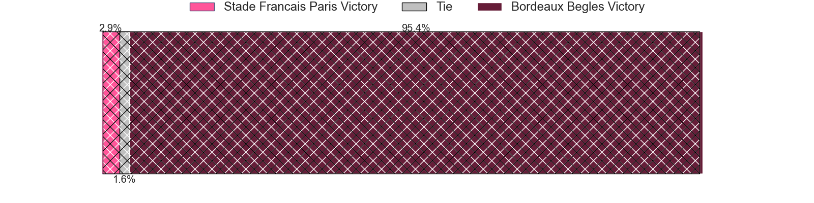
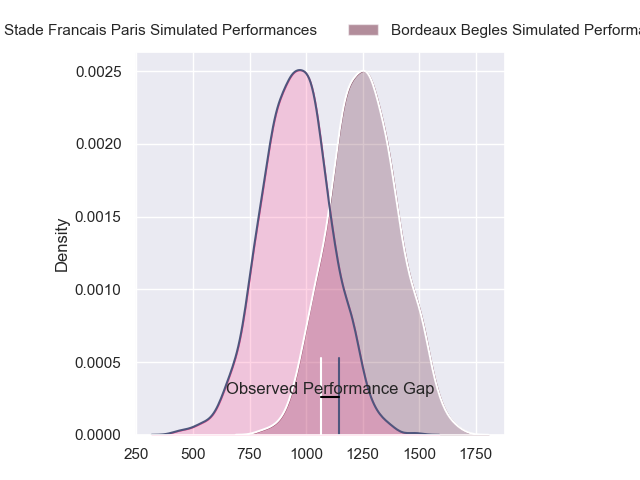
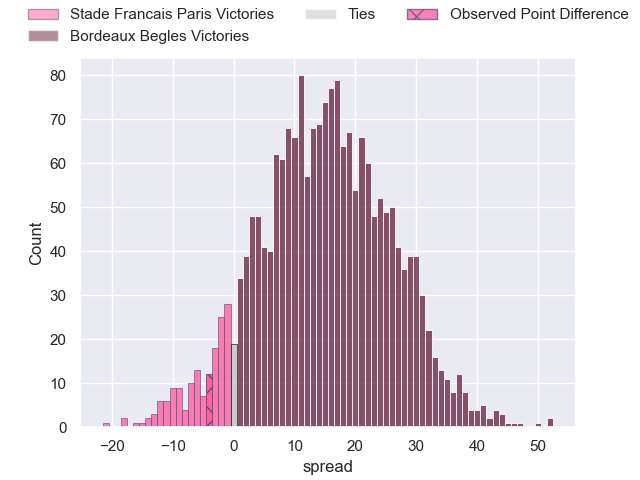
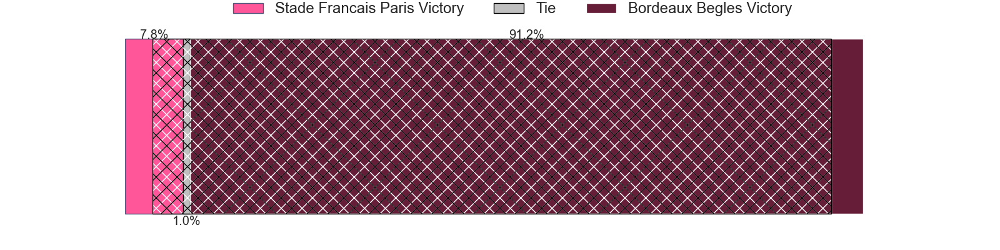
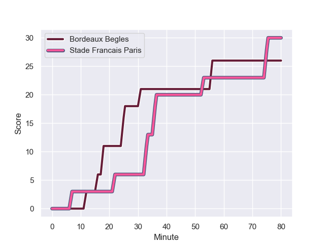
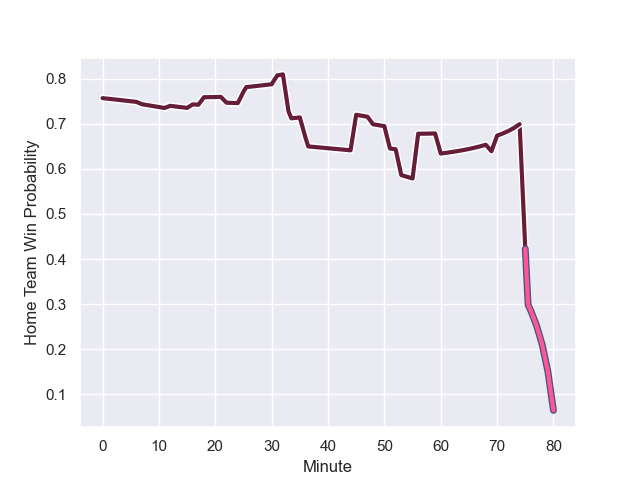

---  
layout: page  
title: Stade Francais Paris at Bordeaux Begles; 30-26  
date: 2024-01-27 18:00:00 -0500  
categories: "Top 14 Orange 2023" match review  
---
# Stade Francais Paris at Bordeaux Begles; 30-26

# Club Level Predictions

The first set of predictions treats a club as the smallest object, as the club develops its members, organizes a gameplan, and deploys its players as needed for each match. This club model has a prediction of 0.715, which translates to predicting Bordeaux Begles to win by 8.1.

Our Over/Under is 40.5 - and combined with the spread above, we have a predicted scoreline of 16 to 24

Each club has a rating and a rating deviation (similar to a Glicko rating), and expected performances can be generated. This allows for simulated matches and spreads like the ones below.
## Projected Performances - Club Model

## Projected Spreads - Club Model

## Projected Results - Club Model

# Player Level Predictions - Version 2

Treating teams instead as an entity made up of the currently active players, I have ratings for each player in an altogether different system. These can be combined to form team ratings once teamsheets are announced, weighting starters a bit higher than the reserves. After the match is played, players can be weighted by their minutes on the field, allowing for an accurate measure of the team's composition. With these compiled team ratings, we can make predictions, measure inaccuracy, and update the individual player ratings.
## Prediction with Player Minutes: Bordeaux Begles by 12.5

Bordeaux Begles by 5.1 on a neutral field
## Prediction without Player Minutes: Bordeaux Begles by 14.0

Bordeaux Begles by 6.6 on a neutral pitch

## Projected Performances - Player Model

## Projected Spreads - Player Model

## Projected Results - Player Model

## Scores over Time

## Win Probability over Time

There were 15 large changes in win probability in this match

|   Away Minutes | Away Player             |   Away elo |   Number |   Home elo | Home Player               |   Home Minutes |
|---------------:|:------------------------|-----------:|---------:|-----------:|:--------------------------|---------------:|
|             45 | Sergo Abramishvili      |      75.58 |        1 |      80.32 | Ugo Boniface              |             48 |
|             60 | Mickael Ivaldi          |      96.43 |        2 |      61.35 | Maxime Lamothe            |             51 |
|             45 | Francisco Gomez Kodela  |      77.18 |        3 |     119.62 | Ben Tameifuna             |             51 |
|             80 | Pierre-Henri Azagoh     |      46    |        4 |      82.06 | Guido Petti               |             41 |
|             80 | Tanginoa Halaifonua     |      18.79 |        5 |     138.33 | Adam Coleman              |             33 |
|             80 | Sekou Macalou           |      74.87 |        6 |      84.63 | Bastien Vergnes Taillefer |             80 |
|             70 | Romain Briatte          |      58.47 |        7 |      69.88 | Mahamadou Diaby           |             80 |
|             60 | Giovanni Habel-Kueffner |      92.99 |        8 |      90.51 | Tevita Tatafu             |             80 |
|             59 | Brad Weber              |      94.82 |        9 |      21.47 | Paul Abadie               |             80 |
|             80 | Joris Segonds           |      45.08 |       10 |      51.92 | Mateo Garcia              |             52 |
|             80 | Stephane Ahmed          |      46.27 |       11 |      46.65 | Mael Moustin              |             69 |
|             48 | Lester Etien            |      65.2  |       12 |      55.58 | Ben Tapuai                |             80 |
|             80 | Jeremy Ward             |     110.1  |       13 |      36.46 | Pablo Uberti              |             80 |
|             80 | Kylan Hamdaoui          |      14.35 |       14 |     124.96 | Madosh Tambwe             |             80 |
|             80 | Leo Barre               |      68.15 |       15 |     124.99 | Romain Buros              |             80 |
|             35 | Moses Alo-Emile         |      51.74 |       16 |      20.72 | Thomas Jolmes             |             47 |
|             35 | Paul Alo-Emile          |      74.92 |       17 |     107.48 | Pierre Bochaton           |             39 |
|             32 | Julien Delbouis         |      77.96 |       18 |      56.35 | Jefferson Poirot          |             32 |
|             21 | Rory Kockott            |     138.4  |       19 |       0.54 | Romain Laterrade          |             29 |
|             20 | Mathieu Hirigoyen       |      24.23 |       20 |      28.7  | Carlu Sadie               |             29 |
|             20 | Laurent Panis           |      39.79 |       21 |      64.33 | Zack Holmes               |             28 |
|             10 | Ryan Chapuis            |      -0.13 |       22 |      60.37 | Tani Vili                 |             11 |

