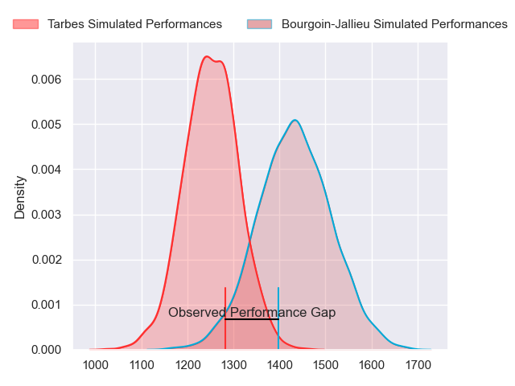
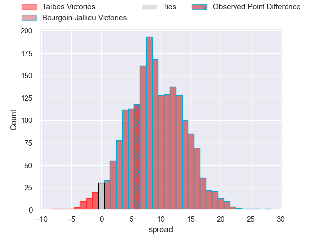
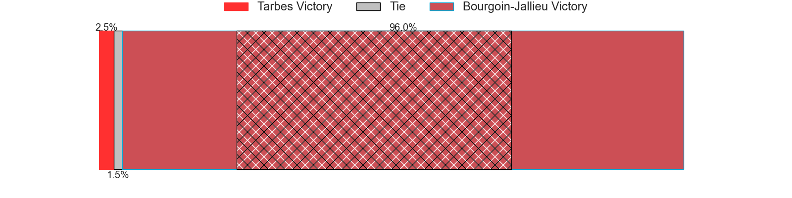
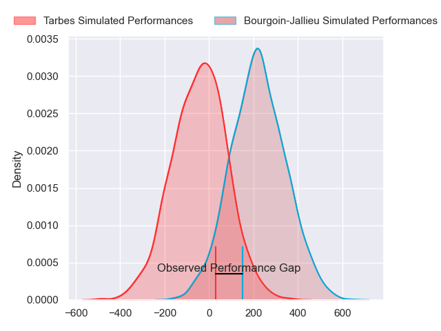
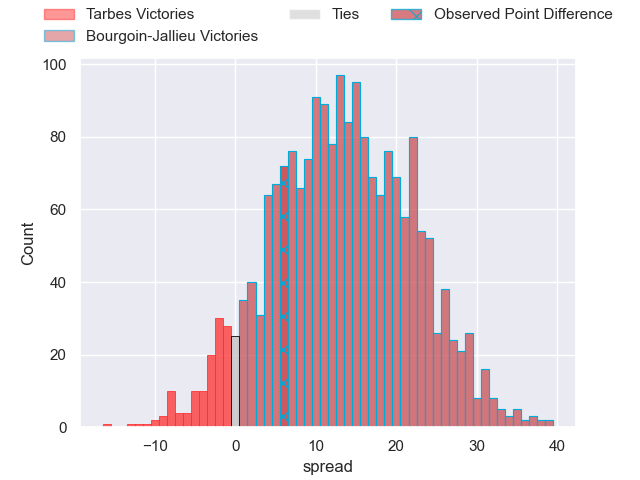
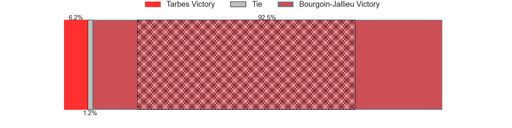

---  
layout: page  
title: Tarbes at Bourgoin-Jallieu; 10-16  
date: 2024-01-27 18:00:00 -0500  
categories: "Nationale 2023" match review  
---
# Tarbes at Bourgoin-Jallieu; 10-16

# Club Level Predictions

The first set of predictions treats a club as the smallest object, as the club develops its members, organizes a gameplan, and deploys its players as needed for each match. This club model has a prediction of 0.731, which translates to predicting Bourgoin-Jallieu to win by 8.8.

Our Over/Under is 43.5 - and combined with the spread above, we have a predicted scoreline of 18 to 26

Each club has a rating and a rating deviation (similar to a Glicko rating), and expected performances can be generated. This allows for simulated matches and spreads like the ones below.
## Projected Performances - Club Model

## Projected Spreads - Club Model

## Projected Results - Club Model

# Player Level Predictions - Version 2

Treating teams instead as an entity made up of the currently active players, I have ratings for each player in an altogether different system. These can be combined to form team ratings once teamsheets are announced, weighting starters a bit higher than the reserves. After the match is played, players can be weighted by their minutes on the field, allowing for an accurate measure of the team's composition. With these compiled team ratings, we can make predictions, measure inaccuracy, and update the individual player ratings.
## Prediction with Player Minutes: Bourgoin-Jallieu by 13.0

Bourgoin-Jallieu by 5.6 on a neutral field
## Prediction without Player Minutes: Bourgoin-Jallieu by 13.2

Bourgoin-Jallieu by 5.9 on a neutral pitch

## Projected Performances - Player Model

## Projected Spreads - Player Model

## Projected Results - Player Model

|   Away Minutes | Away Player        |   Away Percentile |   Number |   Home Percentile | Home Player           |   Home Minutes |
|---------------:|:-------------------|------------------:|---------:|------------------:|:----------------------|---------------:|
|             49 | Johan Mees Erasmus |             12.51 |        1 |             56.3  | Rémy Gaborit          |             49 |
|             49 | Enzo Mondon        |             15.15 |        2 |             69.53 | Killian Tripier       |             80 |
|             54 | Toma Taufa         |             51.03 |        3 |             18.86 | Maxime Calliet        |             49 |
|             80 | Baptiste Peytavi   |             23.37 |        4 |             14.42 | Léandre Cotte         |             80 |
|             54 | Jone Trevor Seuvou |             12.09 |        5 |             62.91 | Jonathan Kpoku        |             49 |
|             79 | Aurelien Ricart    |             59.13 |        6 |              1.63 | Morgan Eames          |             80 |
|             59 | Jean Guicherd      |             20.54 |        7 |              9.13 | Aitor Hourcade        |             80 |
|             80 | Filipe Manu        |              1.17 |        8 |             36.21 | Poutasi Luafutu       |             57 |
|             59 | Anthony Meric      |              3.98 |        9 |             83.7  | Tomas Munilla lo Duca |             80 |
|             80 | Mathieu Berbizier  |              4.59 |       10 |             76.09 | Nicolas Vuillemin     |             80 |
|             80 | Jone Tuva          |              0.32 |       11 |             23    | Christopher Bosch     |             80 |
|             80 | Kalione Nasoko     |             65.47 |       12 |             20.19 | Aviata Silago         |             80 |
|             54 | Pierre Descoubet   |             17.32 |       13 |             37.16 | Makalea Foliaki       |             79 |
|             80 | Johan Paulet       |              4.11 |       14 |             57.91 | Quentin Lefort        |             80 |
|             80 | Thibaut Trotta     |              3.58 |       15 |             47.49 | Paul-Hugo Champ       |             37 |
|             31 | Antoine Palisse    |             36.19 |       16 |             58.18 | Romain Favaretto      |             31 |
|             31 | Florian Lamothe    |             35.04 |       17 |             28.69 | Osman Dimen           |             31 |
|             26 | Alexandre Duny     |             34.58 |       18 |             41.52 | Theophile Cotte       |             31 |
|             26 | Léo Estaque        |             28.26 |       19 |             58.88 | Théo Lepage           |             23 |
|              1 | Julien Cantan      |             13.86 |       20 |             15.51 | Remi Bouet            |              1 |
|             21 | Francis Rolland    |             13.14 |       21 |             22.2  | Nicolas Cachet        |              4 |
|             21 | Thibaut Dulucq     |              4.57 |       22 |             67.26 | Isaiah Leota          |             39 |
|             26 | Savenaca Rawaca    |             23.89 |       23 |            nan    | nan                   |            nan |

