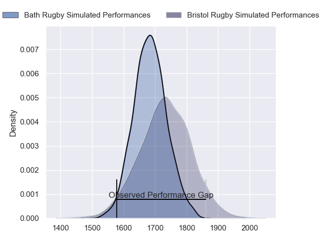
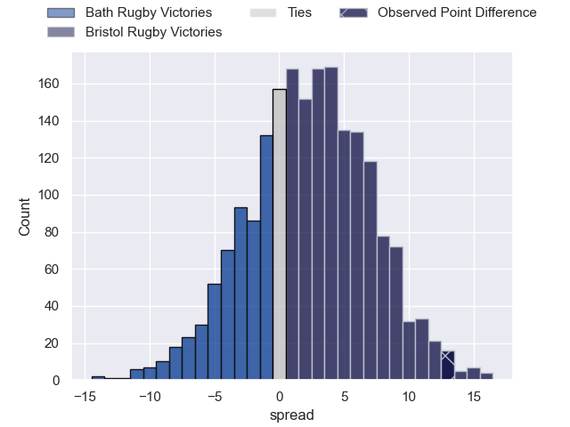
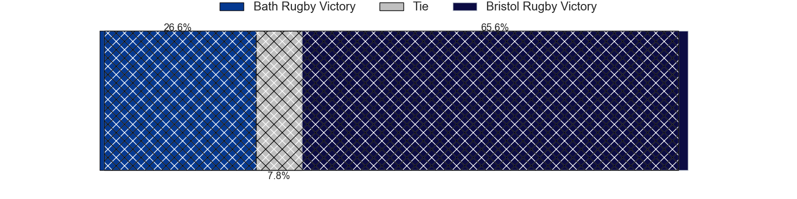
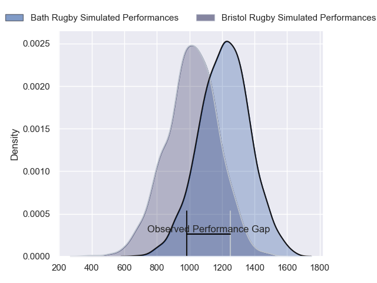
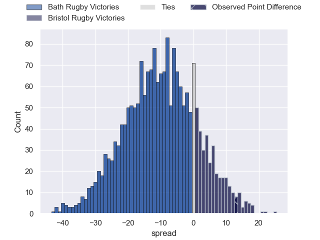
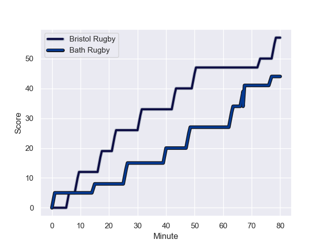
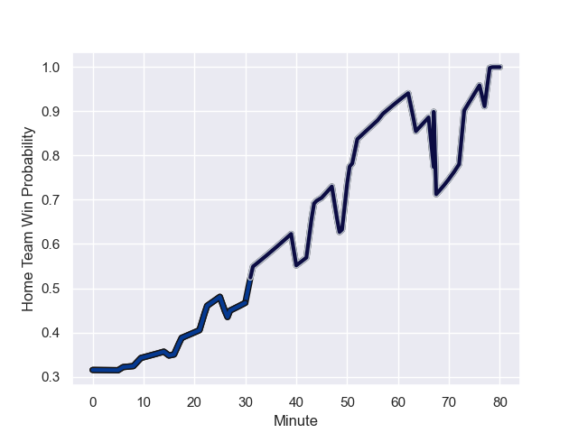

---  
layout: page  
title: Bath Rugby at Bristol Rugby; 44-57  
date: 2024-01-27 18:00:00 -0500  
categories: "Gallagher Premiership 2023" match review  
---
# Bath Rugby at Bristol Rugby; 44-57

# Club Level Predictions

The first set of predictions treats a club as the smallest object, as the club develops its members, organizes a gameplan, and deploys its players as needed for each match. This club model has a prediction of 0.568, which translates to predicting Bristol Rugby to win by 2.4.

Our Over/Under is 54.5 - and combined with the spread above, we have a predicted scoreline of 26 to 29

Each club has a rating and a rating deviation (similar to a Glicko rating), and expected performances can be generated. This allows for simulated matches and spreads like the ones below.
## Projected Performances - Club Model

## Projected Spreads - Club Model

## Projected Results - Club Model

# Player Level Predictions - Version 2

Treating teams instead as an entity made up of the currently active players, I have ratings for each player in an altogether different system. These can be combined to form team ratings once teamsheets are announced, weighting starters a bit higher than the reserves. After the match is played, players can be weighted by their minutes on the field, allowing for an accurate measure of the team's composition. With these compiled team ratings, we can make predictions, measure inaccuracy, and update the individual player ratings.
## Prediction with Player Minutes: Bath Rugby by 8.6

Bath Rugby by 13.4 on a neutral field
## Prediction without Player Minutes: Bath Rugby by 8.3

Bath Rugby by 13.1 on a neutral pitch

## Projected Performances - Player Model

## Projected Spreads - Player Model

## Projected Results - Player Model

## Scores over Time

## Win Probability over Time

There were 20 large changes in win probability in this match

|   Away Minutes | Away Player      |   Away elo |   Number |   Home elo | Home Player                |   Home Minutes |
|---------------:|:-----------------|-----------:|---------:|-----------:|:---------------------------|---------------:|
|             45 | Juan Schoeman    |      35.9  |        1 |      52.32 | Jake Woolmore              |             40 |
|             52 | Tom Dunn         |     119.19 |        2 |      29.99 | Will Capon                 |             27 |
|             80 | Thomas du Toit   |      97.55 |        3 |      66.98 | Kyle Sinckler              |             60 |
|             80 | Elliott Stooke   |      84.39 |        4 |      52.93 | James Dun                  |             77 |
|             52 | Quinn Roux       |      94.47 |        5 |      53.47 | Joe Batley                 |             80 |
|             52 | GJ van Velze     |      54.01 |        6 |      90.16 | Steven Luatua              |             80 |
|             66 | Miles Reid       |     114.36 |        7 |      58.04 | Fitz Harding               |             80 |
|             80 | Jaco Coetzee     |      51.29 |        8 |      22.6  | Magnus Bradbury            |             57 |
|             64 | Louis Schreuder  |      46.37 |        9 |      81.66 | Harry Randall              |             77 |
|             80 | Finn Russell     |     162.37 |       10 |      90.26 | AJ MacGinty                |             77 |
|             77 | Will Butt        |      55.47 |       11 |      77.41 | Gabriel Ibitoye            |             80 |
|             80 | Cameron Redpath  |      66.45 |       12 |      37.02 | James Williams             |             66 |
|             80 | Matt Gallagher   |     114.78 |       13 |      76.29 | Benhard Janse van Rensburg |             80 |
|             80 | Joe Cokanasiga   |     100.62 |       14 |      47.43 | Noah Heward                |             80 |
|             80 | Tom de Glanville |      28.07 |       15 |      51.2  | Richard Lane               |             80 |
|             35 | Luke Graham      |      46.65 |       16 |      33.93 | Max Lahiff                 |             40 |
|             28 | Niall Annett     |      55.26 |       17 |      46.76 | Fred Davies                |             53 |
|             28 | Josh Bayliss     |      36.7  |       18 |      44.93 | Sam Grahamslaw             |             20 |
|             28 | Chris Cloete     |     164.01 |       19 |      46.01 | Jake Heenan                |              3 |
|             14 | Josh McNally     |      87.52 |       20 |      41.04 | Josh Caulfield             |             23 |
|             16 | Tom Carr-Smith   |      47.08 |       21 |      83.64 | Kieran Marmion             |              3 |
|              3 | Orlando Bailey   |      27.79 |       22 |      53.08 | Ratu Naulago               |              3 |
|            nan | nan              |     nan    |       23 |      89.25 | Virimi Vakatawa            |             14 |

