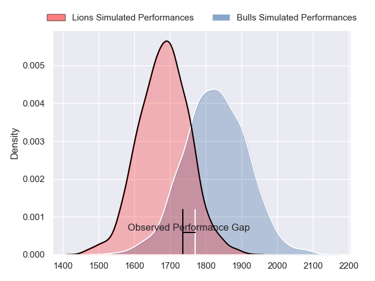
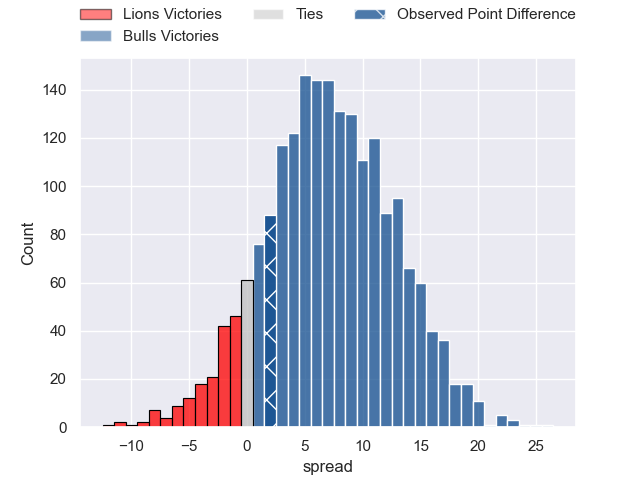
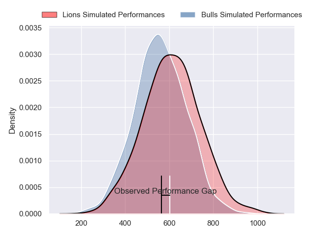
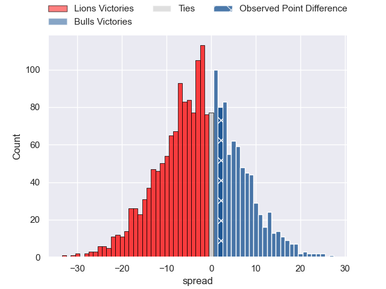

---  
layout: page  
title: Lions at Bulls; 28-30  
date: 2024-01-27 18:00:00 -0500  
categories: "United Rugby Championship 2023" match review  
---
# Lions at Bulls; 28-30

# Club Level Predictions

The first set of predictions treats a club as the smallest object, as the club develops its members, organizes a gameplan, and deploys its players as needed for each match. This club model has a prediction of 0.687, which translates to predicting Bulls to win by 7.0.

Our Over/Under is 67.5 - and combined with the spread above, we have a predicted scoreline of 30 to 37

Each club has a rating and a rating deviation (similar to a Glicko rating), and expected performances can be generated. This allows for simulated matches and spreads like the ones below.
## Projected Performances - Club Model

## Projected Spreads - Club Model

## Projected Results - Club Model

# Player Level Predictions - Version 2

Treating teams instead as an entity made up of the currently active players, I have ratings for each player in an altogether different system. These can be combined to form team ratings once teamsheets are announced, weighting starters a bit higher than the reserves. After the match is played, players can be weighted by their minutes on the field, allowing for an accurate measure of the team's composition. With these compiled team ratings, we can make predictions, measure inaccuracy, and update the individual player ratings.
## Prediction with Player Minutes: Bulls by 0.2

Lions by 4.2 on a neutral field
## Prediction without Player Minutes: Lions by 0.1

Lions by 4.5 on a neutral pitch

## Projected Performances - Player Model

## Projected Spreads - Player Model

## Projected Results - Player Model

|   Away Minutes | Away Player            |   Away Percentile |   Number |   Home Percentile | Home Player         |   Home Minutes |
|---------------:|:-----------------------|------------------:|---------:|------------------:|:--------------------|---------------:|
|             49 | Jean-Pierre Smith      |             79.09 |        1 |             78.73 | Simphiwe Matanzima  |             48 |
|             67 | Jaco Visagie           |             77.19 |        2 |             99.64 | Akker van der Merwe |             57 |
|             49 | Asenathi Ntlabakanye   |             43.43 |        3 |             75.07 | Mornay Smith        |             57 |
|             37 | Ruben Schoeman         |             95.35 |        4 |             84.88 | Deon Slabbert       |             49 |
|             80 | Reinhard Nothnagel     |             91.28 |        5 |             87.91 | Ruan Nortje         |             80 |
|             68 | Hanru Sirgel           |             97.72 |        6 |             91.09 | Marco van Staden    |             40 |
|             80 | Emmanuel Tshituka      |             77.72 |        7 |             93.48 | Elrigh Louw         |             80 |
|             78 | Francke Horn           |             98.36 |        8 |             56.31 | Celimpilo Gumede    |             58 |
|             80 | Morne Van den Berg     |             65.41 |        9 |             94.23 | Embrose Papier      |             80 |
|             80 | Sanele Nohamba         |             96.14 |       10 |             83.82 | Johan Goosen        |             80 |
|             80 | Edwill van der Merwe   |             92.19 |       11 |             94.3  | Sergeal Petersen    |             80 |
|             70 | Marius Louw            |             94.03 |       12 |             96.89 | Harold Vorster      |             80 |
|             80 | Henco van Wyk          |             83.15 |       13 |             93.91 | David Kriel         |             80 |
|             80 | Richard Kriel          |             58.02 |       14 |             97.05 | Sebastian de Klerk  |             57 |
|             80 | Quan Horn              |             87.83 |       15 |             99.05 | Willie le Roux      |             80 |
|             31 | Ruan Dreyer            |             99.2  |       16 |             95.65 | Marcell Coetzee     |             40 |
|             43 | Darrien-Lane Landsberg |             27.44 |       17 |             84.99 | Dylan Smith         |             32 |
|             31 | Morgan Naude           |             52.64 |       18 |             70.58 | Reinhardt Ludwig    |             31 |
|             13 | Morné Brandon          |             27.92 |       19 |             95.44 | Johan Grobbelaar    |             23 |
|             12 | Johannes JC Pretorius  |             77.93 |       20 |             82.81 | Devon Williams      |             23 |
|             10 | Jordan Hendrikse       |             56.28 |       21 |             21.36 | Ntuthuko Mchunu     |             23 |
|              2 | Izan Esterhuizen       |             43.8  |       22 |             70.56 | Cameron Hanekom     |             22 |

