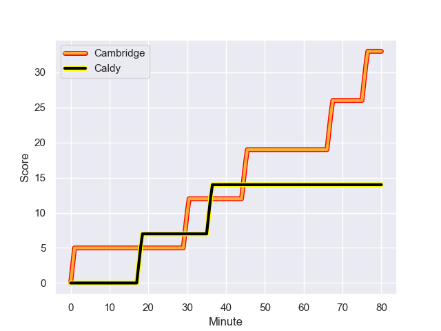
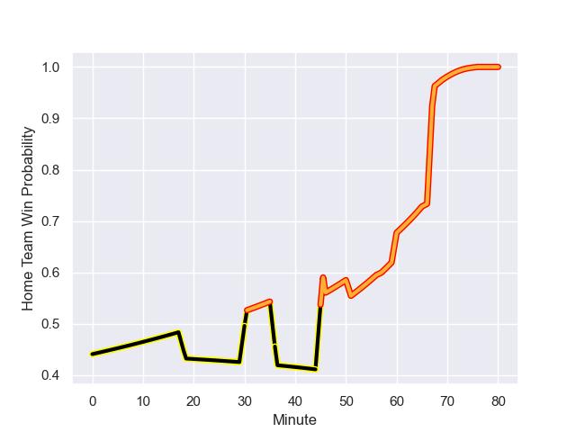

---  
layout: page  
title: Caldy at Cambridge; 14-33  
date: 2024-01-27 18:00:00 -0500  
categories: "RFU Championship 2023" match review  
---
# Caldy at Cambridge; 14-33

# Club Level Predictions

The first set of predictions treats a club as the smallest object, as the club develops its members, organizes a gameplan, and deploys its players as needed for each match. This club model has a prediction of 0.466, which translates to predicting Caldy to win by 1.2.

Our Over/Under is 46.5 - and combined with the spread above, we have a predicted scoreline of 24 to 23

Each club has a rating and a rating deviation (similar to a Glicko rating), and expected performances can be generated. This allows for simulated matches and spreads like the ones below.
## Projected Performances - Club Model

## Projected Spreads - Club Model

## Projected Results - Club Model

# Player Level Predictions - Version 2

Treating teams instead as an entity made up of the currently active players, I have ratings for each player in an altogether different system. These can be combined to form team ratings once teamsheets are announced, weighting starters a bit higher than the reserves. After the match is played, players can be weighted by their minutes on the field, allowing for an accurate measure of the team's composition. With these compiled team ratings, we can make predictions, measure inaccuracy, and update the individual player ratings.
## Prediction with Player Minutes: Caldy by 2.6

Caldy by 5.6 on a neutral field
## Prediction without Player Minutes: Caldy by 1.5

Caldy by 4.6 on a neutral pitch

## Projected Performances - Player Model

## Projected Spreads - Player Model

## Projected Results - Player Model

## Scores over Time

## Win Probability over Time

There were 12 large changes in win probability in this match

|   Away Minutes | Away Player      |   Away elo |   Number |   Home elo | Home Player          |   Home Minutes |
|---------------:|:-----------------|-----------:|---------:|-----------:|:---------------------|---------------:|
|             60 | Adam Aigbokhae   |      41.45 |        1 |      34.84 | Jake Elwood          |             60 |
|             51 | Oliver Hearn     |      31.9  |        2 |      40.51 | Benjamin Brownlie    |             60 |
|             51 | Nathan Rushton   |      32.16 |        3 |      28.33 | Billy Walker         |             60 |
|             66 | Martin Gerrard   |      50.68 |        4 |      31.2  | Kieran Frost         |             80 |
|             80 | Thomas Sanders   |      26.53 |        5 |      42.17 | Gareth Baxter        |             66 |
|             57 | Callum Ridgway   |      27.16 |        6 |      39.9  | George Bretag-Norris |             80 |
|             80 | Ciaran Booth     |      61.75 |        7 |      42.49 | Benjamin Hoppe       |             46 |
|             80 | Josiah Dickinson |      38.57 |        8 |      34.9  | Nahum Merigan        |             69 |
|             69 | Chris Pilgrim    |      23    |        9 |      34.97 | Kieran Duffin        |             77 |
|             69 | Rhys Hayes       |      32.36 |       10 |      37.22 | Steffan James        |             80 |
|             80 | William Robinson |      44.36 |       11 |      38.87 | Josef Green          |             80 |
|             60 | Michael Barlow   |      60.39 |       12 |      23.73 | Jamie Benson         |             80 |
|             80 | Connor Wilkinson |      48.75 |       13 |       3    | Sam Hanks            |             77 |
|             80 | Nick Royle       |      34.24 |       14 |      29.38 | Kwaku Asiedu         |             80 |
|             80 | Matt Kilcourse   |      59.29 |       15 |      30.95 | Elias Caven          |             80 |
|             29 | Matt Gallagher   |      56.95 |       16 |       3.25 | Ben Adams            |             34 |
|             29 | Monty Weatherby  |      56.1  |       17 |      54.73 | Huw Owen             |             20 |
|             23 | Sam Olyott       |      33.62 |       18 |      26.52 | Morgan Veness        |             20 |
|             20 | Ryan Higginson   |      42.37 |       19 |      43.84 | Matt Collins         |             20 |
|             20 | Michael Cartmill |       0.83 |       20 |      23.01 | Jared Cardew         |             14 |
|             14 | Luke Cox         |      46.96 |       21 |      42.91 | Anthony Maka         |             11 |
|             11 | Joseph Murray    |      39.11 |       22 |      46.65 | Jed Gelderbloom      |              3 |
|             11 | Lewis Barker     |      16.34 |       23 |      28.55 | Matt Williams        |              3 |

