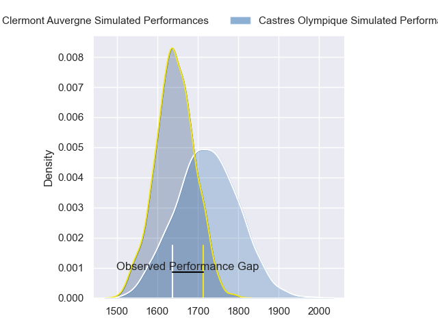
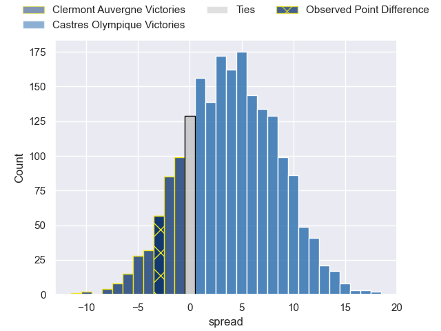
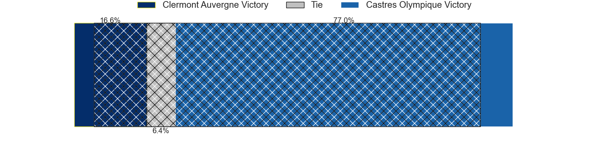
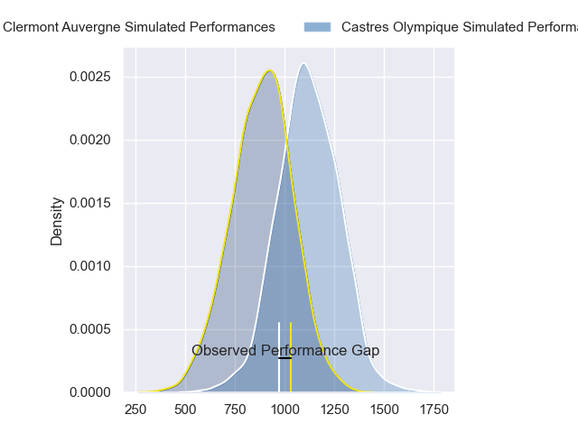
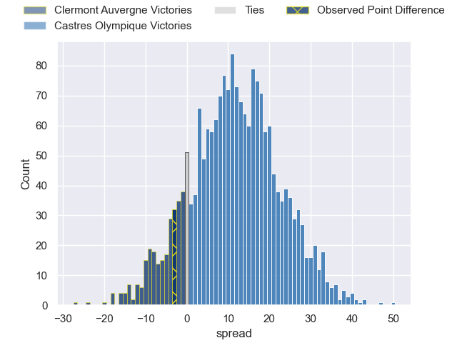
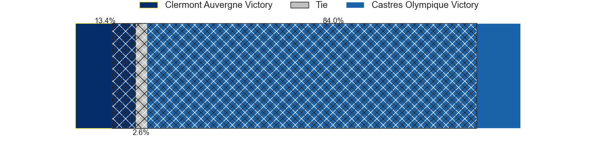
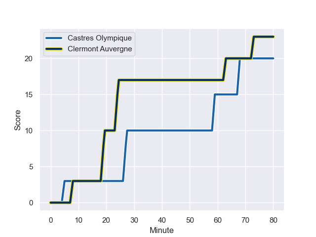
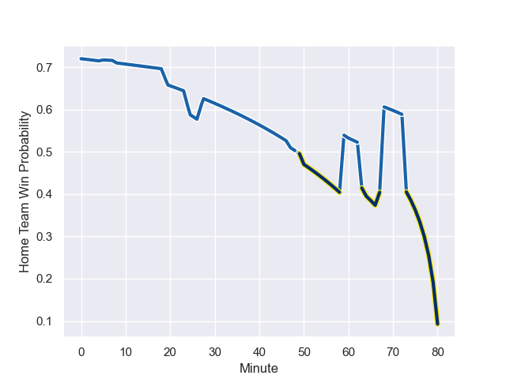

---  
layout: page  
title: Clermont Auvergne at Castres Olympique; 23-20  
date: 2024-01-27 18:00:00 -0500  
categories: "Top 14 Orange 2023" match review  
---
# Clermont Auvergne at Castres Olympique; 23-20

# Club Level Predictions

The first set of predictions treats a club as the smallest object, as the club develops its members, organizes a gameplan, and deploys its players as needed for each match. This club model has a prediction of 0.612, which translates to predicting Castres Olympique to win by 4.0.

Our Over/Under is 36.5 - and combined with the spread above, we have a predicted scoreline of 16 to 20

Each club has a rating and a rating deviation (similar to a Glicko rating), and expected performances can be generated. This allows for simulated matches and spreads like the ones below.
## Projected Performances - Club Model

## Projected Spreads - Club Model

## Projected Results - Club Model

# Player Level Predictions - Version 2

Treating teams instead as an entity made up of the currently active players, I have ratings for each player in an altogether different system. These can be combined to form team ratings once teamsheets are announced, weighting starters a bit higher than the reserves. After the match is played, players can be weighted by their minutes on the field, allowing for an accurate measure of the team's composition. With these compiled team ratings, we can make predictions, measure inaccuracy, and update the individual player ratings.
## Prediction with Player Minutes: Castres Olympique by 10.4

Castres Olympique by 2.6 on a neutral field
## Prediction without Player Minutes: Castres Olympique by 9.8

Castres Olympique by 2.0 on a neutral pitch

## Projected Performances - Player Model

## Projected Spreads - Player Model

## Projected Results - Player Model

## Scores over Time

## Win Probability over Time

There were 14 large changes in win probability in this match

|   Away Minutes | Away Player          |   Away elo |   Number |   Home elo | Home Player                |   Home Minutes |
|---------------:|:---------------------|-----------:|---------:|-----------:|:---------------------------|---------------:|
|             50 | Etienne Falgoux      |      53.76 |        1 |      90.09 | Antoine Tichit             |             50 |
|             80 | Folau Fainga'a       |      92.12 |        2 |      85.89 | Gaetan Barlot              |             67 |
|             50 | Rabah Slimani        |      55.17 |        3 |      65.18 | Levan Chilachava           |             60 |
|             60 | Rob Simmons          |      83.71 |        4 |      73.78 | Leone Nakarawa             |             64 |
|             80 | Tomas Lavanini       |      62.28 |        5 |      62.01 | Tom Staniforth             |             80 |
|             50 | Killian Tixeront     |      48.33 |        6 |      59.11 | Mathieu Babillot           |             80 |
|             80 | Marcos Kremer        |      43.07 |        7 |      54.82 | Baptiste Delaporte         |             80 |
|             64 | Fritz Lee            |      75.69 |        8 |      53.94 | Abraham Papali'i           |             50 |
|             60 | Sebastien Bezy       |      71.6  |        9 |      10.61 | Jeremy Fernandez           |             50 |
|             80 | Anthony Belleau      |      63.76 |       10 |      51.09 | Pierre Popelin             |             64 |
|             80 | Alivereti Raka       |      27.51 |       11 |      68.9  | Nathanael Hulleu           |             80 |
|             80 | George Moala         |      77.1  |       12 |      79.87 | Adrea Cocagi               |             80 |
|             60 | Leon Darricarrere    |      41.24 |       13 |      97.3  | Jack Goodhue               |             80 |
|             80 | Bautista Delguy      |      68.25 |       14 |      55.22 | Josaia Raisuqe             |             80 |
|             80 | Thomas Roziere       |      18.8  |       15 |      54.11 | Julien Dumora              |             47 |
|             30 | Giorgi Beria         |      43.13 |       16 |      36.76 | Théo Chabouni              |             33 |
|             30 | Lucas Dessaigne      |      71.71 |       17 |      57.8  | Santiago Arata             |             30 |
|             20 | Baptiste Jauneau     |      22.41 |       18 |      57.85 | Nick Champion de Crespigny |             30 |
|             20 | Thibaud Lanen        |      60.47 |       19 |      43.07 | Loïs Guerois               |             30 |
|             20 | Benjamin Urdapilleta |      89.19 |       20 |      56.68 | Vilimoni Botitu            |             16 |
|             30 | Henzo Kiteau         |      33.37 |       21 |      46.42 | Henry Thomas               |             20 |
|             16 | Peceli Yato Senibitu |     103.37 |       22 |      49.32 | Florent Vanverberghe       |             16 |
|            nan | nan                  |     nan    |       23 |      41.57 | Loris Zarantonello         |             13 |

