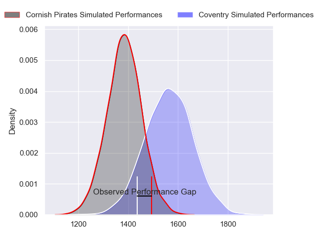
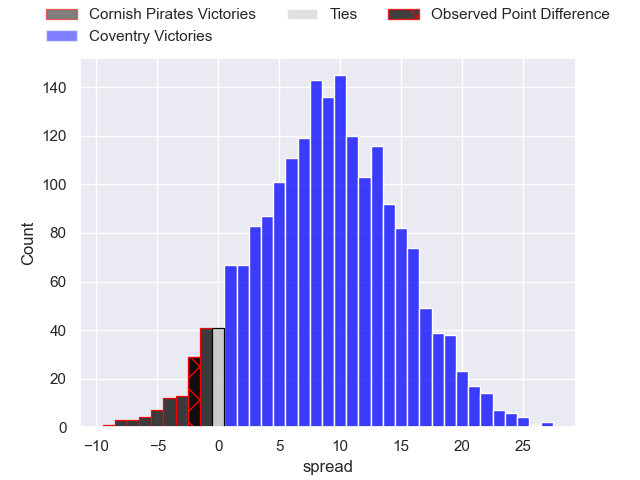
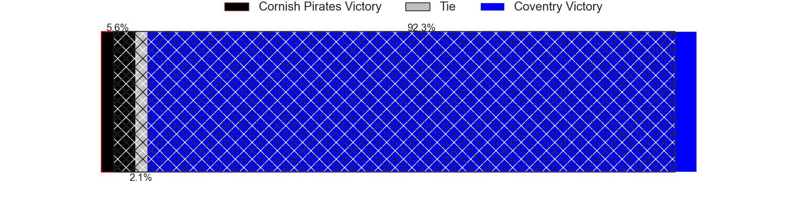
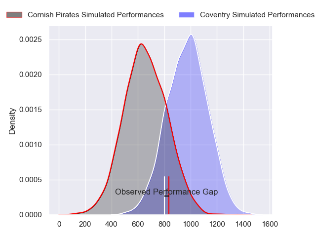
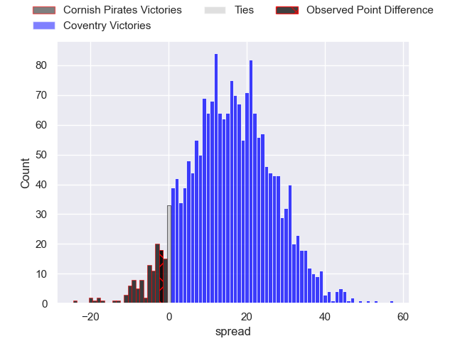
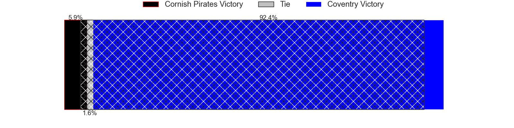
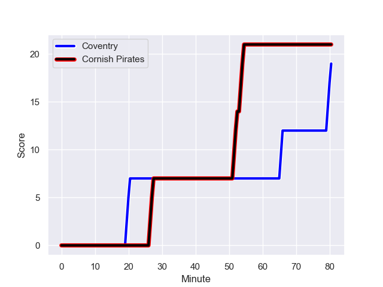
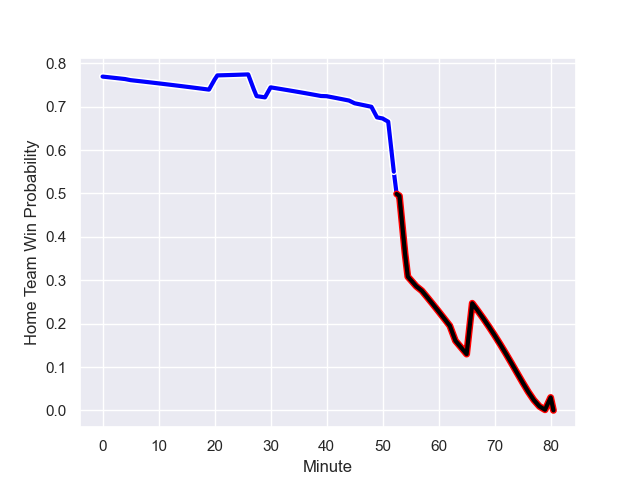

---  
layout: page  
title: Cornish Pirates at Coventry; 21-19  
date: 2024-01-27 18:00:00 -0500  
categories: "RFU Championship 2023" match review  
---
# Cornish Pirates at Coventry; 21-19

# Club Level Predictions

The first set of predictions treats a club as the smallest object, as the club develops its members, organizes a gameplan, and deploys its players as needed for each match. This club model has a prediction of 0.732, which translates to predicting Coventry to win by 8.9.

Our Over/Under is 54.5 - and combined with the spread above, we have a predicted scoreline of 23 to 32

Each club has a rating and a rating deviation (similar to a Glicko rating), and expected performances can be generated. This allows for simulated matches and spreads like the ones below.
## Projected Performances - Club Model

## Projected Spreads - Club Model

## Projected Results - Club Model

# Player Level Predictions - Version 2

Treating teams instead as an entity made up of the currently active players, I have ratings for each player in an altogether different system. These can be combined to form team ratings once teamsheets are announced, weighting starters a bit higher than the reserves. After the match is played, players can be weighted by their minutes on the field, allowing for an accurate measure of the team's composition. With these compiled team ratings, we can make predictions, measure inaccuracy, and update the individual player ratings.
## Prediction with Player Minutes: Coventry by 13.3

Coventry by 9.9 on a neutral field
## Prediction without Player Minutes: Coventry by 12.1

Coventry by 8.6 on a neutral pitch

## Projected Performances - Player Model

## Projected Spreads - Player Model

## Projected Results - Player Model

## Scores over Time

## Win Probability over Time

There were 9 large changes in win probability in this match

|   Away Minutes | Away Player          |   Away elo |   Number |   Home elo | Home Player        |   Home Minutes |
|---------------:|:---------------------|-----------:|---------:|-----------:|:-------------------|---------------:|
|             65 | Lefty Zigiriadis     |      47.86 |        1 |      41.58 | Vilikesa Nairau    |             45 |
|             68 | Morgan Nelson        |      43.45 |        2 |      43.22 | Jordon Poole       |             66 |
|             40 | Matt Johnson         |      53.01 |        3 |      43.7  | Adam Nicol         |             63 |
|             80 | Hugh Bokenham        |      47.25 |        4 |      16.21 | James Tyas         |             66 |
|             80 | Steele Robert Barker |      49.39 |        5 |      32.97 | Obinna Nkwocha     |             80 |
|             80 | Peter Everett        |      51.37 |        6 |      77.75 | Tom Ball           |             49 |
|             63 | Will Gibson          |      64.45 |        7 |      30.84 | Matt Kvesic        |             57 |
|             68 | John Stevens         |      48.59 |        8 |      89.65 | Senitiki Nayalo    |             80 |
|             51 | Alex Schwarz         |      36.87 |        9 |     148.23 | Will Chudley       |             63 |
|              5 | Bruce Houston        |      49.56 |       10 |      75.37 | Patrick Pellegrini |             80 |
|             80 | Matthew McNab        |       5.94 |       11 |      79.1  | James Martin       |             80 |
|             80 | Joe Elderkin         |      34    |       12 |      93.42 | Will Rigg          |             80 |
|             80 | Iwan Jenkins         |      46.98 |       13 |      54.75 | Will Wand          |             80 |
|             80 | Robin Wedlake        |      29.97 |       14 |      21.58 | Ryan Hutler        |             30 |
|             80 | Will Trewin          |      51.48 |       15 |      53.1  | Tobi Wilson        |             80 |
|             75 | Tom Pittman          |      51.2  |       16 |      63.78 | Lucas Titherington |             50 |
|             40 | Finlay Richardson    |      49.42 |       17 |      34.46 | Elliott Chilvers   |             35 |
|             29 | Ruaridh Dawson       |      46.48 |       18 |      34.98 | Paddy Ryan         |             31 |
|             15 | Jake Morris          |      48.3  |       19 |      42.43 | Jack Bartlett      |             23 |
|             17 | Cory Teague          |      32.19 |       20 |      36.92 | Eliot Salt         |             17 |
|             12 | Rhys Williams        |      47.81 |       21 |      57.25 | Will Lane          |             17 |
|             12 | Josh King            |      49.8  |       22 |      50.84 | Will Biggs         |             14 |
|            nan | nan                  |     nan    |       23 |      40.37 | Rhys Anstey        |             14 |

