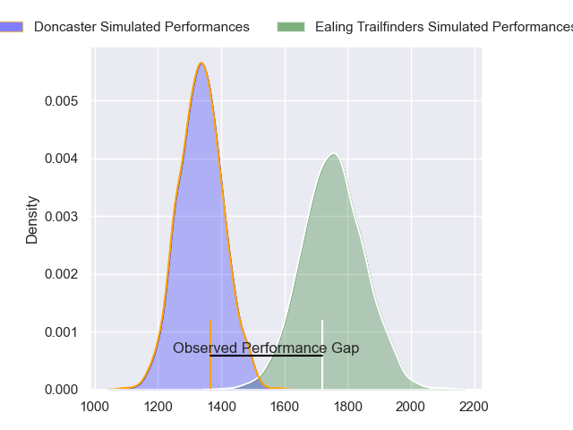
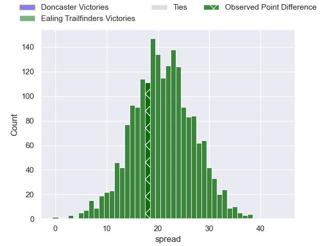
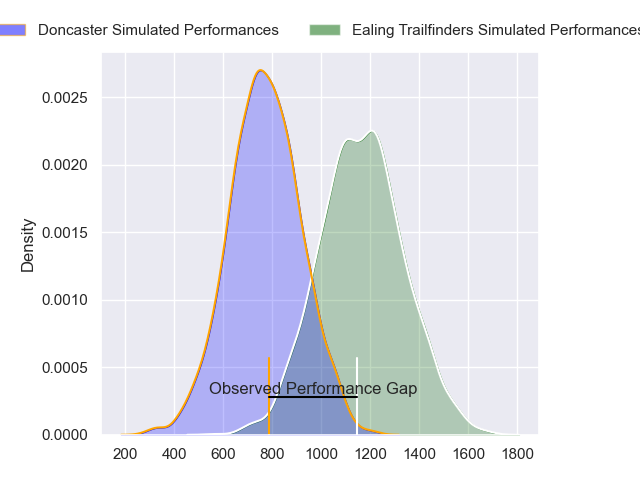
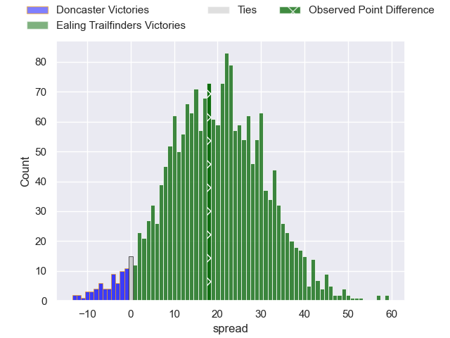
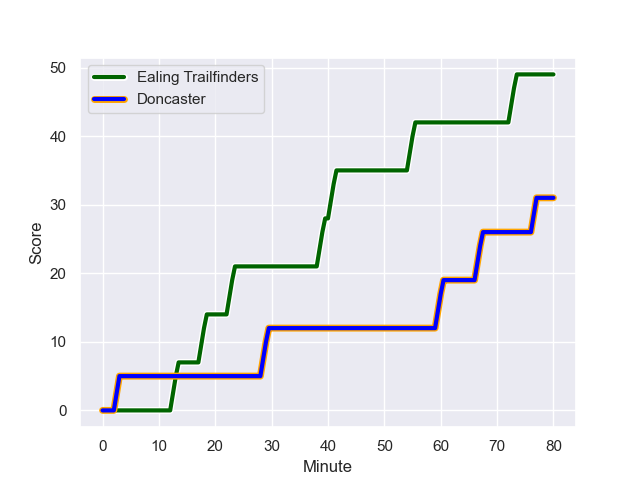
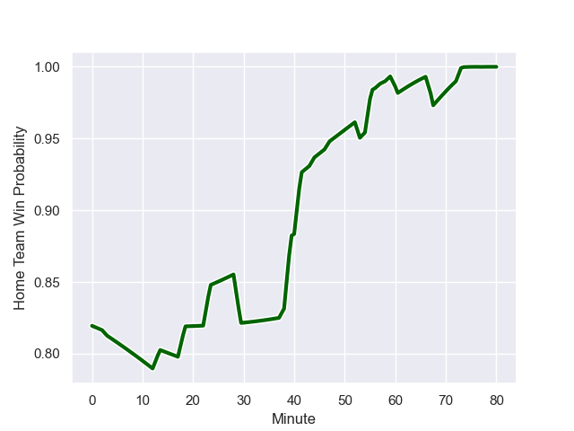

---  
layout: page  
title: Doncaster at Ealing Trailfinders; 31-49  
date: 2024-01-27 18:00:00 -0500  
categories: "RFU Championship 2023" match review  
---
# Doncaster at Ealing Trailfinders; 31-49

# Club Level Predictions

The first set of predictions treats a club as the smallest object, as the club develops its members, organizes a gameplan, and deploys its players as needed for each match. This club model has a prediction of 0.913, which translates to predicting Ealing Trailfinders to win by 21.0.

Our Over/Under is 66.5 - and combined with the spread above, we have a predicted scoreline of 23 to 44

Each club has a rating and a rating deviation (similar to a Glicko rating), and expected performances can be generated. This allows for simulated matches and spreads like the ones below.
## Projected Performances - Club Model

## Projected Spreads - Club Model

## Projected Results - Club Model

# Player Level Predictions - Version 2

Treating teams instead as an entity made up of the currently active players, I have ratings for each player in an altogether different system. These can be combined to form team ratings once teamsheets are announced, weighting starters a bit higher than the reserves. After the match is played, players can be weighted by their minutes on the field, allowing for an accurate measure of the team's composition. With these compiled team ratings, we can make predictions, measure inaccuracy, and update the individual player ratings.
## Prediction with Player Minutes: Ealing Trailfinders by 16.6

Ealing Trailfinders by 12.9 on a neutral field
## Prediction without Player Minutes: Ealing Trailfinders by 16.8

Ealing Trailfinders by 13.1 on a neutral pitch

## Projected Performances - Player Model

## Projected Spreads - Player Model

## Projected Results - Player Model

## Scores over Time

## Win Probability over Time

There were 2 large changes in win probability in this match

|   Away Minutes | Away Player              |   Away elo |   Number |   Home elo | Home Player         |   Home Minutes |
|---------------:|:-------------------------|-----------:|---------:|-----------:|:--------------------|---------------:|
|             44 | Harrison Courtney        |      59.26 |        1 |      70.88 | Kyle John Whyte     |             75 |
|             57 | George Roberts           |      45.41 |        2 |      39.24 | Matthew Cornish     |             59 |
|             51 | Corrie Barrett           |      38.23 |        3 |      41.69 | Jimmy Roots         |             38 |
|             47 | Harry Wilson             |      32.46 |        4 |     100.33 | Bobby de Wee        |             80 |
|             80 | Evan Mintern             |      91.7  |        5 |      72.91 | Barney Maddison     |             80 |
|             66 | Archie Smeaton           |      50.05 |        6 |      48.37 | Rob Farrar          |             56 |
|             80 | Rhys Tait                |      42.42 |        7 |      41.56 | Richard Hardwick    |             57 |
|             57 | Jack Digby               |      68.85 |        8 |     110.65 | Ryan Smid           |             72 |
|             48 | Ollie Fox                |     -15.93 |        9 |      55.2  | Craig Hampson       |             75 |
|             80 | Billy McBryde            |      65.41 |       10 |     114.55 | Craig Willis        |             80 |
|             80 | Westleigh Alleyne Holden |      57.99 |       11 |     119.95 | Tom Collins         |             80 |
|             80 | Russell Bennett          |      69.17 |       12 |      85.93 | Billy Twelvetrees   |             60 |
|             80 | Joe Margetts             |      61.22 |       13 |      46.92 | Reuben Bird-Tulloch |             80 |
|             80 | George Simpson           |      49.48 |       14 |      91.69 | Jonah Holmes        |             80 |
|             53 | Jack Metcalf             |      -7.18 |       15 |      51.99 | Max Bodilly         |             80 |
|             36 | Conor Davidson           |      40.99 |       16 |      57.82 | George Davis        |             42 |
|             33 | Ehize Ehizode            |      11.88 |       17 |      46.31 | Josh Taylor         |             24 |
|             32 | Alex Dolly               |      73.59 |       18 |      46.65 | Jordan Reid         |             23 |
|             29 | Lewis Thiede             |      88.55 |       19 |      35.72 | Henry Walker        |             21 |
|             27 | Sam Bedlow               |      80.11 |       20 |      46.44 | Pat Howard          |             20 |
|             23 | Charlie Beckett          |      44.48 |       21 |       8.7  | Callum Chick        |              8 |
|             23 | Johnny Stewart           |      40.86 |       22 |      66.98 | Lloyd Williams      |              5 |
|             14 | Adam Hopkinson           |      46.85 |       23 |      42.3  | Ross Kane           |              5 |

