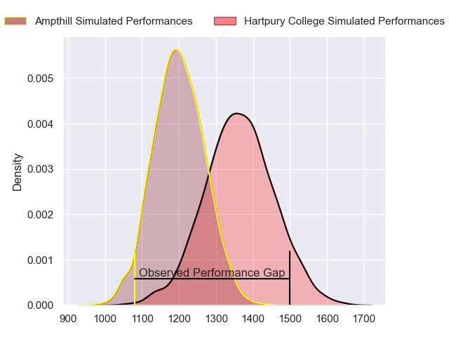
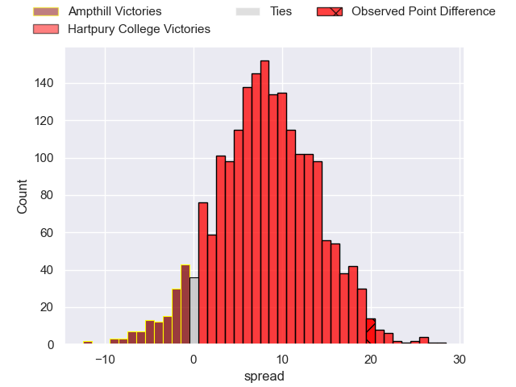
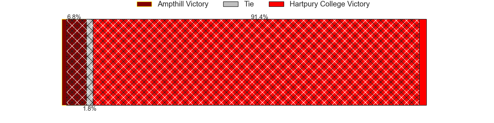
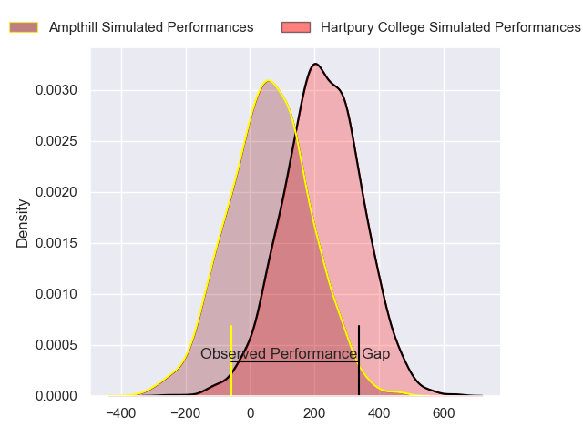
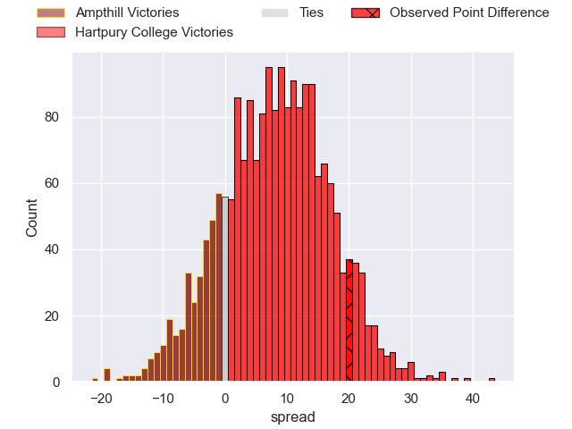
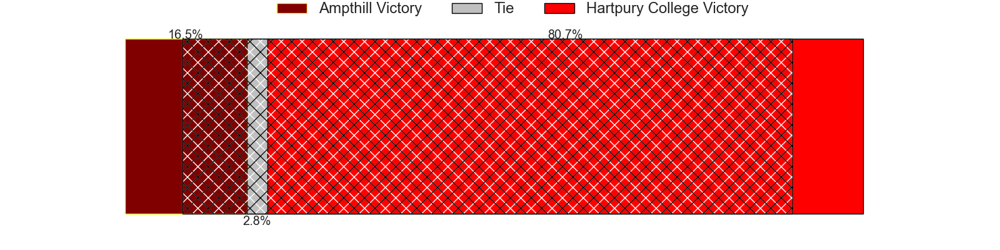

---  
layout: page  
title: Ampthill at Hartpury College; 34-54  
date: 2024-01-27 18:00:00 -0500  
categories: "RFU Championship 2023" match review  
---
# Ampthill at Hartpury College; 34-54

# Club Level Predictions

The first set of predictions treats a club as the smallest object, as the club develops its members, organizes a gameplan, and deploys its players as needed for each match. This club model has a prediction of 0.714, which translates to predicting Hartpury College to win by 8.1.

Our Over/Under is 50.5 - and combined with the spread above, we have a predicted scoreline of 21 to 29

Each club has a rating and a rating deviation (similar to a Glicko rating), and expected performances can be generated. This allows for simulated matches and spreads like the ones below.
## Projected Performances - Club Model

## Projected Spreads - Club Model

## Projected Results - Club Model

# Player Level Predictions - Version 2

Treating teams instead as an entity made up of the currently active players, I have ratings for each player in an altogether different system. These can be combined to form team ratings once teamsheets are announced, weighting starters a bit higher than the reserves. After the match is played, players can be weighted by their minutes on the field, allowing for an accurate measure of the team's composition. With these compiled team ratings, we can make predictions, measure inaccuracy, and update the individual player ratings.
## Prediction with Player Minutes: Hartpury College by 8.4

Hartpury College by 5.3 on a neutral field
## Prediction without Player Minutes: Hartpury College by 8.3

Hartpury College by 5.2 on a neutral pitch

## Projected Performances - Player Model

## Projected Spreads - Player Model

## Projected Results - Player Model

|   Away Minutes | Away Player                 |   Away Percentile |   Number |   Home Percentile | Home Player           |   Home Minutes |
|---------------:|:----------------------------|------------------:|---------:|------------------:|:----------------------|---------------:|
|             40 | Zac Nearchou                |             39.95 |        1 |             84.72 | Aristot Benz-Salomon  |             71 |
|             80 | Benjamin Chapman            |             24.64 |        2 |             80.29 | William Crane         |             71 |
|             50 | Dominic Hardman             |             20.64 |        3 |             80.52 | Jonathan Benz-Salomon |             71 |
|             80 | Joe Peard                   |             37.44 |        4 |             78.26 | Dale Lemon            |             57 |
|             70 | Kaden Pearce-Paul           |             68.6  |        5 |             88.37 | Jack Davies           |             80 |
|             80 | Josh Smart                  |             10    |        6 |             36.63 | Samuel Lewis          |             80 |
|             50 | Izaiha Moore-Aiono          |             25.11 |        7 |             84.13 | Harry Short           |             80 |
|             80 | Morgan Strong               |             50.7  |        8 |             46.5  | Mitchell Eadie        |             21 |
|             70 | Peter White                 |             87.08 |        9 |             76.74 | Michael Austin        |             74 |
|             65 | Josh Barton                 |             25.85 |       10 |             86.47 | Harry Bazalgette      |             80 |
|             80 | Ben Harris                  |             37.87 |       11 |             51.79 | Alex Morgan           |             80 |
|             67 | Josh Hallett                |             17.2  |       12 |             68.82 | Morgan Adderly-Jones  |             80 |
|             80 | Brandon Jackson-Richards    |             30.35 |       13 |             14.7  | Robbie Smith          |             80 |
|             80 | Tobias Elliott              |             56.65 |       14 |             77.85 | Bradley Denty         |             50 |
|             80 | Tomas Bacon                 |             65.63 |       15 |             66.35 | Tommy Mathews         |             57 |
|             40 | Jasper McGuire              |             45.58 |       16 |             83.88 | Josh Gray             |             59 |
|             30 | Nathan Michelow             |             44.13 |       17 |             50.42 | Louis Hillman-Cooper  |             30 |
|             30 | Harvey Beaton               |             44.59 |       18 |             36.96 | Freddie Thomas        |             23 |
|             15 | Gwyn Parks                  |             40.34 |       19 |             85.9  | Charlie Powell        |             23 |
|             13 | Fraser James Kevin Strachan |             81.48 |       20 |             68.72 | Mikey Summerfield     |              9 |
|             10 | Joe Green                   |            nan    |       21 |             67.52 | Ethan Hunt            |              9 |
|             10 | Cai Devine                  |             33.91 |       22 |              0.89 | Joe Rees              |              9 |
|            nan | nan                         |            nan    |       23 |             43.34 | Matty Jones           |              6 |

