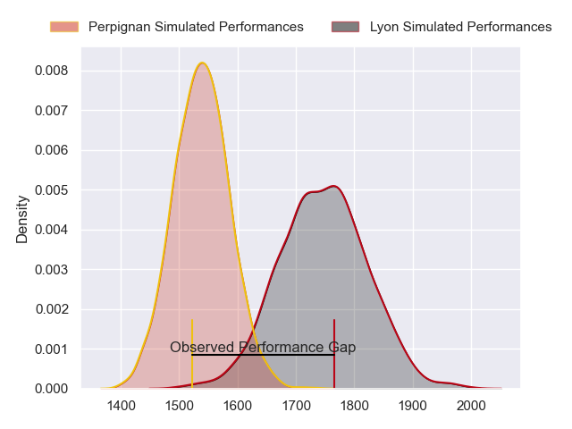
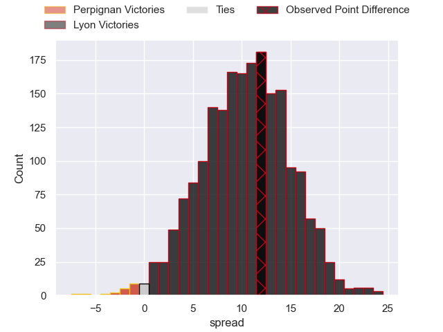
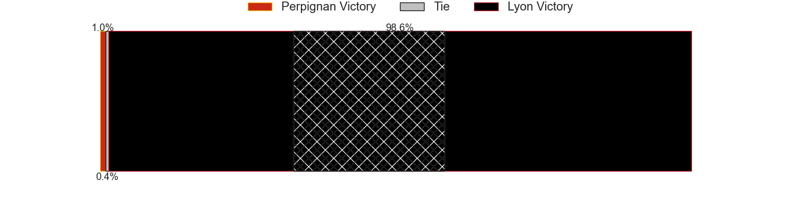
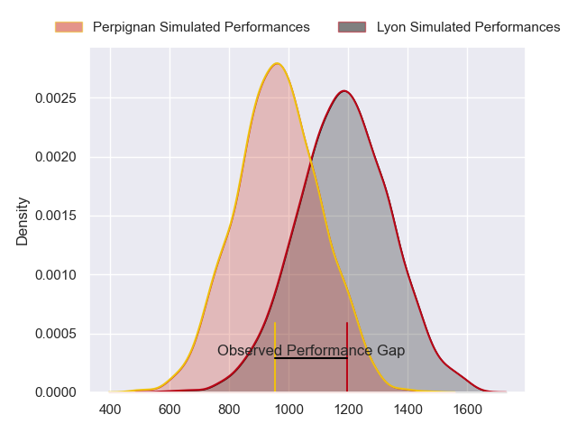
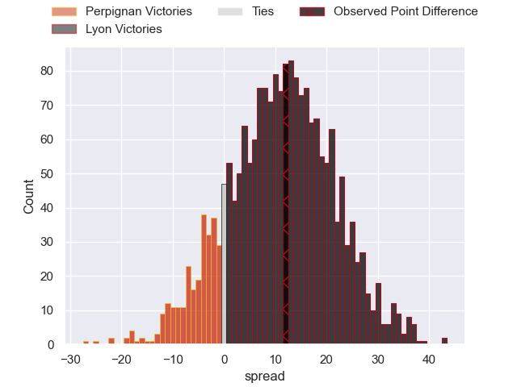
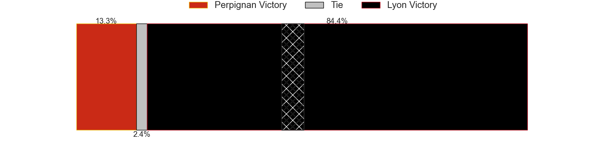
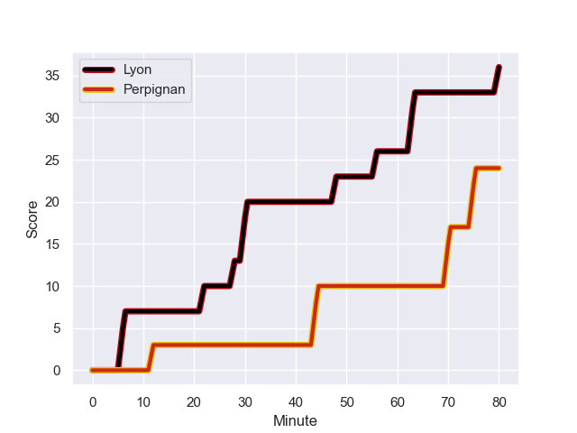
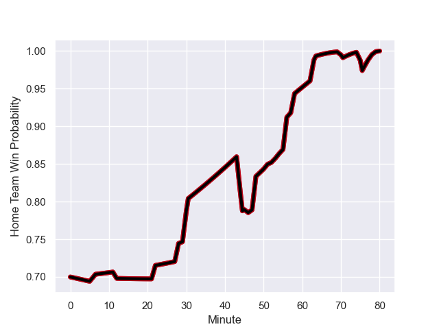

---  
layout: page  
title: Perpignan at Lyon; 24-36  
date: 2024-01-27 18:00:00 -0500  
categories: "Top 14 Orange 2023" match review  
---
# Perpignan at Lyon; 24-36

# Club Level Predictions

The first set of predictions treats a club as the smallest object, as the club develops its members, organizes a gameplan, and deploys its players as needed for each match. This club model has a prediction of 0.766, which translates to predicting Lyon to win by 10.4.

Our Over/Under is 48.5 - and combined with the spread above, we have a predicted scoreline of 19 to 30

Each club has a rating and a rating deviation (similar to a Glicko rating), and expected performances can be generated. This allows for simulated matches and spreads like the ones below.
## Projected Performances - Club Model

## Projected Spreads - Club Model

## Projected Results - Club Model

# Player Level Predictions - Version 2

Treating teams instead as an entity made up of the currently active players, I have ratings for each player in an altogether different system. These can be combined to form team ratings once teamsheets are announced, weighting starters a bit higher than the reserves. After the match is played, players can be weighted by their minutes on the field, allowing for an accurate measure of the team's composition. With these compiled team ratings, we can make predictions, measure inaccuracy, and update the individual player ratings.
## Prediction with Player Minutes: Lyon by 9.3

Lyon by 2.0 on a neutral field
## Prediction without Player Minutes: Lyon by 8.7

Lyon by 1.4 on a neutral pitch

## Projected Performances - Player Model

## Projected Spreads - Player Model

## Projected Results - Player Model

## Scores over Time

## Win Probability over Time

There were 6 large changes in win probability in this match

|   Away Minutes | Away Player           |   Away elo |   Number |   Home elo | Home Player           |   Home Minutes |
|---------------:|:----------------------|-----------:|---------:|-----------:|:----------------------|---------------:|
|             52 | Sacha Lotrian         |      59.01 |        1 |      14.3  | Jerome Rey            |             51 |
|             52 | Ignacio Ruiz          |      57.11 |        2 |      66.47 | Liam Coltman          |             51 |
|             52 | Pietro Ceccarelli     |      66.56 |        3 |      76.27 | Demba Bamba           |             54 |
|             80 | Marvin Orie           |      65.78 |        4 |      63.98 | Felix Lambey          |             80 |
|             54 | Posolo Tuilagi        |      44.48 |        5 |      42.81 | Mickael Guillard      |             80 |
|             80 | Patrick Sobela        |      79.31 |        6 |      43.93 | Marvin Okuya          |             54 |
|             80 | Jacobus van Tonder    |      57.24 |        7 |      45.74 | Liam Allen            |             80 |
|             52 | Joaquin Oviedo        |      67.62 |        8 |      58.6  | Arno Botha            |             46 |
|             58 | Tom Ecochard          |      58.41 |        9 |      99.4  | Baptiste Couilloud    |             69 |
|             80 | Jake McIntyre         |      80.69 |       10 |      72.7  | Leo Berdeu            |             58 |
|             80 | Ali Crossdale         |      37.77 |       11 |      80.81 | Davit Niniashvili     |             80 |
|             80 | Jeronimo de la Fuente |     142.16 |       12 |     160.96 | Semi Radradra         |             80 |
|             58 | Afusipa Taumoepeau    |      73.92 |       13 |      46.82 | Alfred Parisien       |             80 |
|             60 | Tavite Veredamu       |      42    |       14 |     123.94 | Vincent Rattez        |             80 |
|             80 | Tommaso Allan         |      55.9  |       15 |      47.43 | Alexandre Tchaptchet  |             69 |
|             28 | Nemo Roelofse         |      34.22 |       16 |      60.75 | Paddy Jackson         |             22 |
|             28 | Seilala Lam           |      58.06 |       17 |      41.19 | Maxime Gouzou         |             34 |
|             28 | Xavier Chiocci        |      21.01 |       18 |      33.76 | Guillaume Marchand    |             29 |
|             28 | So'otala Fa'aso'o     |     114.1  |       19 |      50.75 | Vivien Devisme        |             29 |
|             26 | Mathieu Tanguy        |      19.24 |       20 |      44.53 | Joel Kpoku            |             26 |
|             22 | Matteo Rodor          |      34.17 |       21 |      38.02 | Pierre-Samuel Pacheco |             11 |
|             22 | Alivereti Duguivalu   |       0.45 |       22 |      27.38 | Josiah Maraku         |             11 |
|             20 | Mathieu Acebes        |     107.75 |       23 |      32.23 | Paulo Tafili          |             26 |

