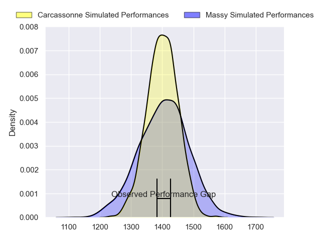
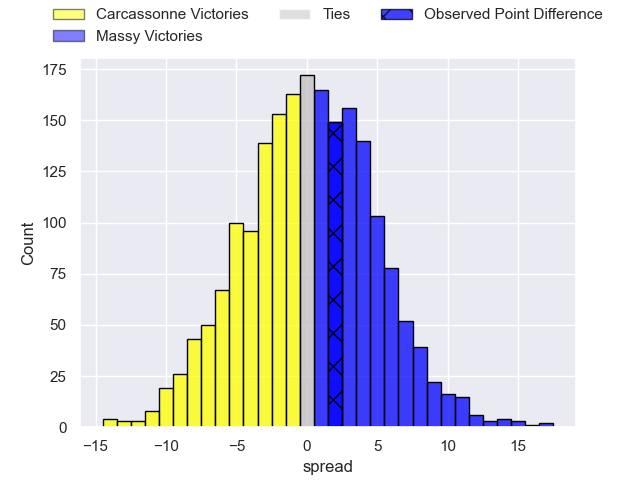
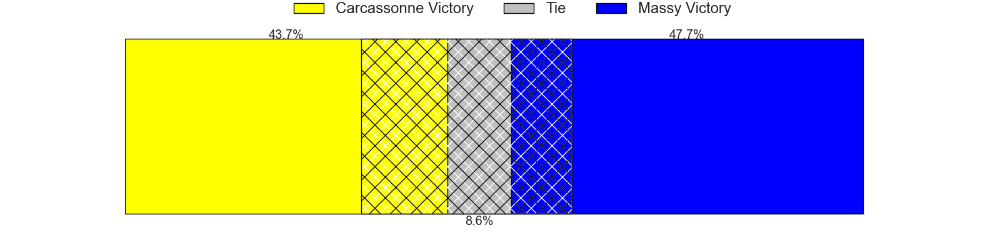
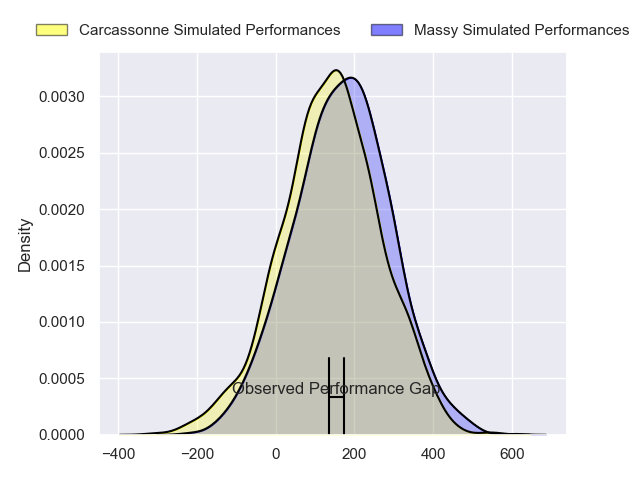
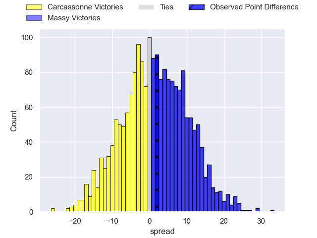
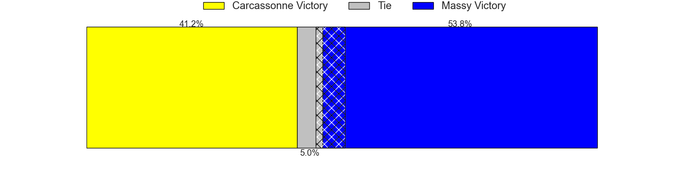

---  
layout: page  
title: Carcassonne at Massy; 20-22  
date: 2024-01-27 18:00:00 -0500  
categories: "Nationale 2023" match review  
---
# Carcassonne at Massy; 20-22

# Club Level Predictions

The first set of predictions treats a club as the smallest object, as the club develops its members, organizes a gameplan, and deploys its players as needed for each match. This club model has a prediction of 0.507, which translates to predicting Massy to win by 0.2.

Our Over/Under is 35.5 - and combined with the spread above, we have a predicted scoreline of 18 to 18

Each club has a rating and a rating deviation (similar to a Glicko rating), and expected performances can be generated. This allows for simulated matches and spreads like the ones below.
## Projected Performances - Club Model

## Projected Spreads - Club Model

## Projected Results - Club Model

# Player Level Predictions - Version 2

Treating teams instead as an entity made up of the currently active players, I have ratings for each player in an altogether different system. These can be combined to form team ratings once teamsheets are announced, weighting starters a bit higher than the reserves. After the match is played, players can be weighted by their minutes on the field, allowing for an accurate measure of the team's composition. With these compiled team ratings, we can make predictions, measure inaccuracy, and update the individual player ratings.
## Prediction with Player Minutes: Massy by 1.7

Carcassonne by 2.5 on a neutral field
## Prediction without Player Minutes: Massy by 2.3

Carcassonne by 1.8 on a neutral pitch

## Projected Performances - Player Model

## Projected Spreads - Player Model

## Projected Results - Player Model

|   Away Minutes | Away Player           |   Away Percentile |   Number |   Home Percentile | Home Player              |   Home Minutes |
|---------------:|:----------------------|------------------:|---------:|------------------:|:-------------------------|---------------:|
|             60 | Andrei Ursache        |             93.21 |        1 |             56.48 | Charif Mansour           |             67 |
|             74 | Luka Petriashvili     |             70.99 |        2 |              4.01 | Mike Tadjer              |             65 |
|             54 | Vakhtangi Akhobadze   |              3.4  |        3 |             54.07 | Tijde Visser             |             56 |
|             60 | Romain Manchia        |             35.23 |        4 |             39.77 | Lilian Rousset           |             55 |
|             80 | Clément Fontaine      |             36.98 |        5 |             14.07 | Andrei Mahu              |             80 |
|             49 | Valentin Sese         |             31.74 |        6 |             43.26 | Tony Tissot              |             55 |
|             80 | Etienne Herjean       |             80.33 |        7 |             79.35 | Saba Pesvianidze         |             80 |
|             60 | Ferdinand Dreno       |             41.82 |        8 |             72.43 | Alexandre Loubiere       |             80 |
|             54 | Martin Landajo        |              0.2  |        9 |             28.03 | Lucas Rubio              |             80 |
|             74 | Gabin Michet          |             77.29 |       10 |             15.94 | Hugo Verdu               |             80 |
|             80 | Sakiusa Bureitakiyaca |             41.56 |       11 |              0.84 | Kimami Sitauti           |             62 |
|             80 | Tutuila Vaea          |             48.15 |       12 |             74.07 | Victorien Jacomme        |             80 |
|             80 | Mathys Barka          |             50.18 |       13 |             57.71 | Arthur Seigneuret        |             80 |
|             80 | Clement Egiziano      |             76.37 |       14 |             72.15 | Alex Preira              |             67 |
|             80 | Enahemo Artaud        |             41.05 |       15 |             37.71 | Giorgi Gogoladze         |             80 |
|             28 | Florent Lorenzon      |             56.57 |       16 |             14.75 | Alexandre Candel         |             21 |
|             14 | Baptiste Moreno       |            nan    |       17 |             56.02 | Pierre-Alexandre Duclieu |             23 |
|             34 | Nikoloz Narmania      |             68.99 |       18 |             39.77 | Nolan Pienaar            |             32 |
|             28 | Romain Guyot          |             70.09 |       19 |              8.84 | Koen Bloemen             |             33 |
|             39 | Gary Graham           |             80    |       20 |             33.04 | Clément Vidoni           |             33 |
|             28 | Corentin Bousquet     |            nan    |       21 |             16.47 | Tom Deleuze              |             26 |
|             34 | Gaetan Pichon         |             37.57 |       22 |             68.99 | Martin Carre             |             21 |
|             14 | Maxime Gianet         |             78.52 |       23 |            nan    | nan                      |            nan |

