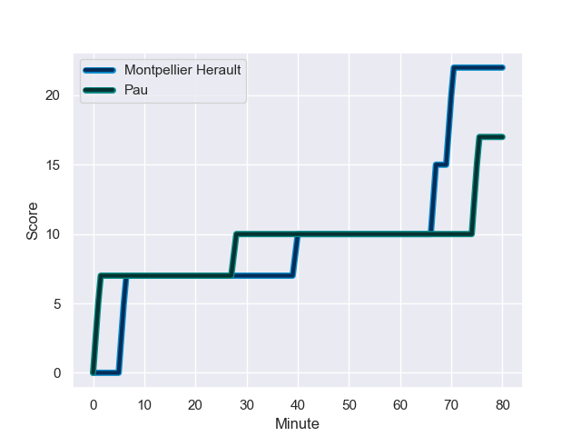
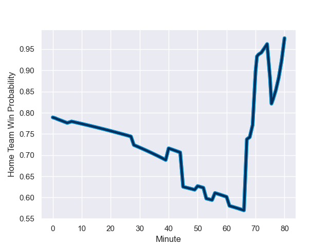

---  
layout: page  
title: Pau at Montpellier Herault; 17-22  
date: 2024-01-27 18:00:00 -0500  
categories: "Top 14 Orange 2023" match review  
---
# Pau at Montpellier Herault; 17-22

# Club Level Predictions

The first set of predictions treats a club as the smallest object, as the club develops its members, organizes a gameplan, and deploys its players as needed for each match. This club model has a prediction of 0.648, which translates to predicting Montpellier Herault to win by 5.4.

Our Over/Under is 37.5 - and combined with the spread above, we have a predicted scoreline of 16 to 21

Each club has a rating and a rating deviation (similar to a Glicko rating), and expected performances can be generated. This allows for simulated matches and spreads like the ones below.
## Projected Performances - Club Model

## Projected Spreads - Club Model

## Projected Results - Club Model

# Player Level Predictions - Version 2

Treating teams instead as an entity made up of the currently active players, I have ratings for each player in an altogether different system. These can be combined to form team ratings once teamsheets are announced, weighting starters a bit higher than the reserves. After the match is played, players can be weighted by their minutes on the field, allowing for an accurate measure of the team's composition. With these compiled team ratings, we can make predictions, measure inaccuracy, and update the individual player ratings.
## Prediction with Player Minutes: Montpellier Herault by 14.5

Montpellier Herault by 7.2 on a neutral field
## Prediction without Player Minutes: Montpellier Herault by 16.5

Montpellier Herault by 9.2 on a neutral pitch

## Projected Performances - Player Model

## Projected Spreads - Player Model

## Projected Results - Player Model

## Scores over Time

## Win Probability over Time

There were 12 large changes in win probability in this match

|   Away Minutes | Away Player       |   Away elo |   Number |   Home elo | Home Player                 |   Home Minutes |
|---------------:|:------------------|-----------:|---------:|-----------:|:----------------------------|---------------:|
|             50 | Guram Papidze     |      21.26 |        1 |      60.82 | Enzo Forletta               |             53 |
|             50 | Lucas Rey         |      29.6  |        2 |      50.13 | Brandon Paenga-Amosa        |             45 |
|             50 | Siate Tokolahi    |      74.74 |        3 |     133.5  | Harry Williams              |             45 |
|             80 | Hugo Auradou      |       8.35 |        4 |      70.77 | Bastien Chalureau           |             45 |
|             69 | Samuel Whitelock  |     146.13 |        5 |      40.75 | Tyler Duguid                |             45 |
|             72 | Thibault Hamonou  |      14.53 |        6 |      79.05 | Nicolaas Janse van Rensburg |             80 |
|             56 | Reece Hewat       |      44.68 |        7 |     104.45 | Yacouba Camara              |             45 |
|             80 | Luke Whitelock    |     101.52 |        8 |      68.05 | Sam Simmonds                |             80 |
|             56 | Dan Robson        |     129.77 |        9 |      91.79 | Cobus Reinach               |             61 |
|             80 | Joe Simmonds      |     106.73 |       10 |      34.9  | Louis Carbonel              |             80 |
|             80 | Samuel Ezeala     |       3.84 |       11 |     127.51 | Ben Lam                     |             80 |
|             80 | Nathan Decron     |      66.74 |       12 |      90.16 | Jan Serfontein              |             80 |
|             80 | Emilien Gailleton |      53.88 |       13 |     116.8  | Geoffrey Doumayrou          |             61 |
|             67 | Théo Attissogbe   |      30.69 |       14 |      57.01 | Arthur Vincent              |             80 |
|             80 | Jack Maddocks     |      68.64 |       15 |      50.27 | Anthony Bouthier            |             80 |
|             30 | Hugo Parrou       |      46.65 |       16 |      39.88 | Vano Karkadze               |             35 |
|             30 | Youri Delhommel   |      39.33 |       17 |      33.47 | Lasha Macharashvili         |             35 |
|             30 | Nicolas Corato    |      14.5  |       18 |      38.93 | Lenni Nouchi                |             35 |
|             24 | Guillaume Ducat   |      14.59 |       19 |      38.31 | Alexandre Becognee          |             35 |
|             24 | Thibault Daubagna |     111.74 |       20 |      64.6  | Florian Verhaeghe           |             35 |
|             13 | Axel Desperes     |      36.69 |       21 |       2.72 | Baptiste Erdocio            |             27 |
|             11 | Fabrice Metz      |      79.37 |       22 |      19.72 | Léo Coly                    |             19 |
|              8 | Mehdi Tlili       |      32.06 |       23 |      61.94 | Julien Tisseron             |             19 |

